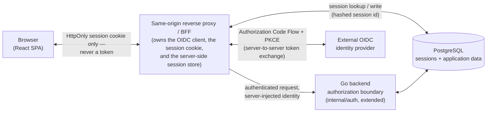
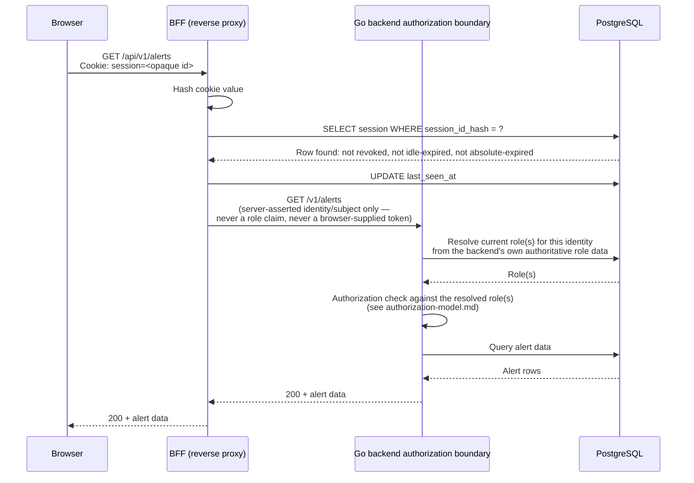
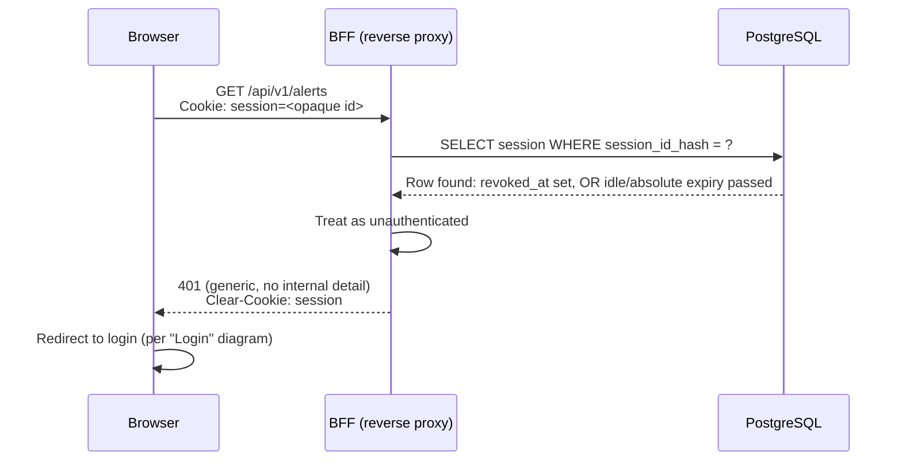

# Cloud-Native Security Telemetry and Detection Platform — Identity and Session Architecture (Proposed)

| Field | Value |
| --- | --- |
| Document | CNSDP Identity and Session Architecture |
| Version | 0.1 |
| Status | **Proposed.** Describes a future target architecture. Not approved, not implemented, not current shipped behavior. |
| Phase | Proposed — Security Foundation design phase. Not yet an approved project phase; see "Relationship to the approved baseline" below. |
| Identifier | Not assigned. Outside the closed PC-015 namespace (`docs/product.md` PC-015). Referenced by path only: `docs/security/identity-and-session-architecture.md`. |
| Authoritative sources | `../architecture.md` (ARCH-01, §6 in particular), `../non-functional-requirements.md` (PD-06, NFR-012–NFR-016), `../acceptance-criteria.md` (PD-07, AC-024–AC-026), `../adr/*`, `../reference-environment.md`, `cmd/platform/main.go`, `internal/auth/auth.go`, `internal/retrieval/*`, `frontend/vite.config.ts`, `frontend/src/lib/api/*` — all inspected directly during this design pass, not assumed from prior summaries. |
| Relationship to baseline | **This document proposes a change to currently approved behavior. It does not itself make that change, and it does not supersede, amend, or reinterpret any approved document.** See the section below. |

> **This entire document describes a proposal, not current behavior.** Every
> diagram, flow, and configuration below is a target design for future
> implementation, contingent on the explicit change-control approval
> described in "Relationship to the approved baseline." Nothing in this
> document authorizes writing code.

## Relationship to the approved baseline

The currently **Approved** Phase 1 architecture baseline (`../architecture.md`
§6, "Security and trust boundaries") states:

> "a shared bearer token / API key represents the single approved trust
> level (NFR-012)... No user or role model, no RBAC — an explicit NFR-012
> waiver, not an oversight."

and names OIDC only as a documented future "upgrade trigger," not a current
decision. The currently **Approved** non-functional requirements (`../non-functional-requirements.md`,
NFR-012) state:

> "v0.1 defines a single authenticated product trust level; persona-differentiated
> authorization is not required,"

and its "Excluded and deferred candidates" list item 5 — "Persona-differentiated
authorization and any role-based access control model" — as **excluded from
Phase 0** by NFR-012. `../functional-requirements.md`'s excluded-candidate
list item 10 similarly defers "per-persona access control" to "non-functional
requirements and later design."

This document exercises, but does not close, a decision those same approved
documents explicitly delegate forward. Both PD-06 ("Matters delegated to
acceptance criteria, threat modeling, architecture, or later engineering
work": *"Threat modeling: trust boundaries, identity and authorization
mechanisms, and the admission-control mechanism for NFR-012 and NFR-013"*)
and PD-07 ("Matters delegated to architecture, threat modeling, or
implementation": *"The authentication and authorization mechanism and the
admission-control mechanism (NFR-012, NFR-013)"*) name this exact decision as
future work, not yet made. This document is that future work's first draft —
it is a proposal for the threat-modeling/architecture stage those documents
anticipated, not a silent exercise of authority those documents do not grant.

**Adopting this proposal requires, before any implementation:**

1. A new Architecture Decision Record (the next available number in
   `docs/adr/`, e.g. `ADR-0005`) recording the identity/session decision with
   its own context, alternatives, and consequences, per this repository's
   existing ADR discipline (`docs/adr/0001`–`0004`).
2. An explicit, separately proposed amendment to `../architecture.md` §6,
   replacing its current authentication statement rather than leaving it to
   silently contradict this document.
3. An explicit, separately proposed amendment or superseding entry against
   `../non-functional-requirements.md` NFR-012 (and its "Excluded and
   deferred candidates" item 5) and `../acceptance-criteria.md` AC-024,
   since both currently state single-trust-level, no-RBAC as approved
   product behavior.
4. An explicit, separately proposed amendment to `../architecture.md` §7,
   which currently commits to *"Docker Compose, exactly two services — the
   application and PostgreSQL — on a single host (NFR-033, NFR-034,
   AC-028)."* This proposal's BFF (§"Target end-to-end flow," below) adds
   at least a third service in any real deployment, and a locally-run
   identity provider for development (see `open-decisions.md`, decision 1)
   would add a fourth in the reference environment — §7's "exactly two
   services" commitment must be explicitly revised, and NFR-033, NFR-034,
   and AC-028 must be revalidated against the resulting topology, not
   merely assumed to still hold unchanged.
5. Confirmation that adopting real human identity does not itself introduce
   multi-tenancy (`PC-C-005`) or any `PC-011` non-goal (SIEM, SOAR,
   incident-response, case-management) — it does not; this proposal adds
   *who is making a request* to a still single-tenant, still-scoped-to-v0.1
   product, and is discussed further in `authorization-model.md` §"Possible
   future tenant isolation."

None of the five steps above are performed by this document — they are
future amendments required only if this proposal is accepted, and until
they are made, `../architecture.md` (including both §6 and §7),
`../non-functional-requirements.md`, and `../acceptance-criteria.md` remain
unchanged and fully in force exactly as currently approved. Per CLAUDE.md's
change-control rule, these amendments must be proposed separately and
explicitly approved before this design is treated as authoritative.

## Target end-to-end flow



This extends, rather than replaces, a pattern already proven in this
repository: `frontend/vite.config.ts`'s development proxy already
demonstrates the same core principle at smaller scale — a server-side
component holds a credential the browser never sees, and it strips/overwrites
any credential-shaped value the browser attempts to supply itself. This
proposal generalizes that same principle from one static shared token to a
real per-user identity and session lifecycle.

**Component roles, restated precisely** (the user's original flow named the
components; this fixes their exact responsibilities, since ambiguity here is
exactly where OIDC implementations most commonly go wrong):

- **The BFF is the only OIDC client.** The browser never talks to the IdP
  directly and never learns the IdP's token endpoint, client secret, or any
  token value.
- **The BFF initiates the authorization redirect.** When an unauthenticated
  browser reaches a protected route, the BFF (not the React SPA) issues the
  `302` to the IdP's `/authorize` endpoint. The SPA never constructs this URL
  itself.
- **The BFF receives and validates the callback.** The IdP redirects the
  browser back to a BFF-owned callback route (e.g. `/auth/callback`), never
  to a route the SPA's client-side router owns. The BFF validates `state`,
  exchanges the code, validates the ID token (including `nonce`), and only
  then establishes a session and redirects the browser to the SPA's actual
  destination URL.
- **The Go backend's authorization boundary trusts the BFF, not the
  browser.** Every request the Go backend evaluates already carries an
  identity the BFF asserted after its own validation — the backend never
  re-parses a cookie or token itself in this proposal (see "Trusted proxy and
  forwarded-header handling," below, for exactly how that trust is bounded).

## Authorization Code Flow with PKCE

Authorization Code Flow with PKCE (RFC 7636) is used unconditionally, even
though the BFF is a confidential (server-side) client that could technically
rely on a client secret alone — PKCE is retained as defense-in-depth against
authorization-code interception, at negligible cost, and because it is the
current baseline recommendation for OIDC/OAuth2 regardless of client type.

1. The BFF generates a cryptographically random `code_verifier` (server-side,
   never exposed to the browser) and derives `code_challenge =
   BASE64URL(SHA256(code_verifier))`, with `code_challenge_method=S256`
   (never the deprecated `plain` method).
2. The BFF generates a random, single-use `state` value and a random,
   single-use `nonce` value, and persists both server-side (e.g. a
   short-lived, ~5–10 minute pre-session record keyed by a value carried in a
   temporary cookie), never in a form the browser can read or forge.
3. The BFF redirects the browser to the IdP's `/authorize` endpoint with
   `response_type=code`, the BFF's `client_id`, the exact registered
   `redirect_uri`, the requested `scope` (minimally `openid` plus whatever
   claims the platform actually needs — e.g. `email`, `profile` — never a
   broad, unused scope), `state`, `nonce`, `code_challenge`, and
   `code_challenge_method=S256`.
4. The user authenticates at the IdP (outside this platform's control or
   visibility — the platform never sees the user's IdP credential).
5. The IdP redirects the browser back to the BFF's callback route with an
   authorization `code` and the same `state` value.

## State and nonce validation

- **`state`** defends the OIDC redirect itself against CSRF: on callback, the
  BFF looks up its server-side pre-session record by the temporary cookie,
  confirms the returned `state` matches exactly, and immediately invalidates
  that record (single use). A missing, mismatched, or already-consumed
  `state` is treated as a failed login attempt (audited — see
  `audit-and-accountability-design.md`) and never silently retried.
- **`nonce`** defends against ID token replay: after the BFF exchanges the
  code for tokens, it verifies the ID token's `nonce` claim matches the value
  it generated in step 2 above. A mismatch invalidates the entire login
  attempt.

## Redirect URI validation

- The redirect URI is registered with the IdP as an exact-match string — no
  wildcard, no pattern matching, no runtime-supplied `redirect_uri`.
- The BFF constructs the authorization request using a fixed,
  configuration-supplied redirect URI, never one derived from request
  headers (`Host`, `Referer`, or similar), which would otherwise allow an
  open-redirect-style attack against the login flow itself.
- Local development and production use **separately registered IdP clients**
  with their own distinct redirect URIs, not one client with multiple
  allowed redirect URIs — this prevents a development redirect URI from ever
  being a usable target for a production authorization code, and mirrors
  this repository's existing discipline of keeping local and production
  configuration structurally distinct rather than toggled by a flag (see
  "Local development versus production," below).

## Where authorization codes and provider tokens are handled

The authorization `code` arrives at the BFF's callback endpoint as a query
parameter on a browser-initiated top-level navigation (TLS-protected,
one-time-use, short-lived per the IdP's own code-lifetime policy — typically
under a minute). The BFF immediately exchanges it **server-to-server**,
directly against the IdP's token endpoint over HTTPS — this exchange never
passes through the browser, and the code is never placed in a cookie, a
redirect URL back to the SPA, or any browser-visible location.

## Whether provider access and refresh tokens are stored

The ID token's identity claims (`sub`, and whichever of `email`/`name`/
`preferred_username` the platform actually needs for display) are extracted
once at login and stored in the local session record (PostgreSQL) — the
tokens themselves are not retained beyond that extraction in the default
configuration proposed here.

Two options exist for the IdP-issued **access token** and **refresh token**;
this document recommends the first and flags the second as a later,
explicitly justified extension:

- **Option A (recommended default).** Discard the provider's access and
  refresh tokens entirely once identity claims are extracted. Session
  renewal (see below) is governed purely by the local session's own idle and
  absolute timeouts, re-authenticating against the IdP only when the local
  session itself expires. This minimizes the amount of long-lived
  provider-issued secret material this platform must protect.
- **Option B (only if silent, IdP-session-length renewal is later required).**
  Retain the provider's refresh token, encrypted at rest, to silently extend
  the local session without forcing a full IdP round-trip login. This
  increases the platform's stored-secret surface and must not be adopted
  without an explicit, separately justified need.

## Whether stored provider tokens require encryption at rest

Yes, unconditionally, if Option B is ever adopted: any retained provider
token must be encrypted at rest using envelope encryption (a key-management
service or equivalent — never a static key embedded in application
configuration), with the encryption key held separately from the database
credentials that grant read access to the session table, so a raw database
read alone can never yield a directly usable IdP token. It must never appear
in logs, diagnostics, or the audit trail defined in
`audit-and-accountability-design.md`, extending the already-approved
principle that platform-managed secrets never appear in diagnostic output
(NFR-015) to this new class of stored secret.

## What information the browser receives

The browser receives **exactly one artifact**: an opaque, high-entropy,
random session identifier, delivered only as the value of the hardened
cookie described below. No ID token, access token, refresh token, or any
JWT reaches browser JavaScript, `localStorage`, `sessionStorage`,
`IndexedDB`, or any non-`HttpOnly` cookie, at any point in this flow.

Where the frontend needs to display identity information (a user's name in
the application shell, for example), it is served by a same-origin
`/api/session` (or similar) endpoint that the BFF computes server-side from
the session record and returns as an ordinary JSON response — never by the
browser decoding a token itself.

## How the application session is identified

The session identifier is a random value with at least 128 bits of entropy —
**not** a JWT, and not derived from any user-identifying data. Following the
same constant-time, hash-before-compare pattern this repository already uses
for its bearer token (`internal/auth/auth.go`'s `Bearer` function), the
session table stores only a SHA-256 hash of the session identifier, never the
raw value — a database read or backup leak does not by itself yield a usable
session credential. The raw identifier is what the cookie carries; the BFF
hashes it on every lookup.

## Session persistence, rotation, expiration, and revocation

**Persistence.** A dedicated PostgreSQL table (owned by a new identity/session
module, following this repository's existing module-boundary discipline —
`../architecture.md` §2 — rather than another module reaching into it
directly), with at minimum: `session_id_hash`, `user_subject` (the IdP `sub`
claim), `issued_at`, `last_seen_at`, `idle_expires_at`,
`absolute_expires_at`, `revoked_at` (nullable), `ip_at_issue`,
`user_agent_at_issue`, `rotation_count`.

**Rotation.** A fresh session identifier is issued and the previous one
invalidated:

1. On every successful login — a pre-authentication session (if one exists,
   e.g. the `state`/`nonce` pre-session record) is never promoted in place
   into an authenticated session; a genuinely new identifier is always
   issued, which is the standard mitigation for session fixation.
2. On any privilege or role change (see `authorization-model.md`).
3. Periodically during a long-lived active session (e.g. every few hours of
   continued use), as defense-in-depth against long-lived-identifier theft.
4. Optionally, when the request's IP address or User-Agent changes
   materially from the values recorded at issuance — flagged for step-up
   re-authentication rather than silently continued, since this may indicate
   a stolen session identifier being replayed elsewhere.

**Expiration.** Both an idle timeout and an absolute timeout are enforced,
checked against the database row on every request — never inferred from the
cookie's mere presence, since this design holds no client-trusted expiry
claim:

- **Idle timeout** — a session unused for a defined interval expires,
  bounding the exposure window of an unattended, unlocked analyst
  workstation.
- **Absolute timeout** — a session expires a defined maximum duration after
  login regardless of activity, bounding the maximum value of a stolen
  session identifier even against faked activity.

Concrete numeric values (e.g. "30 minutes idle / 12 hours absolute") are
**not fixed by this document** — like this repository's own approved
numeric targets (NFR-001, NFR-002, NFR-009), they belong to a future,
explicitly approved decision informed by the eventual analyst workflow, not
invented here as a side effect of this proposal.

**Revocation.** Logout, and any administrator-initiated forced revocation
(see `authorization-model.md`'s Platform Administrator role), sets
`revoked_at` on the session row. Because every request re-validates against
the stored row rather than trusting a self-contained token, revocation is
effective on the very next request — there is no propagation delay or
stale-token acceptance window to reason about.

## Idle timeout and absolute timeout

Rationale restated: idle timeout protects against the shared-workstation,
walked-away-from-the-desk scenario realistic for a SOC; absolute timeout
protects against a session identifier that is stolen and then kept "alive"
indefinitely by an attacker faking activity. Both are necessary; neither
alone is sufficient.

## Logout and IdP logout behavior

- **Local logout** (always available, always fast): the BFF marks the
  session row revoked and clears the cookie. This alone satisfies "logout"
  for this platform's own trust boundary and works even if the IdP itself is
  unreachable.
- **Federated (IdP) logout** (recommended enhancement, not required for an
  initial implementation): the BFF additionally redirects the browser
  through OIDC RP-Initiated Logout to the IdP's `end_session_endpoint`
  (`id_token_hint` included), ending the IdP's own SSO session too — most
  valuable for shared or kiosk-style analyst workstations where leaving an
  IdP-level SSO session alive after "logout" would let the next person at
  the workstation silently re-authenticate as the prior user.

## Compromised-session response

A documented, backend-enforced procedure: a Platform Administrator (see
`authorization-model.md`) can revoke a specific session or every session
belonging to a given user identity, immediately, via a database update —
effective on the next request with no propagation delay, per "Revocation,"
above. Every such forced revocation is itself an audited action (see
`audit-and-accountability-design.md`). If Option B (retained provider
refresh tokens) was adopted, a compromise response additionally includes
rotating or revoking that stored refresh token.

"Every session belonging to a given user identity" presumes a given human
identity can hold more than one concurrent session (e.g. multiple devices
or browsers at once) — this document relies on that possibility for a
complete compromise response, but whether concurrent sessions are allowed
at all, and if so under what bound, is **not decided here**. See
`open-decisions.md`, decision 18, "Concurrent sessions per human
identity."

## Hardened cookie configuration

| Attribute | Value | Justification |
| --- | --- | --- |
| `HttpOnly` | Always set | The session identifier is never readable by browser JavaScript, closing off the direct token-exfiltration path an XSS bug would otherwise open against a JS-readable token. |
| `Secure` | Always set outside local development | The cookie is never sent over an unencrypted connection in any environment reachable beyond a developer's own machine. See "Local development versus production." |
| `SameSite` | `Lax` | `Strict` would break the OIDC redirect-back itself: the IdP's callback redirect is a top-level cross-site navigation in the `SameSite` sense, and a `Strict` cookie would not be attached to it, breaking the flow's own `state` correlation. `Lax` still attaches the cookie only to top-level, "safe" (GET) navigations from another site — it is not sent on cross-site `POST`/`fetch`/image-triggered requests, which is the realistic CSRF vector this platform's state-changing endpoints must actually resist (see "CSRF protection," below, for why `SameSite=Lax` alone is not treated as sufficient). `None` is explicitly rejected: it would send the cookie in every cross-site context, which this platform's session never legitimately needs. |
| `Path` | `/` (default; narrower scoping is an implementation-time decision if static assets are ever served from a separate path prefix outside the BFF's own session-checked routes) | Keeps the cookie's blast radius no wider than the origin actually requires. |
| Expiration / rotation | `Max-Age` mirrors the session's current `absolute_expires_at`; re-issued on every rotation event so the cookie's client-visible expiry always matches the authoritative server-side record | Prevents the cookie's own stated lifetime from silently drifting out of sync with the value the backend actually enforces. |

## CSRF protection for state-changing requests

This proposal introduces a **new** CSRF exposure that the current bearer-token
model does not have: the current implementation is inherently CSRF-immune,
because a forged cross-site request cannot attach an `Authorization` header
it does not know (confirmed by this session's own review of
`frontend/src/lib/api/client.ts` and the credential-boundary e2e tests). An
ambient, automatically-attached session cookie removes that immunity, so
CSRF protection must be added explicitly, not assumed:

- The BFF issues a CSRF token bound to the session (synchronizer-token
  pattern), retrievable by the frontend via a same-origin, session-scoped
  endpoint (e.g. `GET /api/csrf-token`) — or, equivalently, via a companion
  non-`HttpOnly` cookie read by frontend JS purely to echo its value back
  (double-submit pattern). Either is acceptable; the synchronizer-token
  pattern is recommended as the primary approach since it does not depend on
  cookie-read timing.
- Every state-changing request (`POST`/`PUT`/`PATCH`/`DELETE`) must carry
  that token in a custom header (e.g. `X-CSRF-Token`); the BFF rejects the
  request if the header is missing or does not match the value bound to the
  current session.
- `SameSite=Lax` remains defense-in-depth, not a substitute for this
  explicit check — this platform's existing handlers already correctly
  restrict all mutation to non-`GET` methods (confirmed in
  `internal/intake` and `internal/retrieval`), so `Lax`'s GET-only
  cross-site allowance does not by itself create a state-changing exposure,
  but the explicit token check is retained regardless as the primary control.

## Trusted proxy and forwarded-header handling

The BFF/reverse proxy is the **only** component the Go backend trusts to
assert client-identity-adjacent values (`X-Forwarded-For`,
`X-Forwarded-Proto`, and the session-derived identity the BFF injects for
the backend's authorization boundary to consume). The backend must trust
these values **only** when the request demonstrably arrived through that
one fixed hop — e.g. over a private network segment, a Unix domain socket,
or a shared secret the proxy alone injects and the backend independently
verifies — and must never trust them on a request that could have arrived
directly from an arbitrary origin.

This directly extends a principle this repository already implements at
smaller scale: `frontend/vite.config.ts`'s `createApiProxy` unconditionally
calls `proxyReq.removeHeader("authorization")` before attaching its own
server-side credential — "never blindly forward a browser-supplied header"
— applied here to the broader class of forwarded/identity headers a
production reverse proxy boundary must not blindly trust either.

## IdP outage behavior

Because session validity is a local database check (per "Session persistence,"
above), an IdP outage does not affect **already-authenticated** sessions —
an analyst mid-shift is not logged out by an IdP outage. **New** logins fail
during an outage; the BFF must present a generic, safe message (e.g.
"Sign-in is temporarily unavailable — try again shortly"), never a raw IdP
error, extending this repository's existing safe-failure-message discipline
(`internal/retrieval`'s handlers never leak internal detail on failure) to
the login path. Extending the existing `/readyz`-style diagnostics
(`internal/diagnostics`) with an IdP-reachability signal is a reasonable
future enhancement, not required for an initial implementation.

## Local development versus production

- **Production:** mandatory TLS, `Secure` cookies always set, a real
  external OIDC provider, a separately registered IdP client and redirect
  URI from any development configuration.
- **Local development (recommended approach):** run a real, lightweight
  OIDC-compliant provider (e.g. Dex or Keycloak) as an additional
  `docker-compose.yml` service, so local development exercises the actual
  Authorization Code Flow with PKCE end to end rather than a special-cased
  bypass. This keeps development/production parity and avoids the
  well-known risk of a "temporary" dev-only auth bypass surviving into a
  deployed environment.
- **Explicitly not recommended as the primary approach:** a code-level local
  authentication bypass gated only by an environment flag. If one is ever
  introduced for a narrow, specific reason, it must follow the same
  discipline this repository already applies to `API_PROXY_TOKEN` — refuse
  to start at all if any production-like configuration is present, and be
  provably unreachable from a deployed build, not merely "off by default."

## Separation between human sessions and machine/service credentials

Human analysts authenticate exclusively through the OIDC/session flow above.
The existing Kubernetes audit-webhook submitter (and any future automated
integration) continues to use a distinct **machine/service credential**,
structurally separate from the human session mechanism — never a session
cookie, and never sharing a token format with the human flow. This proposal
recommends evolving today's single shared `API_TOKEN` (currently used
indiscriminately for both the submission endpoint and, indirectly through
the frontend proxy, human investigation access) into per-integration service
credentials, with mutual TLS remaining the documented longer-term option
`../architecture.md` §6 already names.

The Go backend's authorization boundary must be able to structurally
distinguish "this request carries a human session" from "this request
carries a service credential" as two different authentication mechanisms
serving two different endpoint classes (ingestion versus
investigation/administration) — never one token format overloaded to mean
both, which is the exact ambiguity today's single shared token has.

## Prohibition on browser-held bearer or refresh tokens

Restated as an explicit, testable invariant, directly extending the pattern
this repository already built and proved for the bearer token
(`frontend/src/test/noClientCredentials.test.ts`,
`frontend/src/test/noLeakedSecretsInBuild.test.ts`): under this proposal,
`import.meta.env`, `localStorage`, `sessionStorage`, `IndexedDB`, and any
non-`HttpOnly` cookie must never contain an ID token, access token, or
refresh token. The only browser-held authentication artifact is the opaque
`HttpOnly` session cookie. A future implementation of this proposal should
extend the existing static-scan and build-scan tests with a check for
JWT-shaped strings (the `eyJ` base64url-encoded-JSON prefix) in bundle
output, as an additional automated guard — noted here as a recommendation
for the eventual implementation task, not performed by this design pass.

## Sequence diagrams

### 1. Login

```mermaid
sequenceDiagram
    actor User
    participant Browser
    participant BFF as BFF (reverse proxy)
    participant IdP as External OIDC IdP
    participant DB as PostgreSQL (sessions)

    User->>Browser: Navigate to a protected route
    Browser->>BFF: GET /alerts (no session cookie)
    BFF->>DB: Check session — none present
    BFF->>BFF: Generate code_verifier, code_challenge (S256),<br/>state, nonce; persist pre-session record
    BFF-->>Browser: 302 to IdP /authorize<br/>(client_id, redirect_uri, scope,<br/>state, nonce, code_challenge)
    Browser->>IdP: GET /authorize (top-level navigation)
    IdP->>User: Present login UI
    User->>IdP: Authenticate
    IdP-->>Browser: 302 to BFF /auth/callback?code=...&state=...
    Browser->>BFF: GET /auth/callback?code=...&state=...
    BFF->>BFF: Validate state (single-use, matches pre-session)
    BFF->>IdP: POST /token (code, code_verifier) — server-to-server
    IdP-->>BFF: ID token, access token, (refresh token per Option A/B)
    BFF->>BFF: Validate ID token signature, nonce, issuer, audience
    BFF->>DB: INSERT session (session_id_hash, user_subject, ...)
    BFF-->>Browser: 302 to original destination<br/>Set-Cookie: session=<opaque id>; HttpOnly; Secure; SameSite=Lax
    Browser->>BFF: GET /alerts (with session cookie)
    BFF-->>Browser: 200 (rendered app)
```

### 2. Authenticated API request



### 3. Session renewal / rotation

```mermaid
sequenceDiagram
    participant Browser
    participant BFF as BFF (reverse proxy)
    participant DB as PostgreSQL

    Browser->>BFF: Request with session cookie
    BFF->>DB: SELECT session WHERE session_id_hash = ?
    DB-->>BFF: Row found: valid, but rotation due<br/>(periodic rotation interval elapsed)
    BFF->>BFF: Generate new opaque session id
    BFF->>DB: INSERT new session row (same user_subject,<br/>fresh absolute/idle expiry)
    BFF->>DB: UPDATE old session row: revoked_at = now()
    BFF-->>Browser: Set-Cookie: session=<new opaque id>; HttpOnly; Secure; SameSite=Lax
    BFF-->>Browser: 200 (original request fulfilled)
```

### 4. Logout

```mermaid
sequenceDiagram
    actor User
    participant Browser
    participant BFF as BFF (reverse proxy)
    participant DB as PostgreSQL
    participant IdP as External OIDC IdP

    User->>Browser: Click "Log out"
    Browser->>BFF: POST /auth/logout<br/>Cookie: session=<opaque id>; X-CSRF-Token: <token>
    BFF->>BFF: Validate CSRF token
    BFF->>DB: UPDATE session SET revoked_at = now()
    BFF-->>Browser: Clear-Cookie: session
    alt Federated logout enabled
        BFF-->>Browser: 302 to IdP end_session_endpoint (id_token_hint)
        Browser->>IdP: GET end_session_endpoint
        IdP-->>Browser: 302 back to application (logged out of IdP SSO too)
    else Local logout only
        BFF-->>Browser: 200 (logged out of this application only)
    end
```

### 5. Revoked or expired session



## Retrieval-latency impact on NFR-002 / AC-021

This proposal adds new I/O to the request path of the two endpoints
`../non-functional-requirements.md` NFR-002 and `../acceptance-criteria.md`
AC-021 already approve a numeric target for (5 seconds or less per
retrieval, `GET /v1/alerts` and `GET /v1/alerts/{id}`): a BFF hop, a
session-table lookup (`identity-and-session-architecture.md`'s own session
persistence), and an authorization-decision lookup
(`authorization-model.md`'s role resolution). None of that added I/O is
expected to approach the existing 5-second target — each added step is a
single indexed-row lookup — but this proposal does not itself measure or
verify that expectation, and NFR-002/AC-021 remain binding, already-approved
requirements regardless of this proposal's existence.

**This proposal requires, as part of its own verification, not a separate
future decision:** a documented re-measurement of NFR-002/AC-021 against
the new request path (BFF overhead, session lookup, authorization lookup,
and — for the login path specifically — IdP round-trip time where
applicable), performed once Passes 2–11 (`implementation-roadmap.md`) are
implemented, before Pass 20's security acceptance gate is considered
satisfied. No claim of continued NFR-002/AC-021 compliance may be made
before that measurement exists.

## Explicit non-goals of this document

- This document does not define role names, permissions, or the
  authorization decision itself — see `authorization-model.md`.
- This document does not define the audit event schema for
  authentication/session events — see `audit-and-accountability-design.md`.
- This document selects no concrete OIDC provider, no concrete session-store
  library, and no concrete cookie-signing implementation — those remain
  implementation choices for the future approved ADR referenced above.
