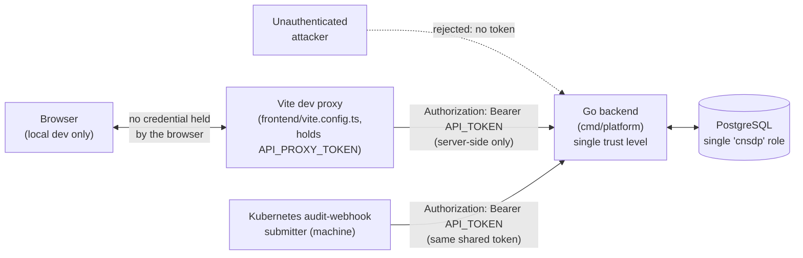
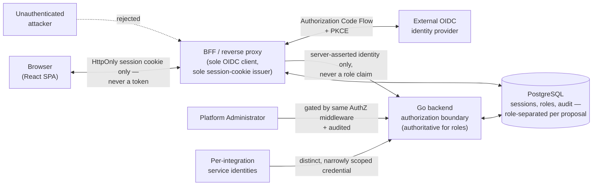

# Cloud-Native Security Telemetry and Detection Platform — Threat Model (Proposed)

| Field | Value |
| --- | --- |
| Document | CNSDP Threat Model |
| Version | 0.1 |
| Status | **Proposed.** Analyzes both currently-shipped behavior and a not-yet-approved future design. This document authorizes no implementation, resolves no open decision, and amends no approved baseline document. |
| Phase | Proposed — Security Foundation design phase. Not yet an approved project phase. |
| Identifier | Not assigned. Outside the closed PC-015 namespace (`docs/product.md` PC-015). Referenced by path only: `docs/security/threat-model.md`. |
| Purpose | Satisfies Security Acceptance Gate item **D6** (`docs/security/security-acceptance-gate.md`, Tier 1) and provides the security foundation required before Design Acceptance (Gate Tier 1, D1–D7). |
| Revision history | **Corrective pass (this revision):** applied every finding from an independent read-only review of the original version — added an explicit, reviewable risk-rating method (§7.0) and re-rated the threats it identified as inconsistent; added TM-D03, TM-I09, TM-R04; rebuilt §9 as a single canonical inventory (41 rows, one Disposition each) with clearly labeled non-authoritative secondary views, replacing an earlier structure in which TM-R03 was missing from the register entirely and three threats were counted in more than one bucket; corrected an acceptance-gate citation error in TM-I01; corrected wording that understated where IdP-outage analysis actually lives; and applied the remaining reference-precision and formatting fixes detailed throughout. **Follow-up corrective pass (this revision, continued):** replaced a stale "Category-1" label at TM-S09 with the current "Category A" name; tightened §7.0's Category C eligibility test so it can no longer be satisfied merely by an absence of production-topology documentation, requiring instead a concrete, artifact-evidenced dependency — re-evaluating TM-I07 against that tightened test found it no longer eligible, correcting its Inherent risk from Medium to Low (canonical severity totals updated accordingly: Medium 6→5, Low 1→2; STRIDE and Disposition totals unaffected). **Decision-resolution pass (this revision, continued):** `open-decisions.md` decisions 3 (session storage), 4 (idle timeout), 5 (absolute timeout), and 18 (concurrent sessions) were resolved by the repository's Project Owner and Security Design Authority (Ron Hagani, 2026-07-29); TM-S06 and TM-D03 updated to cite the resulting concrete values rather than treating them as unfixed, and TM-E04 (concurrent-session abuse) re-rated from "cannot be assessed — no policy chosen" to a rated Proposed residual risk now that a policy exists, moving its Disposition from Unresolved to Partially-Mitigated (canonical Disposition totals updated accordingly: PM 8→9, UNR 12→11; Inherent-severity and STRIDE totals unaffected). No Proposed control is described as implemented by this revision, and Design Acceptance is not declared complete by it — see §15. |
| Authoritative sources | `docs/product.md`, `docs/personas.md`, `docs/use-cases.md`, `docs/scope.md`, `docs/functional-requirements.md`, `docs/non-functional-requirements.md`, `docs/acceptance-criteria.md`, `docs/glossary.md`, `docs/architecture.md`, `docs/adr/0001`–`0005`, `docs/security/identity-and-session-architecture.md`, `docs/security/authorization-model.md`, `docs/security/audit-and-accountability-design.md`, `docs/security/implementation-roadmap.md`, `docs/security/open-decisions.md`, `docs/security/security-acceptance-gate.md`, and direct inspection of `internal/auth`, `internal/intake`, `internal/retrieval`, `internal/evidence`, `internal/traceability`, `internal/diagnostics`, `internal/submission`, `internal/normalization`, `cmd/platform/main.go`, `frontend/src/lib/api`, `frontend/src/app`, `frontend/src/features/alert-inventory`, `frontend/src/features/alert-investigation`, `frontend/vite.config.ts`, `docker-compose.yml`, `migrations/0001`–`0003`, and `docs/reference-environment.md`, all performed during this pass — nothing below is assumed from summaries alone. |

> **This document describes an analysis, not an implementation and not an approval.** Every threat below is evaluated twice where applicable: once against the platform as it is actually built and deployable today (the shared-bearer-token, single-trust-level v0.1 baseline `docs/architecture.md` §6 and `docs/non-functional-requirements.md` NFR-012 currently approve), and once against the identity/session/RBAC/audit design proposed in the six companion documents and ADR-0005. **Nowhere in this document does a Proposed control count as a current mitigation.** Where a threat is mitigated only by an unimplemented proposal, this document says so explicitly and records the residual risk as unresolved, not accepted.

## 1. Purpose and scope

### In scope

- The platform's **currently shipped** v0.1 attack surface: the single shared
  bearer token (`internal/auth.Bearer`) authenticating the telemetry-intake
  endpoint (`POST /v1/audit-events`) and the two retrieval endpoints
  (`GET /v1/alerts`, `GET /v1/alerts/{id}`); the unauthenticated readiness
  endpoint (`GET /readyz`); the durable worker's processing pipeline
  (`admitted → validated → normalized → evaluated → alerted → evidenced`);
  PostgreSQL as the platform's sole persistence store (ADR-0002); the
  Docker Compose reference environment (`docker-compose.yml`,
  `docs/reference-environment.md`); the React frontend's data path
  (`frontend/src/lib/api`, the Alert Inventory and Alert Investigation
  features) and its local development proxy (`frontend/vite.config.ts`);
  the version-controlled detection-definition supply chain (ADR-0004); and
  the content and handling of Kubernetes API server audit-event telemetry
  itself, including its potential to carry sensitive request/response
  content.
- The **Proposed** identity, session, authorization, and audit design
  described in `identity-and-session-architecture.md`,
  `authorization-model.md`, `audit-and-accountability-design.md`,
  `implementation-roadmap.md`, `open-decisions.md`, and ADR-0005 — analyzed
  as a target architecture, not as implemented behavior.
- The trust boundaries, data flows, and controls that would be introduced or
  changed by the twenty-pass implementation roadmap, to the extent needed to
  evaluate the design's soundness before any pass begins.

### Out of scope

- **General Kubernetes cluster or control-plane security.** This platform is
  a consumer of Kubernetes API server audit events, not an operator of a
  cluster; hardening the audit-event producer (audit policy configuration,
  API server hardening, node security) is outside this platform's boundary
  and outside PC-011's non-goals.
- **The external OIDC identity provider's own internal security posture.**
  Treated as an assumption (§11), not modeled — consistent with
  `open-decisions.md` decision 2 ("Correctness of the identity provider's
  own security posture... remains the provider's responsibility").
- **SIEM, SOAR, incident-response, case-management, or multi-tenant
  capabilities.** Binding PC-011 non-goals; this document does not propose,
  model, or imply any of them, and `authorization-model.md`'s "Possible
  future tenant isolation" is noted (§11) but not analyzed as a present
  concern.
- **Compliance or regulatory frameworks.** `docs/non-functional-requirements.md`
  records "no charter basis" for these; this document invents none.
- **General web-application penetration testing of every UI affordance.**
  This is a threat model, not a penetration-test report; §13 defines what
  future testing must cover.
- **Physical security, cloud-provider infrastructure hardening beyond what
  `docs/architecture.md` defines, and personnel/insider-threat vetting
  processes.** Named as assumptions where relevant (§11), not modeled in
  depth.
- **Resolving any open decision.** Per `open-decisions.md`'s own framing and
  this document's task instruction, no open decision is silently closed
  here — see §12.

## 2. System security objectives

| Objective | What it means for CNSDP | Grounding |
| --- | --- | --- |
| **Confidentiality** | Raw telemetry, normalized events, detection definitions, alerts, evidence, and — once they exist — sessions, credentials, and audit records are readable only by parties the platform's own authorization state permits. | PC-P-008; NFR-012, NFR-015, NFR-016; `authorization-model.md` |
| **Integrity** | Recorded artifacts (submissions, validation outcomes, normalized events, detection results, alerts) and the links between them cannot be silently altered without detection. | NFR-006, NFR-007, NFR-017; `internal/traceability` (implemented today) |
| **Availability** | The platform meets its documented capacity, latency, and recovery targets under both legitimate load and defined abuse conditions. | NFR-001–NFR-011, NFR-035, NFR-036 |
| **Accountability** | Every security-relevant action is attributable to a specific actor, not merely to "someone with the shared token." | PC-P-008; `audit-and-accountability-design.md` (Proposed — **not met by current v0.1**, see §7 TM-R01–TM-R03) |
| **Traceability** | Every alert is traceable, without gaps, to the telemetry that produced it — this is a product goal (PC-G-007) as much as a security property. | FR-033–FR-035, NFR-007, NFR-029; `internal/traceability` (implemented today) |
| **Least privilege** | Every identity — human or machine — holds the minimum permission set its role requires, and no permission is granted "for convenience." | NFR-014; `authorization-model.md` "Least privilege," "Machine identity authorization" |
| **User and tenant isolation assumptions** | v0.1 is explicitly single-tenant (PC-C-005); this document assumes no tenant boundary exists and does not model tenant-crossing threats. Per-analyst object isolation is also currently absent by product design (no alert ownership concept exists; see `authorization-model.md`, "Horizontal object-access controls") and is analyzed as a **future** requirement (§7 TM-I04), not a present gap, because no private per-analyst data exists to isolate today. |
| **Protection of security telemetry itself** | The telemetry this platform collects and the evidence it derives are themselves security-sensitive (PC-P-008: "the platform itself is a security-sensitive system"); Kubernetes audit events can carry secrets (e.g. environment-variable values in a Pod spec), so the evidentiary-fidelity guarantee (FR-032) and confidentiality protection must coexist without one silently undermining the other — an explicitly **unresolved** tension (`open-decisions.md` decision 12; §7 TM-I02, §12). |

## 3. Protected assets

| # | Asset | Exists today (v0.1) | Owning module / table | Notes |
| --- | --- | --- | --- | --- |
| A1 | Authenticated identities | **Partially.** No human identity concept exists; the "identity" today is possession of the shared bearer token, undifferentiated between machine and human callers (`authorization-model.md`, "Machine / service identity"). | `internal/auth` | Proposed: `user_subject` (IdP `sub` claim), service-credential identifiers. |
| A2 | Browser sessions and session cookies | **No.** No cookie or session state exists in the shipped backend. The frontend holds no credential of any kind (`frontend/src/lib/api/client.ts`). | — (Proposed: new session module, Pass 4) | Proposed asset only. |
| A3 | OIDC authorization codes and tokens | **No.** No OIDC integration exists. | — (Proposed: BFF, Pass 3) | Proposed asset only. |
| A4 | Provider credentials and service credentials | **Yes, minimally.** `API_TOKEN` (shared, `.env`-supplied), `POSTGRES_PASSWORD`. | `cmd/platform/main.go`, `docker-compose.yml` | Proposed: per-integration service credentials (Pass 19), OIDC client secret (Pass 3/17). |
| A5 | Role and permission assignments | **No.** NFR-012 defines a single trust level; no role data exists. | — (Proposed: roles table, Pass 9) | Proposed asset only. |
| A6 | Raw telemetry and raw event payloads | **Yes.** `submissions.raw_event` (BYTEA, exact received bytes). | `internal/submission` | Rendered in full to any authenticated caller today (`internal/retrieval`, `SourceEventInspection.tsx`); see TM-I01, TM-I02. |
| A7 | Normalized events | **Yes.** `normalized_events.content`. | `internal/normalization` | **A materially lower-sensitivity artifact than A6 (raw payload) — not the same authorization boundary.** Under the Proposed model, Viewer is entitled to normalized-event content (bundled into "View alert investigation details," `authorization-model.md`'s matrix) while being denied the raw payload specifically. See TM-I01's expanded discussion. |
| A8 | Alert and detection results | **Yes.** `detection_results`, `alerts`. | `internal/detection`, `internal/alerting` | |
| A9 | Detection definitions | **Yes.** Version-controlled YAML, embedded into the compiled binary at build time (`internal/detection`, `go.yaml.in/yaml/v3` parser, ADR-0004) and loaded into `detection_definitions` at startup. | `internal/detection` | No in-product edit path exists by construction (ADR-0004). |
| A10 | Audit records (accountability trail) | **No.** Only ephemeral, denial-only `slog` diagnostics exist (`internal/diagnostics.LogAccessDenied`) — process-local, unpersisted, and covering denied access only, not a security audit trail. | — (Proposed: `internal/audit`, Pass 12) | See §2 "Accountability" and TM-R01–TM-R03. |
| A11 | Exports | **No.** No export capability exists (`authorization-model.md`'s governance note; `open-decisions.md` decision 13). | — (Proposed capability, not yet approved as product scope) | |
| A12 | Database records (PostgreSQL) | **Yes.** Single instance, single `cnsdp` application role for all tables today (ADR-0002; `audit-and-accountability-design.md`, "Database permissions," confirms single-role reality by direct inspection). | `internal/db` | No role separation exists yet, even for the data that does exist today. |
| A13 | Cryptographic material | **Minimal today.** SHA-256 digests (`raw_event_sha256`, `source_key`) for tamper-evidence; the bearer token itself, hashed only in-memory during comparison, never persisted as a hash. | `internal/auth`, `internal/submission`, `internal/traceability` | Proposed: session-identifier hashes, hash-chain `integrity_metadata` for audit rows, possible provider-refresh-token encryption keys (Option B, not recommended). |
| A14 | Configuration and secrets | **Yes.** `.env` (gitignored, local-dev only — explicitly not a production secrets mechanism per `docs/reference-environment.md`). | `docker-compose.yml`, `cmd/platform/main.go` | Proposed: production secret management, Pass 17. |
| A15 | Administrative and break-glass capabilities | **No.** No administrator role, no administrative surface, no break-glass mechanism exists in any approved or proposed document (`open-decisions.md` decision 10: "Open, unresolved. Not addressed by any of documents B/C/D in detail"). | — (Proposed role only; break-glass mechanism itself is an open decision, not designed) | |

## 4. Threat actors

Capabilities are stated per actor; no actor is assumed to have another's capabilities unless stated.

| Actor | Capability | Realistic access today (v0.1) | Realistic access under Proposed architecture |
| --- | --- | --- | --- |
| **Unauthenticated external attacker** | Network access to whatever is exposed; no credential of any kind. | Can reach `GET /readyz` (intentionally unauthenticated) and can attempt requests against the intake/retrieval endpoints, all rejected without the bearer token. Cannot reach PostgreSQL directly (not published to the host in `docker-compose.yml`). | Can reach the BFF's public routes, including the login-initiation and callback routes — the platform's new largest unauthenticated surface. |
| **Compromised browser or endpoint** | Full control of a legitimate, already-authenticated user's browser session (malware, malicious extension, physical access). | Today, "authenticated" browser access means the browser reached the app through the dev proxy, which itself holds the only credential — compromising the browser alone yields no credential to steal (§7 TM-S06 "current: not applicable"). | Can exfiltrate anything the browser's JavaScript can read. Cannot read the `HttpOnly` session cookie directly (by design), but can perform any action the legitimate session is authorized for while the browser is compromised, and can attempt to abuse an open CSRF gap if one exists. |
| **Malicious Viewer** | Holds a legitimate, low-privilege authenticated identity (Proposed: Viewer role). | **Does not exist as a distinguishable actor today** — no Viewer role exists; every bearer-token holder has identical access. | Per `authorization-model.md`'s matrix: can view alert inventory, investigation details, and provenance, but is denied raw-payload viewing and every mutation. Threat: attempts to escalate to raw-payload access or beyond. |
| **Malicious or compromised Analyst** | Holds a legitimate SOC Analyst identity. | Not distinguishable from any other bearer-token holder today. | Can view raw payloads and (once approved) acknowledge/annotate alerts. Threat: attempts export, disposition changes, or administrative actions beyond SOC Analyst's grant. |
| **Privileged insider** | Legitimate elevated access (e.g. a Detection Engineer or Senior Analyst/IR identity, or direct deployment/operator access). | Today, anyone with `.env` access or deploy access already has the one credential that grants everything — there is no lesser privileged-insider tier to distinguish. | Can attempt actions beyond their granted role, or misuse legitimately granted permissions (e.g. unnecessary raw-payload access, unwarranted export). |
| **Compromised administrator account** | Full Platform Administrator capability (Proposed only — no administrator role exists today). | Not applicable — no administrator role exists. | The single highest-value target once Pass 18 ships: user/role management, session revocation, audit-log access, administrative configuration. |
| **Compromised service identity** | Holds a machine/service credential (today: the one shared `API_TOKEN`; Proposed: a narrowly scoped per-integration credential). | Today, compromise of `API_TOKEN` is equivalent to full compromise of every other actor's capability, since the same token also gates human retrieval access. | Proposed: a compromised service identity is scoped to exactly "submit telemetry" (`authorization-model.md`, "Machine identity authorization") — materially bounded compared to today. |
| **Compromised OIDC provider** | Control over identity assertions the platform trusts (Proposed only). | Not applicable — no OIDC integration exists. | Can mint or approve authentication for any identity; bounded only by this platform's own session-validity model (already-authenticated sessions are unaffected by an IdP-availability outage, but an IdP **compromise**, as distinct from an outage, is not specifically analyzed by the Proposed design beyond decision 16's platform-wide revocation escape hatch — see TM-S11). |
| **Supply-chain attacker** | Ability to introduce malicious code through a dependency, a compromised build step, or a malicious contribution merged through code review. | Applies today: Go module dependencies, npm dependencies, and the detection-definition YAML files (which ship through ordinary code review, not a separate hardened pipeline) are all reachable through this vector. | Unchanged in kind; the Proposed architecture adds new dependencies (OIDC client library, session-store driver, etc.), widening the surface without changing the vector. |
| **Attacker with network position** | Can observe or intercept traffic on a path the platform's data crosses (unencrypted transport, a compromised network segment). | Bounded today: the reference environment binds the app port to `127.0.0.1` only, and the only credential in transit is the bearer token in an `Authorization` header — no ambient/ automatically-replayed credential exists. | Materially higher stakes once a session cookie exists: an on-path attacker who can observe plaintext traffic (missing TLS) can capture a live, ambient, automatically-replayed session cookie — see TM-T06. |
| **Attacker with database access** | Has obtained read and/or write access to PostgreSQL directly (compromised credential, compromised host, insider with `psql` access). | Applies today: a single `cnsdp` role has full read/write over every table, including `submissions.raw_event` (§7 TM-T05). | Widens to include sessions, roles, and — critically — the audit trail itself, unless the Proposed database-role separation (`audit-and-accountability-design.md`, "Database permissions") is actually implemented, not merely documented. |

## 5. Trust boundaries

### 5.1 Current v0.1 (as shipped)

**No production browser-to-backend path is currently defined.** `docs/architecture.md` §7 commits to exactly two Compose services (application, PostgreSQL); the frontend's only documented path to a real backend is the local Vite dev/preview proxy. How a deployed browser would reach the backend in a non-local environment is an **undocumented gap** in the current approved baseline, not merely a Proposed-architecture concern — this document records it here because it is exactly the gap ADR-0005's BFF proposal exists to close, but closing it is not yet approved.

**Current authoritative components:**

| Function | Currently authoritative component |
| --- | --- |
| Authentication | `internal/auth.Bearer`, called first in every handler (`internal/intake`, `internal/retrieval`) |
| Session state | None exists |
| Role resolution | None exists — NFR-012's single trust level means "authenticated" is the only state |
| Permission enforcement | Binary: the same bearer-token check gates submission and retrieval alike; no per-action or per-field distinction |
| Response composition | `internal/retrieval` composes the full response uniformly for any authenticated caller (`toResponse`, `toListResponse`) — no role-based field omission exists |
| Audit generation | `internal/diagnostics.LogAccessDenied` — denials only, not a full accountability record |
| Audit persistence | None — diagnostics are ephemeral process logs, never written to PostgreSQL |

### 5.2 Proposed architecture

**Proposed authoritative components** (per `identity-and-session-architecture.md` and `authorization-model.md`):

| Function | Proposed authoritative component |
| --- | --- |
| Authentication | The BFF (sole OIDC client, validates ID token/`nonce`/`state`, issues the session) |
| Session state | The PostgreSQL session table, read/re-validated on every request — never inferred from cookie presence |
| Role resolution | The **Go backend's own authoritative role/permission data** — explicitly *not* the BFF or the session record, which carries identity only (`identity-and-session-architecture.md`, "Component roles"; sequence diagram 2) |
| Permission enforcement | The Go backend's authorization middleware (`internal/authorization`, Pass 8), first action in every handler |
| Response composition | The Go backend only — never the BFF, never the frontend (Pass 11; `authorization-model.md`, endpoint-to-permission mapping) |
| Audit generation | `internal/audit`, instrumented at each security-relevant call site (Pass 12) |
| Audit persistence | A dedicated, append-only PostgreSQL table under a restricted database role without `UPDATE`/`DELETE`/`TRUNCATE` |

Both diagrams are simplifications; the full sequence-level detail for login, an authenticated request, rotation, logout, and revocation already exists in `identity-and-session-architecture.md` and is not reproduced here — this document cites it by section rather than duplicating it, consistent with this repository's own practice of citing prior work "by finding, not reproduced" (`docs/architecture.md`, spike citations).

**Failure behavior for the BFF↔PostgreSQL and backend↔PostgreSQL boundaries is not stated by any companion document** — see TM-D03 (§7): whether a session-store outage causes authentication/authorization to fail open or fail closed is an unresolved design gap, distinct from the already-analyzed IdP-outage case (which concerns the external identity provider, not this platform's own database).

## 6. Security-sensitive data flows

Each flow is stated for current v0.1 behavior and, where different, the Proposed behavior. Full step-by-step detail for the Proposed OIDC/session flows lives in `identity-and-session-architecture.md`'s five sequence diagrams; this table adds the trust-boundary and risk lens a sequence diagram does not.

| Flow | Current v0.1 | Proposed | Trust boundaries crossed | Key threats |
| --- | --- | --- | --- | --- |
| Login initiation | **Not applicable** — no login concept. | Browser → BFF → 302 to IdP `/authorize` with PKCE challenge, `state`, `nonce`. | Browser↔BFF, BFF↔IdP | TM-S01, TM-S03, TM-S09 |
| OIDC callback | Not applicable. | IdP → browser → BFF `/auth/callback`; `state` validated single-use. | Browser↔BFF, BFF↔IdP | TM-S01, TM-S04, TM-S09 |
| Authorization Code + PKCE exchange | Not applicable. | BFF ↔ IdP, server-to-server only; code never touches the browser. | BFF↔IdP | TM-S02, TM-S03 |
| Session creation | Not applicable. | BFF validates ID token, writes a new session row, issues a fresh opaque cookie — never promotes a pre-auth identifier. | BFF↔PostgreSQL | TM-S05 |
| Session rotation | Not applicable. | Periodic / on privilege change / on login; old identifier invalidated. | BFF↔PostgreSQL | TM-S06, TM-S07 |
| Normal authenticated API request | Browser (dev-proxy-mediated) → backend, `Authorization: Bearer <token>` attached server-side only. | Browser (cookie) → BFF (session lookup) → backend (identity asserted) → backend resolves role → response composed per role. | Browser↔BFF, BFF↔backend, backend↔PostgreSQL | TM-S08, TM-T06, TM-E01, TM-I04 |
| Logout | Not applicable. | POST with CSRF token; session row marked revoked; optional federated IdP logout. | Browser↔BFF | TM-T01 |
| Revocation | Not applicable — no session to revoke. | Administrator- or self-initiated; effective on next request, no propagation delay. | Admin↔BFF/backend↔PostgreSQL | TM-E03, TM-E05 |
| Compromised-session response | Not applicable. | Administrator revokes one or all sessions for an identity. | Admin↔PostgreSQL | TM-E05, TM-S06 |
| Role and permission resolution | Not applicable — single trust level. | Backend queries its own authoritative role data on each applicable request. | Backend↔PostgreSQL | TM-S12, TM-E02, TM-E03 |
| Raw-payload access | Any authenticated (bearer-token) caller receives the full raw event unconditionally (`internal/retrieval`, `toResponse`). | Gated to Analyst-tier and above; Viewer receives `available:false` never silent omission indistinguishable from a data gap (Pass 11). | Backend↔PostgreSQL, backend→BFF→browser | TM-I01, TM-I02 |
| Export access | Not applicable — no export capability exists. | ⚠ Proposed capability only, not yet approved as product scope; separately gated from viewing. | — | TM-I03 |
| Administrative changes | Not applicable — no administrative surface. | Gated to Platform Administrator, audited, triggers session rotation for the affected identity. | Admin↔backend↔PostgreSQL | TM-E02, TM-E05 |
| Service-to-service authentication | Single shared `API_TOKEN`, undifferentiated between the Kubernetes audit-webhook submitter and (indirectly) human investigation access. | Per-integration scoped credentials, structurally distinct from human sessions, gradually migrated (Pass 19). | Submitter↔backend | TM-S10, TM-E06 |
| Audit-event creation and persistence | Not applicable — only ephemeral denial-only diagnostics exist. | Every event in the catalog (`audit-and-accountability-design.md`) is written append-only, hash-chained, with classification-driven fail-open/fail-closed behavior. | Backend↔PostgreSQL (restricted audit-writer role) | TM-R01, TM-R02, TM-T02 |
| Session validation during a session-store/backend outage | Not applicable — `internal/auth.Bearer` has no database dependency at all. | **Unspecified** — no companion document states whether an unreachable session store causes authentication to fail open (available but unsafe) or fail closed (safe but a total outage); role resolution and audit persistence share the same dependency. | BFF↔PostgreSQL, backend↔PostgreSQL | TM-D03 |

## 7. Threat analysis

STRIDE is the organizing frame. Three ratings are recorded per threat, in one combined bullet: **inherent risk** (before any control, theoretical), **residual risk — current v0.1** (after whatever is actually shipped today), and, where the Proposed design changes the picture, **residual risk if Proposed is implemented and gate-verified** — explicitly hypothetical, never presented as an achieved state.

### 7.0 Risk-rating method (revision note: this subsection replaces the prior version's three-line prose formula, which was stated but not consistently applied — see the corrective-pass note at the top of this document)

**Allowed Likelihood values (exactly three):** Low, Medium, High — calibrated against the attacker capability actually required and the platform's real exposure (a single-host reference environment with no confirmed internet-facing production deployment, §5.1).

**Allowed Impact values (exactly four):** Low, Medium, High, Critical — calibrated against data/control exposed, reversibility, and effect on evidentiary integrity (PC-008, PC-P-008).

**The matrix (exact, exhaustive — every cell is defined, no residual "everything else" bucket):**

| Likelihood ↓ / Impact → | Low | Medium | High | Critical |
| --- | --- | --- | --- | --- |
| **Low** | Low | Low | Medium | Critical |
| **Medium** | Low | Medium | High | Critical |
| **High** | Medium | High | High | Critical |

**Inherent risk** = a direct lookup of (Likelihood, Impact) in the matrix above, using the worst plausible-case Impact value for a threat whose impact differs by scenario (e.g. read vs. write access) — before any control is credited. Only four output values exist: Critical, High, Medium, Low. No hedge label (e.g. "Medium-High") is used; every prior hedge has been resolved to one discrete bucket in this pass, with the resolution reasoning stated inline where it changed the original label.

**Current-v0.1 residual risk** = Inherent risk reduced only by controls that are actually implemented and directly inspected in this document (§7's "Current control status" field). If no such control exists, current residual risk equals inherent risk, or is marked **N/A** where the underlying asset itself does not exist in the shipped system.

**Proposed residual risk** = Inherent risk reduced only by Proposed-design elements that are (a) fully specified in a companion document and (b) tied to a named Gate verification item. Where the Proposed design is silent, contingent on an unresolved open decision, or only partially specified, Proposed residual risk is **never rated below what the specified partial controls actually achieve**, and the remaining gap is stated explicitly rather than assumed closed. A threat with no adequate Proposed answer at all keeps its Proposed residual risk at or near its Inherent risk and is dispositioned **Unresolved** (§9).

**Conservative override — common rules (revision note: this replaces the prior version's claim of "one override category," which was inaccurate — TM-I03 and TM-I07 already used two further, unnamed adjustments; all three are now explicitly named, scoped, and audited below, per an independent review finding).** A rating may be moved upward from the matrix lookup only under one of the three named categories defined below, stated inline as `(base: X; override → Y — rationale)`. In every case:
1. the base matrix result is shown;
2. the move is upward only — never used to lower a matrix result, and never invoked merely because a rating "feels" more conservative without meeting a category's written eligibility condition;
3. the specific named category's eligibility condition is met and cited — not a generic severity judgment;
4. every threat meeting materially identical conditions for a given category receives that category's override identically — an override applied to one threat and withheld from an equivalent one is not permitted.

**Three override categories are used in this document — no fourth, unnamed, or purely case-by-case override exists anywhere in this document:**

- **Category A — Authentication/session-establishment primitive compromise.** *Eligibility:* a successful attack yields the attacker a fully authenticated or forged session/identity (not merely a partial information leak), defeating every downstream control that assumes authentication integrity — a consequence class the generic Impact axis does not separately weight. *Maximum movement:* one step up from the matrix lookup. *Evidence required:* the entry states which specific authenticated-session outcome the successful attack produces. *Threats using it:* TM-S01, TM-S02, TM-S03, TM-S04, TM-S07 — all Low-likelihood/High-impact OIDC or session-mechanics threats whose successful exploitation ends in exactly this outcome. *Confirmed:* cannot lower risk (upward-only, common rule 2); cannot be invoked without the specific authenticated-session outcome (common rule 3); applied identically to every threat meeting the condition, none omitted (common rule 4).

- **Category B — Irreversible highest-leverage data-exfiltration point.** *Eligibility:* applies only to a capability that (a) does not yet exist in either the current or Proposed architecture, and (b) is explicitly and in writing characterized by its own governing source document as the platform's single highest-leverage, irreversible data-exfiltration point — once the boundary is crossed, no access control this platform holds can recall or revoke the disclosure, unlike ordinary view-access, which remains subject to revocation. *Maximum movement:* one step up from the matrix lookup computed against the capability's inherent risk as though it already existed. *Evidence required:* a direct quotation from the governing source document naming the capability as uniquely highest-leverage and irreversible — here, `open-decisions.md` decision 13's own text, quoted at TM-I03. *Threats using it:* TM-I03 only — the sole not-yet-built capability carrying this written characterization in any companion or open-decision document. *Confirmed:* cannot lower risk (upward-only); cannot be invoked without an external, governing-document citation, so it cannot be reached for merely by feel; applies to any other future capability that later earns the identical written characterization, and to no threat that does not.

- **Category C — Concrete, artifact-evidenced production-topology dependency** *(revision note: this replaces an earlier, looser version of this category, whose sole eligibility basis — an undocumented-topology **gap** — was in substance indistinguishable from "documentation is incomplete," an independent-review finding that required tightening; see the re-evaluation of TM-I07 below).* *Eligibility (all four required together):* (1) a specific, identifiable production-topology dependency materially changes the threat's Likelihood or Impact relative to what the currently documented architecture baseline would otherwise support; (2) that dependency is evidenced by a specific implementation, deployment, configuration, infrastructure, or operational artifact — never merely the *absence* of one; (3) the dependency is either absent from, or actively conflicts with, the currently applicable documented architecture baseline (`docs/architecture.md`, an Accepted ADR, or an approved companion document); (4) the threat entry cites that exact artifact and states the causal chain from the artifact to the specific severity adjustment claimed. *Maximum movement:* one step up from the matrix lookup, the same bound as every category — never more. *Evidence required:* a named, checkable artifact per condition (2) — a file, a configuration value, a deployed component, or a documented operational procedure — not a citation to a gap or an absence. *Explicitly insufficient, standing alone or in any combination, to satisfy eligibility:* the system not yet being deployed; architecture documentation being incomplete; a future topology being merely possible; or a preference for a more conservative rating — none of these substitutes for the artifact condition (2) requires. *Threats using it:* **none currently.** TM-I07 was previously rated through this category under the prior, looser eligibility test described above; re-evaluated against this tightened rule, it does not qualify — no implementation, deployment, configuration, infrastructure, or operational artifact evidences a real cross-origin topology dependency, and the entry's own evidence (direct code inspection finding no CORS headers anywhere, and no document proposing cross-origin serving) affirmatively shows the opposite. See TM-I07's own entry for the resulting Inherent-risk correction. **Not** TM-T06 either, for the same reason as before: T06's Critical Impact is the real, anticipated worst case for a planned rollout window, rated directly from the matrix, never through this category (see TM-T06's own entry). *Confirmed:* cannot lower risk (upward-only, common rule 2); cannot be invoked from absence of documentation alone, per the explicit disqualifier list above and common rule 3; applies identically to any future threat presenting a materially equivalent artifact-evidenced dependency, and to no threat that does not (common rule 4).

**Input-value selection (not an override, distinct from the three categories above).** Where a hypothetical worst-case Impact value is not the design's stated intent (e.g. a misconfiguration the architecture explicitly never plans to introduce, such as CORS on a same-origin-only design), the matrix is applied to the impact value consistent with the *stated design intent*, not the unbounded hypothetical. This changes which Impact value is looked up in the matrix, not the matrix's output — it is not a downward override of a matrix result. TM-I07 is the only case in this document. It does not also receive a Category C override: under §7.0's tightened Category C eligibility rule above, TM-I07 no longer qualifies (see the Category C definition and TM-I07's own entry), so its Inherent risk equals this intent-adjusted base-matrix lookup directly, with no further adjustment on top of it.

### S — Spoofing

#### TM-S01 — OIDC login CSRF
- **Assets:** A1, A2
- **Actor:** Unauthenticated external attacker
- **Entry point:** BFF login-initiation / callback routes (Proposed)
- **Trust boundary crossed:** Browser ↔ BFF
- **Preconditions:** Proposed OIDC flow implemented (Pass 3); no `state` binding, or a `state` value the attacker can predict, reuse, or omit-and-still-succeed.
- **Attack scenario:** An attacker crafts a callback URL carrying the attacker's own valid authorization code/`state` and lures the victim into visiting it while authenticated to the attacker's IdP identity, causing the victim's browser to complete a login *as the attacker* — a classic login-CSRF outcome where the victim unknowingly acts under an attacker-controlled identity, or vice versa if `state` is not bound to a specific pre-session record.
- **Impact:** Victim's subsequent actions are attributed to, or blended with, an attacker-controlled session; undermines the accountability objective (§2) this entire design exists to create.
- **Likelihood:** Low (requires the design to omit the specified control). **Impact:** High. **Inherent risk:** High (base: Medium; override → High — Category A — Authentication/session-establishment primitive compromise: a successful attack ends with an attacker-controlled or victim-attributed authenticated session, per §7.0).
- **Required controls:** Server-side, single-use `state` bound to a specific pre-session record and invalidated on first use (`identity-and-session-architecture.md`, "State and nonce validation").
- **Current control status:** **Not applicable** — no OIDC flow exists in shipped code. Fully specified in the Proposed design; not implemented.
- **Residual risk — current v0.1:** None (asset does not yet exist).
- **Residual risk if Proposed implemented and gate-verified:** Low, contingent on Pass 3's own required e2e test ("a forged/mismatched `state` on callback is rejected") actually passing. **Gap found:** `security-acceptance-gate.md`'s Tier 2 checklist (I1–I21) has **no dedicated item** for `state`/`nonce`/PKCE mechanics, even though Pass 3 itself requires exactly these tests — see §12 and the report's "contradictions discovered."
- **Detection/audit expectations:** A rejected/mismatched `state` is an audited "login failure" event (`audit-and-accountability-design.md` event catalog, "Session lifecycle").
- **References:** Pass 3; ADR-0005; `identity-and-session-architecture.md` §"State and nonce validation."

#### TM-S02 — Authorization-code interception
- **Assets:** A3, A1
- **Actor:** Attacker with network position; compromised browser or endpoint
- **Entry point:** The browser-initiated top-level navigation carrying `?code=...&state=...` to the BFF callback
- **Trust boundary crossed:** Browser ↔ BFF (the one leg where the code is briefly browser-visible, per design)
- **Preconditions:** TLS not enforced or compromised on this leg; or a compromised endpoint (browser history, referrer leakage, malicious extension) capturing the URL.
- **Attack scenario:** An attacker who can observe the redirect URL (network position, shared machine, browser history sync to a compromised account) captures the authorization code and races the legitimate exchange, or replays it before the code's short IdP-enforced lifetime (typically under a minute) expires.
- **Impact:** Depends on PKCE: without PKCE, a captured code alone can be exchanged for tokens. With PKCE, the attacker also needs the `code_verifier`, which never leaves the BFF (server-side only) — so this attack is structurally defeated by PKCE even if the code itself is observed.
- **Likelihood:** Low (requires TLS failure or endpoint compromise, and PKCE is specified unconditionally). **Impact:** High (would be full account takeover without PKCE). **Inherent risk:** High (base: Medium; override → High — Category A — Authentication/session-establishment primitive compromise, §7.0); **with PKCE as designed:** Low.
- **Required controls:** PKCE `S256` unconditionally (`identity-and-session-architecture.md`, "Authorization Code Flow with PKCE" — deliberately retained even though the BFF is a confidential client); TLS on every leg (Pass 16).
- **Current control status:** **Not applicable** — no OIDC flow exists today.
- **Residual risk — current v0.1:** None.
- **Residual risk if Proposed implemented and gate-verified:** Low, contingent on PKCE actually being implemented as unconditional (not optional) and on Pass 16's TLS boundary landing before this pass carries real traffic.
- **Detection/audit expectations:** A code-exchange failure (verifier mismatch) is an audited login-failure event.
- **References:** Pass 3; Pass 16; RFC 7636.

#### TM-S03 — PKCE downgrade or bypass
- **Assets:** A3, A1
- **Actor:** Attacker with network position; compromised OIDC client configuration
- **Entry point:** The `/authorize` request's `code_challenge_method` parameter
- **Trust boundary crossed:** BFF ↔ IdP
- **Preconditions:** A BFF implementation or configuration bug that accepts `code_challenge_method=plain` or omits PKCE entirely for some code path.
- **Attack scenario:** An attacker forces or discovers a code path where PKCE is not enforced (e.g. a legacy/fallback branch, a misconfigured IdP client accepting the deprecated `plain` method), reducing the flow to TM-S02's undefended case.
- **Impact:** Full authorization-code-theft-to-takeover path re-opens.
- **Likelihood:** Low if implemented as specified. **Impact:** High. **Inherent risk:** High (base: Medium; override → High — Category A — Authentication/session-establishment primitive compromise, §7.0: this is the same undefended endpoint TM-S02 describes once PKCE is bypassed).
- **Required controls:** `code_challenge_method=S256` unconditionally, never `plain`, with no configuration path to disable it (`identity-and-session-architecture.md` step 1).
- **Current control status:** Not applicable today.
- **Residual risk — current v0.1:** None.
- **Residual risk if Proposed implemented and gate-verified:** Low, contingent on Pass 3's unit tests for "PKCE challenge/verifier generation and matching" actually asserting `S256`-only, not merely presence of *a* challenge.
- **Detection/audit expectations:** Same as TM-S02.
- **References:** Pass 3; RFC 7636 §4.3.

#### TM-S04 — State or nonce reuse
- **Assets:** A3, A1, A2
- **Actor:** Attacker with network position; malicious or compromised Analyst attempting session/identity confusion
- **Entry point:** Callback route
- **Trust boundary crossed:** Browser ↔ BFF
- **Preconditions:** `state`/`nonce` not marked single-use, or a replay window exists.
- **Attack scenario:** A captured or predicted `state`/`nonce` value is replayed in a second callback, either completing a second login the BFF should have rejected, or (for `nonce`) allowing a replayed ID token to be accepted as fresh.
- **Impact:** Login-flow integrity violation; potential session establishment under attacker control.
- **Likelihood:** Low if single-use invalidation is implemented as specified. **Impact:** High (a successful nonce replay results in a forged/replayed authenticated identity — resolved from the prior "Medium-High" hedge to a single discrete bucket per §7.0). **Inherent risk:** High (base: Medium; override → High — Category A — Authentication/session-establishment primitive compromise, §7.0).
- **Required controls:** Both values invalidated immediately on first use (`identity-and-session-architecture.md`, "State and nonce validation").
- **Current control status:** Not applicable today.
- **Residual risk — current v0.1:** None.
- **Residual risk if Proposed implemented and gate-verified:** Low, same gate gap as TM-S01 (no dedicated Tier 2 item; only Pass 3's own test list covers it).
- **Detection/audit expectations:** A reused `state`/`nonce` is an audited login-failure event with a closed-vocabulary `reason_code`.
- **References:** Pass 3.

#### TM-S05 — Session fixation
- **Assets:** A2, A1
- **Actor:** Attacker with network position; compromised browser or endpoint
- **Entry point:** Any point an attacker can plant a pre-chosen session identifier into a victim's browser before authentication
- **Trust boundary crossed:** Browser ↔ BFF
- **Preconditions:** A pre-authentication identifier (e.g. the `state`/`nonce` pre-session cookie) is promoted in place into an authenticated session rather than replaced.
- **Attack scenario:** An attacker sets a known session/pre-session identifier in the victim's browser (via a subdomain cookie, a shared machine, or a crafted link), waits for the victim to authenticate, and then uses the same identifier to access the now-authenticated session as the victim.
- **Impact:** Full session takeover without ever observing the victim's credential.
- **Likelihood:** Low if the design's explicit rule is honored. **Impact:** Critical (full account takeover). **Inherent risk:** Critical.
- **Required controls:** Login always issues a genuinely new identifier; a pre-auth identifier is never promoted in place (`identity-and-session-architecture.md`, "Rotation," item 1 — "the standard mitigation for session fixation").
- **Current control status:** Not applicable today (no session concept).
- **Residual risk — current v0.1:** None.
- **Residual risk if Proposed implemented and gate-verified:** Low, contingent on Gate item **I5** ("Session fixation prevention") passing against real integration tests, not merely unit-level assertions.
- **Detection/audit expectations:** N/A directly (fixation itself produces no distinguishing audit signal beyond ordinary login success) — mitigated structurally, not detected after the fact.
- **References:** Pass 5; Gate I5.

#### TM-S06 — Session theft
- **Assets:** A2, A1
- **Actor:** Compromised browser or endpoint; attacker with network position
- **Entry point:** Any browser-side credential-exfiltration path (XSS, malware, browser-extension compromise) or network interception
- **Trust boundary crossed:** Browser ↔ BFF
- **Preconditions:** Proposed cookie-based session exists; either an XSS vulnerability, endpoint compromise, or plaintext transport.
- **Attack scenario:** Malicious script or malware running in the victim's browser context, or an on-path attacker over unencrypted transport, captures the session cookie and replays it from another location.
- **Impact:** Full session takeover for the cookie's lifetime (bounded by idle timeout, 20 minutes, and absolute timeout, 8 hours — resolved by `open-decisions.md` decisions 4–5).
- **Likelihood:** Medium (XSS and endpoint compromise are common real-world vectors). **Impact:** High. **Inherent risk:** High.
- **Required controls:** `HttpOnly` (closes the JS-read path entirely — the token is never in `localStorage`/`sessionStorage`/`IndexedDB`, per ADR-0005's explicit rejection of browser-readable tokens), `Secure`, TLS everywhere (Pass 16), bounded idle/absolute timeout, IP/User-Agent-change flagging as defense-in-depth (`identity-and-session-architecture.md`, "Rotation," item 4).
- **Current control status:** **Not applicable today — and structurally cannot happen today**, because the browser holds no credential of any kind to steal (`frontend/src/lib/api/client.ts`'s own doc comment: "Deliberately carries no credential of any kind"). This is a genuine current strength worth preserving conceptually even as the threat surface changes.
- **Residual risk — current v0.1:** None.
- **Residual risk if Proposed implemented and gate-verified:** **Medium — this is a threat the current architecture does not have, and the Proposed architecture explicitly and knowingly accepts as a trade** (ADR-0005, "Security consequences": genuinely reduces the *browser-JS-readable* token risk to zero via `HttpOnly`, but a stolen `HttpOnly` cookie via OS-level malware or a physically compromised, unlocked device remains possible — bounded by the now-resolved 20-minute idle timeout (`open-decisions.md` decision 4), or up to the 8-hour absolute bound (decision 5) if theft occurs immediately after genuine activity refreshes the idle timer).
- **Detection/audit expectations:** IP/User-Agent drift flagged for step-up re-authentication (recommended, not required); every session use is, at minimum, implicitly covered by ordinary request logging — but session theft that mimics the legitimate user's behavior pattern is not specifically detectable by the Proposed design as written.
- **References:** Pass 5; `open-decisions.md` decisions 4, 5, 14, 18.

#### TM-S07 — Cookie replay
- **Assets:** A2
- **Actor:** Compromised browser or endpoint; attacker with database access (session-hash correlation, not direct replay)
- **Entry point:** Any request carrying the session cookie
- **Trust boundary crossed:** Browser ↔ BFF
- **Preconditions:** A captured cookie value (see TM-S06) replayed after the legitimate session has been rotated or revoked.
- **Attack scenario:** An attacker replays a previously captured cookie value after the platform has since rotated the session (e.g. after a privilege change) — the specific question is whether the *old* identifier still works.
- **Impact:** If rotation genuinely invalidates the old identifier, replay fails; if rotation is implemented incorrectly (old row not marked revoked, or check not applied), the stale cookie continues to work indefinitely.
- **Likelihood:** Low if rotation is correctly implemented. **Impact:** High. **Inherent risk:** High (base: Medium; override → High — Category A — Authentication/session-establishment primitive compromise, §7.0: a successful replay is a live, valid, forged session).
- **Required controls:** Rotation invalidates the prior identifier, not merely issues a new one alongside it (`identity-and-session-architecture.md`, "Rotation").
- **Current control status:** Not applicable today.
- **Residual risk — current v0.1:** None.
- **Residual risk if Proposed implemented and gate-verified:** Low, contingent on Gate item **I6** ("Session rotation... confirming the prior identifier is invalidated") and the explicit e2e test named in Pass 5 ("A browser replaying a pre-rotation cookie value after rotation is rejected").
- **Detection/audit expectations:** A rejected replay of a revoked/rotated identifier should be distinguishable in diagnostics from an ordinary expired-session rejection, though neither document specifies a distinct `reason_code` for this specific case versus ordinary revocation — a minor specification gap worth closing before Pass 12.
- **References:** Pass 5; Gate I6, I7.

#### TM-S08 — Forged forwarded identity headers
- **Assets:** A1, A5
- **Actor:** Attacker with network position; compromised service identity attempting to reach the backend directly
- **Entry point:** Any request reaching the Go backend directly, bypassing the BFF
- **Trust boundary crossed:** BFF ↔ backend (the boundary the backend must not extend trust across without verification)
- **Preconditions:** The Go backend is reachable other than through the one trusted BFF hop (misconfigured network topology, an exposed port, a container escape).
- **Attack scenario:** An attacker who can reach the backend's port directly crafts a request carrying a self-asserted identity header (whatever mechanism Pass 7 uses to carry the BFF's identity assertion) claiming to be an arbitrary user or an administrator, bypassing authentication and authorization entirely if the backend trusts the header unconditionally.
- **Impact:** Complete authentication and authorization bypass — the single most severe failure mode this design's entire BFF-trust model exists to prevent.
- **Likelihood:** Low if network topology genuinely restricts backend reachability to the BFF hop alone (private segment, Unix socket, or a shared secret the proxy alone injects); Medium if that restriction is only a convention, not enforced. **Impact:** Critical. **Inherent risk:** Critical.
- **Required controls:** The backend trusts forwarded/identity headers **only** when the request demonstrably arrived through the one fixed, verified hop (`identity-and-session-architecture.md`, "Trusted proxy and forwarded-header handling"; Pass 15).
- **Current control status:** **Partially analogous today, and already correctly handled for the one header that exists**: `frontend/vite.config.ts`'s `createApiProxy` unconditionally calls `proxyReq.removeHeader("authorization")` before attaching its own server-side credential — confirmed by direct inspection — so a browser-supplied `Authorization` header is never blindly forwarded even in the current, simpler model. The Go backend itself, however, has no forwarded-header trust logic at all today because it has no proxy-derived identity concept to trust — this is genuinely new surface, not an extension of an existing gap.
- **Residual risk — current v0.1:** Low (nothing to forge that the backend would trust as an identity claim beyond the bearer token itself, which is checked directly, not via a forwarded header).
- **Residual risk if Proposed implemented and gate-verified:** Medium until Pass 15 lands and Gate items **I16**/**I20** (forged-header and trusted-proxy tests) pass against the real deployed topology, not only a unit-level simulation.
- **Detection/audit expectations:** A request bearing an identity-shaped header that did not arrive through the trusted hop should itself be an audited/diagnosed anomaly — not currently named as its own event-catalog entry in `audit-and-accountability-design.md`; recommend adding one before Pass 15 ships (a specification gap this document surfaces, not resolves).
- **References:** Pass 7, Pass 15; Gate I16, I20; `frontend/e2e/real-backend.spec.ts`'s existing forged-`Authorization`-header test (the pattern this generalizes).

#### TM-S09 — Open redirect
- **Assets:** A1, A2 (via phishing that harvests the eventual credential or session)
- **Actor:** Unauthenticated external attacker (phishing)
- **Entry point:** The login-initiation or post-login redirect target
- **Trust boundary crossed:** Browser ↔ BFF
- **Preconditions:** The BFF derives its redirect target (either to the IdP or back to the SPA after login) from request-controlled input (query parameter, `Referer`, `Host`) rather than a fixed, configured value.
- **Attack scenario:** An attacker crafts a link to the platform's own login route with a manipulated "return to" parameter pointing at an attacker-controlled domain, so a legitimate-looking `platform.example.com/login?next=evil.example.com` redirects the victim off-platform after authenticating — useful for credential phishing or for laundering a malicious link through a trusted domain.
- **Impact:** Medium — primarily a phishing amplifier, not a direct platform compromise, but damages user trust in the platform's own links and can be chained with other attacks.
- **Likelihood:** Low if the design's fixed-redirect-URI rule is honored. **Inherent risk:** Low (base matrix: Low + Medium = Low, §7.0; corrected in this pass from the prior "Medium," which did not follow the stated formula — this is a phishing amplifier, not an authentication-primitive compromise, so the Category A override does not apply).
- **Required controls:** Redirect URI registered as an exact-match string with the IdP, constructed from a fixed, configuration-supplied value, never derived from request headers (`identity-and-session-architecture.md`, "Redirect URI validation").
- **Current control status:** Not applicable today (no redirect flow exists).
- **Residual risk — current v0.1:** None.
- **Residual risk if Proposed implemented and gate-verified:** Low, contingent on the post-login "return to original destination" logic (sequence diagram 1, step "302 to original destination") also being restricted to same-origin, in-app paths only — the design document specifies the *IdP-facing* redirect URI precisely but is less explicit about validating the *post-login internal* destination path against an open-redirect pattern. Flagged as a specification gap worth closing in Pass 3's implementation, not a defect in the written design as such.
- **Detection/audit expectations:** N/A directly; would surface as an unusual post-login destination in ordinary request logs if instrumented.
- **References:** Pass 3.

#### TM-S10 — Service credential replay
- **Assets:** A4, A6
- **Actor:** Compromised service identity; attacker with network position
- **Entry point:** `POST /v1/audit-events`
- **Trust boundary crossed:** Service identity ↔ backend
- **Preconditions:** The shared `API_TOKEN` (today) or a per-integration credential (Proposed) is captured (log leakage, compromised submitter host, intercepted transport).
- **Attack scenario:** An attacker who has obtained the token replays it to submit forged telemetry, or — critically, under the **current** model — uses the exact same token to read every alert and raw payload, since today's single token is not scoped between submission and retrieval.
- **Impact:** **Current v0.1: severe** — the token that authenticates the Kubernetes audit-webhook submitter is the same token that authorizes full alert-inventory and raw-payload retrieval (confirmed by `cmd/platform/main.go`: `intake.Handler`, `retrieval.ListHandler`, and `retrieval.Handler` all take the identical `Token string` field, and `docs/reference-environment.md`'s own frontend setup instructions require `frontend/.env`'s `API_PROXY_TOKEN` to equal the backend's `.env`'s `API_TOKEN` — i.e., the intended operational deployment scopes them identically today). A leaked ingestion credential is a full read compromise, not merely a forged-telemetry risk.
- **Likelihood:** Medium (any component holding the token — a submitter host, an operator's shell history, a misconfigured log — is a leak vector). **Impact:** Critical (current), Medium (Proposed, if properly scoped). **Inherent risk:** Critical.
- **Required controls:** Structurally separate, narrowly scoped, per-integration machine credentials (`authorization-model.md`, "Machine identity authorization"; Pass 19); rotation (`open-decisions.md` decision 17).
- **Current control status:** **Partially mitigated only** — constant-time comparison (`internal/auth.Bearer`) prevents timing-based guessing, and the token is never logged (`internal/diagnostics.LogAccessDenied` logs method/path/outcome family only) — but the fundamental over-scoping (one token = submit + read everything) is a design property of v0.1, not an implementation bug, and is explicitly named as a problem ADR-0005 exists to fix ("one token format standing in for two fundamentally different kinds of caller").
- **Residual risk — current v0.1:** **High** — this is one of the most consequential gaps this threat model identifies in the *current, shipped* system, distinct from anything Proposed-only.
- **Residual risk if Proposed implemented and gate-verified:** Low, contingent on Pass 19's gradual migration actually completing (Gate item **P9**: "the old shared `API_TOKEN` is either fully retired or its continued, narrowed use is explicitly documented and time-bounded") — a partially-migrated state (old token still active "temporarily") preserves this threat at full severity for as long as the old token remains valid.
- **Detection/audit expectations:** Not currently auditable at all beyond a generic access-denied log on failure; a *successful* replay produces no distinguishing signal today. Proposed: "Machine identity" audit category records each authenticated telemetry submission's identity.
- **References:** Pass 19; `open-decisions.md` decision 17; `authorization-model.md` "Machine identity authorization."

#### TM-S11 — OIDC provider compromise
- **Assets:** A1, A2, A3, A5 (everything downstream of a trusted identity assertion)
- **Actor:** Compromised OIDC provider
- **Entry point:** Any BFF request that trusts an IdP-issued assertion
- **Trust boundary crossed:** BFF ↔ IdP
- **Preconditions:** The external IdP itself is compromised (not merely unavailable — a materially different threat than an IdP *outage*, which `identity-and-session-architecture.md`'s own "IdP outage behavior" section addresses; that analysis lives only in that companion document, not in this Threat Model, and is a distinct scenario from a *backend/session-store* outage — see TM-D03 for that).
- **Attack scenario:** An attacker who has compromised the IdP can mint valid-looking assertions for arbitrary identities, defeating every downstream control that trusts "the IdP said so."
- **Impact:** Critical — every identity this platform trusts is only as trustworthy as the IdP.
- **Likelihood:** Low (depends entirely on the chosen provider's own security posture, explicitly out of this document's modeling authority — §11) but not zero. **Inherent risk:** Critical (base matrix: any likelihood + Critical impact = Critical, §7.0; normalized in this pass to a single combined bullet).
- **Required controls:** None specific to *preventing* IdP compromise (out of this platform's control by design — ADR-0005 explicitly rejects building a custom IdP for exactly this class of obligation). The platform's own compensating control is **response speed**: `open-decisions.md` decision 16's proposed "revoke every session platform-wide" emergency capability exists specifically for "a suspected IdP compromise where every existing session's trustworthiness is simultaneously in question."
- **Current control status:** Not applicable today (no IdP trust exists to compromise).
- **Residual risk — current v0.1:** None.
- **Residual risk if Proposed implemented and gate-verified:** **Unresolved even in the fully-implemented Proposed state** — decision 16 is only "partially resolved" per its own register entry (the per-user/per-session revocation exists; the platform-wide emergency capability is still an open extension), and no detection mechanism for IdP compromise (as distinct from outage) is specified anywhere in the six companion documents. This is a genuine, currently-unaddressed gap this threat model surfaces for `open-decisions.md` decision 16's resolution to account for explicitly.
- **Detection/audit expectations:** None specified. Recommend the eventual implementation define at least a manual/operational IdP-compromise runbook, since no automated detection is designed.
- **References:** `open-decisions.md` decision 16; ADR-0005 "Alternatives considered" (custom-IdP rejection rationale).

#### TM-S12 — Client-supplied roles or permissions
- **Assets:** A5, A8, A6
- **Actor:** Malicious Viewer/Analyst; compromised browser or endpoint
- **Entry point:** Any request where a role or permission claim could originate from client-controlled input
- **Trust boundary crossed:** Browser ↔ BFF, BFF ↔ backend
- **Preconditions:** A role claim is trusted from the session cookie's own content, a client-supplied header, or the BFF's assertion, rather than independently re-resolved by the backend.
- **Attack scenario:** An attacker crafts or tampers with a request to include an elevated role claim (e.g. a forged header, a manipulated request if the session cookie itself carried role data as a JWT claim), attempting to have the backend act on a self-declared privilege level instead of its own authoritative lookup.
- **Impact:** Full privilege escalation if successful.
- **Likelihood:** Low, **specifically because the design explicitly forecloses this vector by construction**: the session cookie is "an opaque, high-entropy, random session identifier... not a JWT, and not derived from any user-identifying data" (`identity-and-session-architecture.md`), and "the session crosses the BFF↔backend boundary as identity only, never as an authoritative role claim... the Go backend independently resolves that identity's current role(s) from its own authoritative role/permission data" (ADR-0005). **Impact:** Critical. **Inherent risk:** Critical; **as specifically designed:** Low.
- **Required controls:** Backend-only role resolution from its own authoritative store, on every applicable request, never trusting a claim carried by the session, a header, or any client-controlled value.
- **Current control status:** Not applicable today (no role concept exists to spoof).
- **Residual risk — current v0.1:** None.
- **Residual risk if Proposed implemented and gate-verified:** Low, contingent on Pass 8/9's middleware actually implementing "independently resolve" rather than trusting a convenience cache the BFF could poison — Gate item **I4** (deny-by-default) and **I10** (authorization-matrix tests) are the relevant verification, though neither is named as testing *specifically* for a forged-role-claim scenario; recommend an explicit test added at Pass 9.
- **Detection/audit expectations:** A role mismatch between what a forged claim asserts and what the backend's own resolution finds is not itself a named audit event — the backend's independent resolution makes the forged claim simply ineffective rather than something to specifically detect.
- **References:** ADR-0005; Pass 8, Pass 9.

### T — Tampering

#### TM-T01 — CSRF against state-changing endpoints
- **Assets:** A2, A5, A8 (any mutable resource once mutation endpoints exist)
- **Actor:** Unauthenticated external attacker (via a malicious page the victim visits while authenticated)
- **Entry point:** Any state-changing (`POST`/`PUT`/`PATCH`/`DELETE`) route once a session cookie exists
- **Trust boundary crossed:** Browser ↔ BFF
- **Preconditions:** An ambient session cookie exists (Proposed only) and no CSRF-specific check is enforced.
- **Attack scenario:** A victim with an active session visits an attacker-controlled page that issues a cross-site form submission or `fetch` to a state-changing platform endpoint; the browser automatically attaches the session cookie, and without a CSRF token the request succeeds as if the victim intended it.
- **Impact:** Depends on which endpoint — logout (nuisance) up to role changes or evidence export (severe) once those capabilities exist.
- **Likelihood:** High if unmitigated (CSRF is a well-understood, easily automated attack class). **Impact:** High. **Inherent risk:** High.
- **Required controls:** Synchronizer-token CSRF check on every non-`GET` route (Pass 6); `SameSite=Lax` as defense-in-depth only, never the sole control.
- **Current control status:** **Not applicable today, and today's model is inherently immune** — confirmed both by design reasoning and by direct inspection during this design phase (`identity-and-session-architecture.md`: "the current implementation is inherently CSRF-immune, because a forged cross-site request cannot attach an `Authorization` header it does not know," confirmed against `frontend/src/lib/api/client.ts` and the credential-boundary e2e tests). This is a genuine property being *traded away*, not merely a gap being closed — ADR-0005 records this explicitly as "a genuine trade, not a free improvement."
- **Residual risk — current v0.1:** None.
- **Residual risk if Proposed implemented and gate-verified:** Low, contingent on Gate item **I9** (CSRF protection) passing and on the CSRF check being enforced at the BFF regardless of `SameSite` value, per the design's own explicit warning against treating `SameSite` as sufficient (a warning this threat model independently reinforces per CLAUDE.md's constraint: "Do not treat SameSite as a complete CSRF defense").
- **Detection/audit expectations:** A missing/invalid CSRF token rejection should be distinguishable in diagnostics; not yet named as its own audit-event type in `audit-and-accountability-design.md`'s catalog — recommend adding one.
- **References:** Pass 6; `open-decisions.md` decision 7; Gate I9; ADR-0005 "Security consequences."

#### TM-T02 — Audit tampering
- **Assets:** A10, A13
- **Actor:** Attacker with database access; privileged insider; compromised administrator account
- **Entry point:** Direct SQL access to the audit table (Proposed only — no audit table exists today)
- **Trust boundary crossed:** Audit persistence boundary
- **Preconditions:** Attacker has obtained credentials or access sufficient to write to PostgreSQL.
- **Attack scenario:** An attacker who has compromised the application's database credentials (or a privileged insider with direct `psql` access) attempts to alter or delete an existing audit row to remove evidence of a prior malicious action — e.g. erasing the record of an unauthorized role change or a raw-payload access.
- **Impact:** Critical for a security-accountability system specifically — an alterable audit trail provides no accountability guarantee at all.
- **Likelihood:** Medium (database compromise is a realistic, well-precedented attack outcome) — see TM-T05. **Impact:** Critical. **Inherent risk:** Critical.
- **Required controls:** Two independent layers per `audit-and-accountability-design.md`: (1) application-level — the audit-writer module exposes only an insert operation, no update/delete code path exists; (2) database-level — a dedicated, least-privilege PostgreSQL role granted only `INSERT`/`SELECT`, explicitly not `UPDATE`/`DELETE`/`TRUNCATE`; plus a hash chain (`integrity_metadata`) so any row altered outside these paths (e.g. a superuser `UPDATE`) is detectable even though not preventable at that privilege tier.
- **Current control status:** **Not applicable — no audit table exists to tamper with.** This is the sharpest illustration in this document of why accountability (§2) is currently unmet: there is nothing to tamper with because there is nothing recorded.
- **Residual risk — current v0.1:** N/A (asset does not exist); **but framed differently, the absence of any audit trail is itself the maximal-severity version of this threat** — see TM-R01.
- **Residual risk if Proposed implemented and gate-verified:** Medium — the two-layer design is sound and directly reuses an already-proven pattern in this codebase (`internal/traceability`'s "fail visibly and identify the specific affected link," per `audit-and-accountability-design.md`'s own citation), but a database *superuser* or a compromised migration/administration role (which the design explicitly separates from the audit-writer role) retains the ability to bypass the database-level guard entirely — the design acknowledges this precisely: "Even a fully compromised **application process** using that role cannot alter history," which is a narrower claim than "no one can." Gate item **I17** verifies the two layers exist and function; it does not and cannot verify resistance to a compromised superuser or migration credential, which remains an accepted residual risk requiring separate operational controls (credential segregation, database-host hardening) outside this document's scope.
- **Detection/audit expectations:** The hash-chain verifier detects a break "from that point forward" on the next periodic verification run — meaning tampering has a detection *latency* bounded only by how often the verifier runs, which is not itself specified (recommend a defined verification cadence be fixed before Pass 12 ships).
- **References:** Pass 12; Gate I17; `audit-and-accountability-design.md` "Append-only enforcement," "Tamper detection," "Database permissions."

#### TM-T03 — Cache poisoning or unsafe response caching
- **Assets:** A6, A7, A8, A2 (a cached authenticated response served to the wrong party)
- **Actor:** Attacker with network position; unauthenticated external attacker (if a shared/intermediary cache exists)
- **Entry point:** Any HTTP response that could be cached by an intermediary (CDN, reverse proxy, browser cache) without regard to the requester's identity
- **Trust boundary crossed:** Browser ↔ BFF, or any intermediary in between
- **Preconditions:** A caching layer exists between the client and the authorizing component, and cache keys do not account for identity/authorization state (e.g. caching `GET /v1/alerts/{id}` without varying on session/role).
- **Attack scenario:** A misconfigured cache (browser, CDN, or reverse proxy) serves one user's authorized, role-shaped response (e.g. one that included a raw payload) to a different, less-privileged user who requests the same URL, because the cache key did not distinguish requester identity or role.
- **Impact:** Cross-user information disclosure without any active exploitation beyond an ordinary request — high severity because it requires no attacker skill once the misconfiguration exists.
- **Likelihood:** Low today (no caching layer of any kind is documented or implemented — `docs/architecture.md` §7 explicitly states "No metrics or distributed-tracing stack... latency and capacity targets are acceptance-tested with point-in-time measurement, not a monitoring product," and no CDN/cache is named anywhere in the approved or proposed architecture). **Impact:** High if introduced without care. **Inherent risk:** Medium (low likelihood, high potential impact).
- **Required controls:** `Cache-Control: private, no-store` (or equivalent) on every authenticated/role-shaped response; if a shared cache is ever introduced, cache keys must include the resolved identity or role, never URL alone.
- **Current control status:** **No caching layer exists today, so the threat has no current attack surface** — but no explicit `Cache-Control` header is set by `internal/retrieval` either, which is a latent gap: if any caching intermediary were introduced later without this analysis being consulted, the gap would be immediate.
- **Residual risk — current v0.1:** Low (no cache exists, but no defensive header exists either — an unaddressed latent gap, not an actively mitigated one).
- **Residual risk if Proposed implemented and gate-verified:** Unchanged unless a caching layer is introduced — **not addressed by any of the six companion documents or the roadmap's twenty passes.** Recommend an explicit `Cache-Control` directive be added to `internal/retrieval`'s handlers regardless of Proposed-architecture adoption, since this is a cheap, currently-actionable hardening step independent of the identity work.
- **Detection/audit expectations:** Not currently detectable; would require cache-layer-specific instrumentation if one is ever introduced.
- **References:** None in the current roadmap — a gap this document surfaces (see §12).

#### TM-T04 — Malicious detection definition or rule content
- **Assets:** A9, A8
- **Actor:** Supply-chain attacker; privileged insider; compromised administrator account (once one exists)
- **Entry point:** The version-controlled YAML detection-definition source files, merged through ordinary code review
- **Trust boundary crossed:** None at runtime — the risk is entirely in the **build/change-control** pipeline, since ADR-0004 structurally forecloses any in-product edit path
- **Preconditions:** An attacker can get a malicious or subtly-wrong detection definition merged through code review (compromised contributor credentials, a reviewer who misses a subtle logic change, a compromised CI/build step that alters the embedded YAML before compilation).
- **Attack scenario:** An attacker introduces a detection definition that appears legitimate but is tuned to systematically fail to match a specific real attack pattern (a false-negative backdoor), or one that generates excessive false positives to desensitize analysts to real alerts (alert fatigue as an attack), or one whose "documented conditions" text is misleading relative to its actual evaluation logic.
- **Impact:** High — this directly undermines the platform's core value proposition (explainable, trustworthy detection, PC-008) without ever touching the runtime attack surface at all.
- **Likelihood:** Low (requires compromising the code-review/merge process itself, which has no v0.1-specific weakness beyond whatever the repository's general contribution controls provide). **Impact:** High. **Inherent risk:** Medium (base matrix: Low + High = Medium, §7.0; resolved from the prior "Medium-High" hedge — no override applies, since a successful attack degrades detection trustworthiness rather than compromising an authentication primitive).
- **Required controls:** Version control's own diff/history/review discipline (ADR-0004's explicit rationale for choosing files over database-resident definitions); code review; the deterministic, fixture-driven regression suite (NFR-024, NFR-027) that would catch an unintended behavior change, though not a *deliberately* subtle one crafted to pass existing fixtures.
- **Current control status:** **Structurally partially mitigated** — no in-product edit path exists at all (ADR-0004: "Structurally excludes in-product authoring by construction... without relying on a policy convention that could be bypassed later"), which forecloses the runtime-tampering variant of this threat entirely. The build-time/review-time variant, however, has **no detection-definition-specific control beyond ordinary code review** — no automated semantic-consistency check between "documented conditions" and evaluation logic exists (explicitly excluded as a candidate requirement per `docs/functional-requirements.md`'s excluded-candidate list item 4: "Platform self-detection of discrepancies between a recorded match reason and the documented conditions... would be a new capability with no scope basis").
- **Residual risk — current v0.1:** Medium — bounded by ordinary repository hygiene, not by any detection-specific control.
- **Residual risk if Proposed implemented and gate-verified:** Unchanged — none of the six companion documents or the twenty-pass roadmap addresses detection-definition supply-chain integrity; this is **outside the identity/session/RBAC/audit design's scope entirely** and is a gap this threat model surfaces for a future, separate treatment (not resolved here, consistent with this document's own scope discipline — §1).
- **Detection/audit expectations:** `audit-and-accountability-design.md`'s "Detection content ⚠" event category (detection definition creation/modification, enable/disable) is marked ⚠ Proposed-capability-contingent — i.e. it audits *in-product* changes, which cannot occur today by design; it does **not** audit the actual current change vector (a `git` commit through code review). Recommend the eventual detection-content governance work explicitly account for supply-chain integrity of the YAML files themselves (signed commits, required review count, or equivalent), not only in-product authoring, which is already structurally excluded.
- **References:** ADR-0004; NFR-024, NFR-027; `docs/functional-requirements.md` excluded-candidate item 4.

#### TM-T05 — Database compromise
- **Assets:** A6, A7, A8, A9, A12, A13, and (Proposed) A2, A5, A10
- **Actor:** Attacker with database access; compromised administrator account; privileged insider
- **Entry point:** Direct PostgreSQL access (compromised `cnsdp` credential, compromised database host, an exposed port, a SQL-injection vector — none identified in this pass, all queries observed use parameterized `$1`/`$2` placeholders)
- **Trust boundary crossed:** Backend ↔ PostgreSQL
- **Preconditions:** Attacker obtains the database credential or host-level access.
- **Attack scenario:** An attacker who compromises the single `cnsdp` PostgreSQL role (confirmed by direct inspection to be the only role in use today — `audit-and-accountability-design.md`, "Database permissions," corroborated by `docker-compose.yml`) gains read/write over **every table** — raw telemetry, normalized events, detection definitions, alerts, and (once they exist) sessions, roles, and audit records, since no role separation exists at all today.
- **Impact:** Critical — total confidentiality and integrity loss across every asset this platform holds.
- **Likelihood:** Medium (credential leakage, host compromise, and container-escape are all realistic vectors for a reference-environment deployment with no documented database-network isolation beyond Docker's default bridge network and PostgreSQL's own port not being published to the host). **Impact:** Critical. **Inherent risk:** Critical.
- **Required controls:** Least-privilege database-role separation (application role / audit-writer role / migration role, per `audit-and-accountability-design.md`'s "Database permissions" recommendation); network isolation; credential rotation; the traceability chain's own tamper-evidence (`internal/traceability.VerifyAlert`) as a *detective*, not preventive, compensating control.
- **Current control status:** **Partially mitigated only.** PostgreSQL's port is not published to the host (`docker-compose.yml` has no `ports:` mapping for the `postgres` service), and the application container itself is meaningfully hardened (`read_only: true`, `cap_drop: [ALL]`, `security_opt: [no-new-privileges:true]`) — real, currently-implemented defense-in-depth worth crediting. However, **no PostgreSQL role separation exists at all**: the single `cnsdp` role has full read/write over the entire schema, confirmed by direct inspection, so any compromise of that one credential is total. The tamper-evidence mechanism (`raw_event_sha256`, `source_key` re-derivation) explicitly does **not** defend against this actor: its own doc comment states plainly, "It does not defend against a privileged database writer who coherently replaces both the content and its digest/key together — that would require an external trust anchor, signature, or keyed MAC, which is out of scope for this checkpoint."
- **Residual risk — current v0.1:** **High.**
- **Residual risk if Proposed implemented and gate-verified:** Medium — role separation as recommended in `audit-and-accountability-design.md` would meaningfully bound a compromised *application-role* credential's reach over the audit table specifically, but the document itself only "recommends" this for production and does not make it a numbered, gated roadmap pass with its own acceptance criteria distinct from Pass 12's audit-specific role. **A full application-data role split (separating, say, alert data from session data from detection-definition data) is not designed by any of the six companion documents** — only the audit-writer/application/migration three-way split is specified, and only for the new audit table. This is a scope gap worth naming explicitly: database compromise remains a near-total-loss event for every *non-audit* table even under the fully Proposed architecture.
- **Detection/audit expectations:** `internal/traceability.VerifyAlert`'s existing chain-integrity check (already implemented) would surface a coherent-content-and-digest replacement as intact (a known, documented limitation) but would catch an *incoherent* tamper attempt (content changed without the digest following). No database-access-pattern anomaly detection exists or is proposed.
- **References:** ADR-0002; NFR-006, NFR-007, NFR-017; `internal/traceability.go` (implemented); `audit-and-accountability-design.md` "Database permissions."

#### TM-T06 — Missing TLS or unsafe proxy-header trust
- **Assets:** A2, A1, A6 (anything in transit)
- **Actor:** Attacker with network position
- **Entry point:** Any network hop between browser and BFF, or BFF and backend, that is not TLS-protected; or a backend that trusts forwarded headers without verifying arrival path (see also TM-S08, a related but distinct mechanism)
- **Trust boundary crossed:** Every network-crossing boundary in §5
- **Preconditions:** A production deployment exposing a network boundary beyond localhost without TLS, or a reverse-proxy configuration that forwards headers without the backend verifying their trustworthy origin.
- **Attack scenario:** An on-path attacker on an unencrypted network segment observes or modifies traffic — most severely, capturing an ambient session cookie (TM-S06) or a bearer token in transit, or injecting/modifying forwarded headers the backend has been configured to trust without verification.
- **Impact:** Critical once a session cookie exists (full account takeover via passive interception, no active exploitation needed); Medium today (bearer token in an `Authorization` header, not automatically replayed, and the reference environment has no documented network boundary beyond `127.0.0.1`).
- **Likelihood:** Low for the current single-host, loopback-bound reference environment; **the likelihood becomes deployment-dependent and unknown the moment this platform is exposed beyond that environment**, which `docs/architecture.md` §6 already anticipates conditionally ("TLS is required wherever the deployment exposes a network boundary beyond localhost... where the reference environment has no such boundary, this is recorded as not-applicable"). **Impact:** Critical (Proposed, worst-case: passive session-cookie interception yields a live authenticated session — the impact value used for Inherent risk), Medium (current, bearer token only). **Inherent risk:** Critical (base matrix: any likelihood + Critical impact = Critical, §7.0; corrected from the prior "High" — this is a real, anticipated risk during the window before Pass 16 lands, not a hypothetical the design forecloses, so it is rated directly from the matrix rather than treated as an excluded hypothetical the way TM-I07 is).
- **Required controls:** Mandatory TLS on every production network boundary (Pass 16); explicit, verified trusted-hop configuration for forwarded headers (Pass 15).
- **Current control status:** **Conditionally not-applicable today**, per AC-025's own explicit branch — the reference environment defines no such boundary, so this is correctly recorded as not-applicable rather than a gap, **but this status is fragile**: it holds only as long as no one exposes the current `docker-compose.yml` app port beyond `127.0.0.1` without independently adding TLS, which nothing in the current architecture prevents someone from doing incorrectly.
- **Residual risk — current v0.1:** Low, conditional on the documented topology being honored exactly as deployed.
- **Residual risk if Proposed implemented and gate-verified:** Medium until Gate items **P1** (production TLS boundary) and **I16/I20** (trusted-proxy tests) both pass against the real deployed topology — the design correctly treats this as production-readiness-tier (Tier 3), appropriately later than the mechanism-correctness tier.
- **Detection/audit expectations:** A plaintext connection attempt at the production boundary should be redirected/refused and is a candidate audit-worthy event, though not named in the current event catalog.
- **References:** Pass 15, Pass 16; Gate P1, I16, I20; `docs/architecture.md` §6.

### R — Repudiation

#### TM-R01 — Audit suppression
- **Assets:** A10
- **Actor:** Privileged insider; compromised administrator account; malicious or compromised Analyst
- **Entry point:** Any code path that should emit an audit event but does not
- **Trust boundary crossed:** Audit generation boundary
- **Preconditions:** A security-relevant action's code path lacks (or an attacker bypasses) its audit-emission call site.
- **Attack scenario:** An insider with legitimate access to a sensitive action (e.g. a raw-payload access, or, once it exists, a role change) performs it through any path that was never instrumented with an audit-emission call, leaving no accountability trace at all — not a tampered record, simply an absent one.
- **Impact:** Critical — defeats the entire purpose of the accountability objective (§2) without needing to attack the audit store itself; currently this is the *entire state of the system*, not a gap in an otherwise-complete design.
- **Likelihood:** Medium (a missed instrumentation call site is a realistic engineering-completeness failure, not an exotic attack) once the audit design is implemented. **Impact:** Critical (current — no audit trail exists at all), High (Proposed, for a residual missed-call-site risk). **Inherent risk:** Critical (base matrix: any likelihood + worst-case Critical impact = Critical, §7.0; normalized in this pass from a split-bullet structure that duplicated the "Impact" label without changing the underlying rating).
- **Required controls:** Systematic instrumentation at every security-relevant call site (Pass 12), verified by Gate item **I17**'s "every event category... that is reachable by code landed so far actually emits a row."
- **Current control status:** **Unmitigated by design, not by omission.** No security audit trail exists at all today (§3 A10) — only `internal/diagnostics.LogAccessDenied`, which covers denied access only, is ephemeral (process logs, no persisted table), and records nothing about *successful* security-relevant actions (a successful raw-payload read, a successful submission) at all. Every action performed with the one shared bearer token today is, by construction, unattributable to a specific human or a specific purpose.
- **Residual risk — current v0.1:** **Critical.** This is the single most significant accountability gap this threat model identifies in the currently shipped system.
- **Residual risk if Proposed implemented and gate-verified:** Medium — the design is structurally sound (append-only, two-layer enforcement, per TM-T02) but completeness of instrumentation coverage is a per-call-site engineering property that Gate item I17 checks only against "code landed so far," meaning any future code path added *after* Pass 12 without corresponding audit instrumentation would silently reintroduce this exact gap. Recommend a standing engineering practice (e.g. a lint rule or code-review checklist item tying new security-relevant handlers to a mandatory audit-emission call) beyond what the roadmap currently specifies.
- **Detection/audit expectations:** Suppression by omission is, definitionally, not self-detecting — it requires either a completeness audit against the event catalog or behavioral analysis (e.g. correlating `request_id`s between ordinary diagnostics and the audit trail to spot requests present in one but absent from the other, per "Correlation with application logs and telemetry").
- **References:** Pass 12; Gate I17; `audit-and-accountability-design.md` event catalog.

#### TM-R02 — Fail-open behavior when audit persistence fails
- **Assets:** A10, and transitively every asset an unaudited action touches
- **Actor:** Any actor capable of triggering an audit-write failure (a database-availability attacker, or simply an operational fault coinciding with an attack)
- **Entry point:** The audit-writer module's own failure path
- **Trust boundary crossed:** Audit persistence boundary
- **Preconditions:** Audit-table write fails (connectivity, disk, lock contention) at the same moment a security-relevant, high-sensitivity action is attempted.
- **Attack scenario:** An attacker deliberately induces audit-persistence failure (e.g. exhausting a resource the audit table shares with other load) immediately before or during a high-sensitivity action (a role change, an evidence export), attempting to have the action proceed without ever being recorded.
- **Likelihood:** Low for a precisely-timed, deliberate fault-injection attack; Medium for the general, non-adversarial case (an ordinary audit-write hiccup) over the deployment's lifetime. **Impact:** Critical for high-sensitivity actions if the policy is violated (an unaudited high-sensitivity action is, by the design's own words, "unacceptable for a security platform"); Medium for routine actions by design (fail-open is the *intended*, documented behavior there). **Inherent risk:** Critical (base matrix: any likelihood + the worst-case Critical impact = Critical, §7.0; corrected from the prior "High" — an unaudited high-sensitivity action is the worst-case outcome this threat covers, and per §7.0 inherent risk uses the worst plausible-case impact).
- **Required controls:** The three-tier policy `audit-and-accountability-design.md` specifies precisely: `routine` may continue but never silently (bounded retry, degraded health signal, alert); `sensitive` fails closed for any mutation/disclosure, narrowly fail-open only for a defined non-disclosing read subclass; `high_sensitivity` fails closed unconditionally. Critically, **`security_classification` is assigned by the audit-writer module itself from the fixed action enum, never supplied or overridable by the calling code path** — closing the obvious bypass of a call site simply mislabeling its own action `routine` to obtain fail-open treatment.
- **Current control status:** **Not applicable — this is explicitly, by the design document's own words, "a proposed policy only; it is not implemented, and no code path currently enforces it."** No audit persistence exists to fail today.
- **Residual risk — current v0.1:** N/A (asset does not exist).
- **Residual risk if Proposed implemented and gate-verified:** Medium, contingent on Gate item **P6** ("Failure-mode behavior verified... against a real (or realistically simulated) audit-write failure") — this is correctly placed at Tier 3 (production-readiness), appropriately later than mere mechanism existence, since fail-closed-under-real-failure is genuinely hard to verify short of induced-fault testing against realistic infrastructure.
- **Detection/audit expectations:** By definition, the failure that would need detecting is the one that defeats detection — the design's own answer is the `routine`-tier degraded-health-signal requirement (never silent) as the compensating visibility mechanism, extending NFR-036's existing "visible behavior at resource exhaustion" principle.
- **References:** Pass 12, Pass 20; Gate P6; `audit-and-accountability-design.md` "Failure behavior when audit persistence fails."

#### TM-R03 — Audit-log flooding
- **Assets:** A10, and availability of the platform's ordinary function if the audit write path becomes a bottleneck
- **Actor:** Unauthenticated external attacker (if any unauthenticated action generates audit volume); malicious or compromised Analyst; compromised service identity
- **Entry point:** Any code path that triggers a high volume of audit-worthy events
- **Trust boundary crossed:** Audit persistence boundary
- **Preconditions:** An attacker can trigger audit-generating events (e.g. repeated failed logins, repeated denied authorization attempts) at high volume.
- **Attack scenario:** An attacker deliberately generates a large volume of audit-worthy events (a credential-stuffing burst against login, or repeated denied requests) — not necessarily to exhaust storage, but to bury a single genuinely malicious event in noise, degrading a Platform Administrator's ability to notice it during review (a repudiation-flavored outcome: the event is technically recorded but practically undiscoverable), or to exhaust NFR-035/NFR-036-bounded resources.
- **Impact:** Medium — primarily a detection-evasion and availability concern rather than a direct confidentiality/integrity breach.
- **Likelihood:** Medium (login endpoints are a classic flooding target, and no rate limiting exists in the current codebase to bound it independent of the identity work). **Impact:** Medium. **Inherent risk:** Medium (base matrix: Medium + Medium = Medium, §7.0; resolved from the prior "Medium-High" hedge — no override applies).
- **Required controls:** Rate limiting at the login endpoint and general API surface (Pass 13), bounding the volume an unauthenticated or low-privilege actor can generate; NFR-035/NFR-036's existing bounded-resource-consumption and visible-exhaustion-behavior principles, extended to the audit store specifically (`audit-and-accountability-design.md`, "Archival": "governed by the same already-approved bounded-resource-consumption... requirements... not a new mechanism").
- **Current control status:** **Not applicable — no audit trail exists to flood.** The closest current analog, flooding the ephemeral diagnostics log, has no rate-limiting control either (no rate limiting exists anywhere in the shipped codebase today), though the consequence is materially lower (process logs, not a persisted accountability record).
- **Residual risk — current v0.1:** Low (ephemeral logs, not the accountability-critical asset).
- **Residual risk if Proposed implemented and gate-verified:** Medium, contingent on Pass 13 landing **before** Pass 12's audit trail is relied upon in practice — the roadmap does not enforce this ordering (Pass 13's only hard prerequisite is Pass 2; it is explicitly noted as "substantially independent of the identity work and could be pulled earlier"), meaning an implementer could ship Pass 12 (audit logging) without Pass 13 (rate limiting) yet landed, leaving this specific threat live during that window. Worth flagging as a sequencing risk for whoever executes the roadmap, not a defect in the roadmap's stated dependencies.
- **Detection/audit expectations:** Ironically self-referential — flooding the audit log is best detected by volume-anomaly monitoring *of* the audit log, which is not specified by any of the six companion documents.
- **References:** Pass 13; NFR-035, NFR-036.

#### TM-R04 — Audit replay, duplication, and time-source manipulation *(new — added in this corrective pass, per independent review finding)*
- **Assets:** A10, A13
- **Actor:** Attacker with database access; compromised administrator account; compromised service identity (for the duplicate-submission sub-case)
- **Entry point:** The audit-writer module's insert path; specifically, whichever clock source populates the server-generated `occurred_at` field. `audit-and-accountability-design.md` ("Clock and timestamp expectations") states only that `occurred_at` is "always server-generated... never client-supplied" — it does not specify whether that source is the application process's own clock or a value computed by PostgreSQL itself, and that unspecified source is the entry point sub-case 5 (below) analyzes.
- **Trust boundary crossed:** Audit generation and persistence boundary
- **STRIDE classification (Repudiation, not Tampering):** The canonical security outcome this threat protects is trustworthy attribution, ordering, and evidentiary integrity of the audit record — whether the trail can be trusted as an accurate account of who did what and when, the defining Repudiation concern. Sub-cases 1–4 above use Tampering-shaped *mechanisms* (a forged or duplicated row, a manipulated clock) to *produce* that repudiation-flavored outcome, but the mechanism is not what determines the STRIDE category here — the outcome is, consistent with how TM-R01–TM-R03 already treat other attacks on the audit subsystem as Repudiation regardless of mechanism. These are secondary facets of this one threat, not separate canonical records. **TM-T02 remains the canonical threat for direct audit-data tampering** (altering or deleting an *existing* row); this threat's sub-cases never alter or delete an existing row, only add a misleading new one or misstate its timing — the two threats' scopes do not overlap, and neither double-counts the other.
- **Preconditions:** Varies by named sub-case below.
- **Named sub-cases** (kept as one threat ID per the corrective-pass instruction to use explicit named subcases rather than a proliferation of near-duplicate IDs):
  1. **Duplicate audit-event submission** — a retried request (e.g. a client timeout-and-retry on an operation that actually succeeded) could, if the audit-writer has no idempotency key, produce two rows for one real event, inflating the apparent frequency of a security-relevant action without a corresponding real recurrence.
  2. **Replayed audit events** — distinct from duplication: a captured, previously-written audit row's content is resubmitted by an attacker with write access to fabricate a second occurrence of an event that happened only once (or never).
  3. **Event-order ambiguity** — two audit rows for closely-spaced actions could be persisted out of causal order if the write path is not strictly serialized, complicating incident reconstruction.
  4. **Clock manipulation / timestamp trust** — `occurred_at` is stated as always server-generated, never client-supplied (`audit-and-accountability-design.md`, "Clock and timestamp expectations"), which correctly forecloses a *caller* from backdating an event. It does **not** address an attacker who has compromised the audit-writing **host** itself and manipulates that host's own system clock — a materially different, more privileged attacker than the one the "never client-supplied" language defends against.
  5. **Database-side versus application-side time** — `occurred_at`'s source (application process clock vs. a `now()` computed by PostgreSQL itself) is not specified by `audit-and-accountability-design.md`; the two can drift, and which one is authoritative for ordering is not stated.
- **Attack scenario:** An attacker with database write access (already a precondition for TM-T02) additionally forges a plausible-looking, correctly-hash-chained row asserting an event occurred at a time other than when it actually did, or duplicates a legitimate row to manufacture the appearance of repeated activity — either muddying an incident timeline or providing false corroboration for a fabricated narrative.
- **Impact:** High — undermines the accountability trail's reliability as forensic evidence, distinct from TM-T02's outright deletion/alteration concern; a subtly *wrong* audit trail can be more damaging than an obviously *missing* one, since it is trusted by default.
- **Likelihood:** Medium (duplicate submission from an ordinary retry requires no attacker at all; the clock-manipulation and replay sub-cases require host or database compromise, already covered as a precondition elsewhere). **Impact:** High. **Inherent risk:** High (base matrix: Medium + High = High, §7.0; no override needed).
- **Required controls:** An idempotency key or equivalent dedup mechanism for audit writes (not specified by any current document); a documented, single authoritative time source for `occurred_at` (not specified); the existing hash chain (`audit-and-accountability-design.md`, "Tamper detection") partially bounds the replay/reorder sub-cases since a chain position is fixed at write time, but does not itself guarantee input-time accuracy.
- **Current control status:** Not applicable — no audit table exists today.
- **Residual risk — current v0.1:** None (asset does not exist).
- **Residual risk if Proposed implemented and gate-verified:** **Unresolved** — clock-source trust for the "never client-supplied" case is addressed, but idempotency/dedup, replay resistance, and the application-vs-database time-source question are not specified anywhere in `audit-and-accountability-design.md` or the other five companion documents. This is a genuine gap this corrective pass surfaces, not a pre-existing finding restated.
- **Detection/audit expectations:** None specified for any of the five sub-cases beyond what the hash chain incidentally provides for replay/reorder.
- **References:** `audit-and-accountability-design.md` "Clock and timestamp expectations," "Tamper detection"; TM-T02 (shared database-write-access precondition).

### I — Information Disclosure

#### TM-I01 — Raw-payload disclosure
- **Assets:** A6
- **Actor:** Malicious Viewer; malicious or compromised Analyst; any current bearer-token holder
- **Entry point:** `GET /v1/alerts/{id}`
- **Trust boundary crossed:** None additional under the current model (the endpoint itself is the boundary); under Proposed, the response-composition boundary within the Go backend
- **Preconditions:** Attacker holds any valid credential for the endpoint.
- **Attack scenario:** A caller with legitimate but low-privilege access (or, today, *any* valid access at all, since no privilege tiers exist) requests an alert's full investigation payload and receives the complete raw Kubernetes audit event unconditionally.
- **Impact:** Medium today, High once a Viewer tier exists (matching the Inherent-risk split below) — primarily as a stepping stone to TM-I02 (secret-bearing content); the raw payload is not inherently secret, but it is unconditionally the *most* sensitive artifact this platform holds, since it is the least-transformed, richest-content record.
- **Likelihood:** **Currently High by design** — confirmed by direct inspection: `internal/retrieval/retrieval.go`'s `toResponse` populates `SourceEvent.RawEvent` for any request that passes the single bearer-token check, with no further gating; the frontend's `SourceEventInspection.tsx` renders it in full via `JsonTree` with no masking or redaction logic anywhere in the component. **Impact:** Medium (today, since there is no lower-privilege tier being bypassed — this is simply how v0.1 is designed to work, consistent with NFR-012's explicit single-trust-level scope). **Inherent risk:** Medium (current), High (once a Viewer tier exists and this becomes a genuine bypass target).
- **Required controls:** Analyst-tier-and-above gating for raw-payload viewing specifically, distinct from ordinary alert-summary viewing (`authorization-model.md`, "Treatment of sensitive raw payloads and exports"; Pass 11).
- **Current control status:** **Not a gap relative to v0.1's own approved scope** — NFR-012 explicitly defines "a single authenticated product trust level; persona-differentiated authorization is not required" for v0.1, and every current holder of the one credential is, by definition, equally entitled under that approved model. This becomes a live threat only relative to the **Proposed** model's own stated goal, not relative to the current baseline's own requirements.
- **Residual risk — current v0.1:** Low relative to v0.1's own approved security objective (single trust level, as designed); the residual exposure is really TM-S10's over-scoped-credential problem, not a defect in *this* endpoint's behavior given its approved scope.
- **Residual risk if Proposed implemented and gate-verified:** Low, contingent on Gate items **I3** ("Backend authorization on every protected endpoint") and **I10** ("Authorization integration tests... every implemented endpoint... every role") — corrected in this pass from an earlier, imprecise citation of "I11," which is actually scoped to horizontal privilege-escalation testing once per-object ownership exists (see TM-I04) and does not test role-based response-field composition. Pass 11's own required tests ("Response composition for each role against a fixture alert, confirming exactly which fields are present"; "A network-level capture of the response for a denied role confirms the raw payload is absent, not merely suppressed by frontend rendering") are correctly specified as a wire-level check, not a UI check, consistent with `authorization-model.md`'s "Frontend visibility as convenience only" — but no Tier-2 gate item is named specifically for response-field composition testing; I3/I10 are the closest existing items, not a perfect match.
- **Normalized-event visibility, distinguished from raw-payload visibility:** The **normalized event** (A7) is a materially different, lower-sensitivity artifact than the **raw payload** (A6) this threat covers: `authorization-model.md`'s permission matrix grants Viewer ✓ for "View alert investigation details" and "View provenance / traceability details" — which bundle the normalized event — while denying Viewer only "View raw event payload" specifically. Do not read this threat, or A7's asset entry, as implying normalized events and raw payloads share one authorization boundary: under the Proposed design a Viewer is expected to see the normalized event (subject, operation, target, outcome, time, and scenario-specific characteristics per `internal/normalization.Event`) but never the raw Kubernetes audit payload underneath it. Today, both are visible to any bearer-token holder alike, consistent with NFR-012's single-trust-level scope.
- **Detection/audit expectations:** `audit-and-accountability-design.md`'s "Sensitive data access" category ("Sensitive raw-event access") — Proposed only; not audited today.
- **References:** Pass 10, Pass 11; Gate I3, I10; `authorization-model.md` "Treatment of sensitive raw payloads and exports," permission matrix.

#### TM-I02 — Secret-bearing telemetry disclosure
- **Assets:** A6, A14 (indirectly — telemetry-embedded secrets are not platform-managed secrets, but are disclosed through the same viewing path)
- **Actor:** Malicious Viewer; malicious or compromised Analyst; any current bearer-token holder; attacker with database access
- **Entry point:** Same as TM-I01 — raw-payload viewing
- **Trust boundary crossed:** Same as TM-I01
- **Preconditions:** A submitted Kubernetes audit event's request/response content includes sensitive values (e.g. environment-variable values set on a Pod specification, which Kubernetes audit events can legitimately carry).
- **Attack scenario:** A Pod-creation audit event captured for scenario 2 (high-risk privilege/host-access detection) legitimately includes the full Pod specification per FR-018/FR-025 — which can include environment variables that themselves contain secrets (database passwords, API keys) set by the workload's own deployment process. Any party who can view the raw payload (today: anyone with the token; Proposed: Analyst-tier+) sees those secrets in full, unmasked, unconditionally.
- **Impact:** High — this is a genuine, product-level tension explicitly and honestly left unresolved in the source documents themselves, not a hypothetical this document is inventing: `open-decisions.md` decision 12 states plainly that "Kubernetes audit events can carry sensitive request/response content" and that whether to mask any of it is "explicitly **not resolved** by documents B, C, or D."
- **Likelihood:** High (real-world Kubernetes workloads commonly set secrets via environment variables, however discouraged that practice is by Kubernetes' own best practices; this platform has no control over what a monitored cluster's workloads actually do — resolved in this pass from the prior "Medium-High" hedge, §7.0). **Impact:** High. **Inherent risk:** High (base matrix: High + High = High, §7.0).
- **Required controls:** **None currently designed.** `open-decisions.md` decision 12 explicitly defers this to "its own dedicated analysis beyond this design phase" and names this very Threat Model document as "the more appropriate place to analyze this fully" — a forward reference this document now closes the loop on by treating it as a first-class, explicitly unresolved threat rather than a footnote.
- **Current control status:** **Unmitigated.** No masking, redaction, or field-level sensitivity classification exists anywhere in the current implementation (confirmed: `SourceEventInspection.tsx` renders the complete raw event via `JsonTree` with no redaction logic; `internal/evidence`'s `assembleInventory`/`Compose` copy `sub.RawEvent` verbatim).
- **Residual risk — current v0.1:** **High**, and this is not merely "not yet built" — it is a genuine tension with an already-approved requirement (FR-032: source-event evidence "shall faithfully represent the submission content as received... shall not alter the underlying evidentiary meaning"), meaning **any future masking scheme must itself be reconciled with FR-032, not simply layered on top of it** (`open-decisions.md` decision 12's own rationale). This is not a decision this document is authorized to make (per CLAUDE.md: "Do not silently resolve any open decision" and "Keep the document implementation-independent where a decision is still open").
- **Residual risk if Proposed implemented and gate-verified:** **Still High / unresolved even under the fully Proposed architecture as currently specified** — Pass 11 gates *who* can view the raw payload (Analyst-tier+), but does not mask *any* field within it; an Analyst-tier identity (or the Proposed model's own Detection Engineer or Senior Analyst/IR roles) still sees embedded secrets in full. Whether this is an acceptable, documented residual risk or requires a separate PD-05/PD-06 requirements amendment is exactly what `open-decisions.md` decision 12 leaves for a future, separate decision.
- **Detection/audit expectations:** "Sensitive raw-event access" audit category records *that* an access happened, deliberately never a copy of the accessed payload (`audit-and-accountability-design.md`, explicit prohibition) — meaning the audit trail itself cannot later prove *which* secret was exposed, only that exposure of *some* raw event occurred; a documented, accepted trade-off in that design, worth restating here as a limitation specifically relevant to this threat.
- **References:** `open-decisions.md` decision 12; FR-032; NFR-015 (platform-managed secrets only — explicitly does not cover this case, per NFR-015's own text: "This requirement governs platform-managed secrets only; source telemetry and source-event evidence may themselves contain sensitive source data, and their evidentiary fidelity remains governed by FR-032").

#### TM-I03 — Unauthorized export
- **Assets:** A6, A7, A11
- **Actor:** Malicious or compromised Analyst; malicious Viewer attempting escalation
- **Entry point:** A future `GET /v1/alerts/{id}/export` endpoint (⚠ Proposed capability, not yet approved as product scope or implemented)
- **Trust boundary crossed:** Platform-controlled-surface boundary — export is explicitly treated as a distinct, higher-risk boundary-crossing than viewing, since exported content leaves every access control this platform can enforce
- **Preconditions:** The export capability is approved as product scope and built (currently neither has happened).
- **Attack scenario:** A SOC Analyst (granted view but not export per the default matrix) attempts to reach the export endpoint directly, or a Senior Analyst/IR identity (granted export) exports evidence for a purpose outside legitimate investigation need, permanently removing it from the platform's controlled surface with no platform-side control over its subsequent handling.
- **Impact:** High — "the highest-leverage data-exfiltration point in the entire model... once evidence leaves the platform's controlled surface, none of this platform's own access controls apply to the exported copy any longer" (`open-decisions.md` decision 13, verbatim rationale).
- **Likelihood:** Low currently (capability does not exist to attack) but not zero as a future concern — the *mechanism* question (format, watermarking, chain-of-custody, link expiry) is explicitly unresolved. **Impact:** High. **Inherent risk:** N/A today (no capability exists — the special case §7.0 exempts from a numeric matrix lookup, analogous to how a nonexistent asset has no likelihood to rate); High once built, if the mechanism question remains unresolved at build time (base matrix once the capability exists: Low + High = Medium; override → High under §7.0's **Category B — Irreversible highest-leverage data-exfiltration point** — export is explicitly named as "the highest-leverage data-exfiltration point in the entire model" by its governing source, `open-decisions.md` decision 13, satisfying Category B's eligibility condition).
- **Required controls:** Separately gated permission from viewing (`authorization-model.md` — already specified); the *mechanism* controls (watermarking, chain-of-custody binding, link expiry) are explicitly **not** specified by any current document.
- **Current control status:** **Not applicable — capability does not exist.** No endpoint, no product-scope approval (`authorization-model.md`'s own governance note: this requires "a separate prerequisite decision," not a side effect of approving the authorization model).
- **Residual risk — current v0.1:** N/A.
- **Residual risk if Proposed implemented and gate-verified:** **Cannot be assessed as mitigated even under a hypothetically fully-implemented Proposed architecture**, because the permission-gating half is designed but the mechanism half is explicitly deferred (`open-decisions.md` decision 13: "Open, deferred... none of which are decided here"). This document records unauthorized export as an **open, unresolved threat pending both product-scope approval and a mechanism decision** — not something a future implementer can consider closed merely by wiring up the permission check.
- **Detection/audit expectations:** "Export sensitive evidence" is a named audit category (`audit-and-accountability-design.md`) — specified but, like the endpoint itself, not implemented.
- **References:** `open-decisions.md` decision 13; `authorization-model.md` "Treatment of sensitive raw payloads and exports," "Endpoint-to-permission mapping."

#### TM-I04 — IDOR / BOLA
- **Assets:** A8, A6, A7 (any per-object resource)
- **Actor:** Malicious Viewer; malicious or compromised Analyst
- **Entry point:** `GET /v1/alerts/{id}` (object-identifier-addressed endpoints generally)
- **Trust boundary crossed:** Backend's own object-level authorization boundary
- **Preconditions:** An identity with view permission for alerts *in general* attempts to access a *specific* alert or object it should not be able to view.
- **Attack scenario:** An attacker enumerates or guesses sequential alert IDs (`BIGSERIAL`, confirmed sequential in the schema) to access alerts outside their legitimate scope.
- **Impact:** Medium currently, because **no per-object ownership concept exists at all today or in the currently-specified Proposed model** — `authorization-model.md` states this explicitly: "every alert is visible to any role holding alert-read permission, by current product design," and PC-011 already excludes the case-management/assignment concepts that would create per-analyst-private data in the first place. IDOR in the classic "access someone else's private record" sense is therefore **not yet a meaningful risk category** for this product's current or currently-proposed scope — but object existence itself is guessable/enumerable.
- **Likelihood:** High for enumeration (sequential IDs, no rate limiting). **Impact:** Low today (nothing per-object-private exists to improperly access — every alert-viewer-permitted identity is equally entitled to every alert); would become High the moment any future "private note" or "assignment" capability ships, exactly as `authorization-model.md`'s own "Horizontal object-access controls" section anticipates. **Inherent risk:** Medium today (base matrix: High + Low = Medium, §7.0; corrected from the prior "Low," which did not follow the stated formula), High for the future, contingent capability (base matrix: High + High = High; resolved from the prior "Medium-High" hedge).
- **Required controls:** Object-level denial returning `404` rather than `403` to prevent confirming existence to an unauthorized party (`authorization-model.md`, "Authorization failure behavior"); an `author_id`-based ownership check, **explicitly not built now**, the moment any private-object capability is approved.
- **Current control status:** Not applicable in the classic sense — `GET /v1/alerts/{id}` returns `404` today for a nonexistent ID (`internal/retrieval.go`: `evidence.ErrNotFound` maps to `http.StatusNotFound`) and, since every valid-token holder is equally entitled to every alert, there is no "wrong owner" case to distinguish. Enumeration itself is possible (sequential IDs, no rate limiting) but discloses only that *an* alert exists at that ID, not any content beyond what the requester is already fully entitled to under the current single-trust-level model.
- **Residual risk — current v0.1:** Low.
- **Residual risk if Proposed implemented and gate-verified:** Low for the base role-gated case (Gate item **I13** explicitly verifies the `404`-not-`403` object-level denial pattern), **but this rating applies only as long as no per-object ownership capability exists** — this document explicitly flags (per `authorization-model.md`'s own forward-looking note) that the rating must be re-evaluated the moment any "assigned analyst" or "private note" capability is separately approved, since Gate item **I11** ("Horizontal privilege-escalation tests") is itself scoped as "not applicable (and explicitly not required) before such a capability exists" — meaning **no test currently exists that would catch a horizontal-access regression once that capability ships**, only a documented intent to add one later.
- **Detection/audit expectations:** Object-level denials are themselves an audited event ("rejected authorization attempts," per `authorization-model.md`, "Authorization failure behavior").
- **References:** `authorization-model.md` "Horizontal object-access controls," "Authorization failure behavior"; Gate I11, I13.

#### TM-I05 — Sensitive-data leakage through logs or errors
- **Assets:** A4, A6, A13, A2, A3 (Proposed)
- **Actor:** Privileged insider with log access; attacker who gains log/diagnostic access through a separate compromise
- **Entry point:** Structured diagnostics (`internal/diagnostics`), error responses, and (Proposed) the audit trail itself
- **Trust boundary crossed:** Operability/observability boundary
- **Preconditions:** A code path logs or echoes back more than its diagnostic purpose requires.
- **Attack scenario:** An attacker with log access (or an attacker who triggers a verbose error response) recovers a credential, session identifier, or sensitive telemetry fragment that should never have left the request-handling boundary.
- **Impact:** High if it occurs (direct credential/session compromise), but the *design intent* across every layer inspected is explicitly to prevent this.
- **Likelihood:** Low today, based on direct inspection: `internal/diagnostics.LogAccessDenied` logs method/path/outcome-family only, explicitly never the token, body, or internal error text; `internal/retrieval`'s handlers return bare status codes with no internal detail on failure (`w.WriteHeader(http.StatusInternalServerError)` with no body, confirmed in `retrieval.go`); `NFR-015` requires diagnostics to "not copy sensitive source-telemetry content beyond what its diagnostic purpose requires."
- **Impact:** High. **Inherent risk:** Medium (real vector, but the current implementation's discipline is genuinely good).
- **Required controls:** Continued discipline as already practiced; Proposed: closed-vocabulary `reason_code`s for audit rows specifically to prevent a raw error string or attempted-credential value from ever landing in a persisted, potentially-broadly-readable store (`audit-and-accountability-design.md`, "How rejected actions are audited safely").
- **Current control status:** **Currently well-mitigated by direct inspection** — this is one of the few threats in this document where the currently-shipped implementation already meets a high bar, not merely because the threat hasn't yet been exercised, but because the code demonstrably avoids the leak paths (safe error responses, denial-only/method-path-only diagnostics, and the build-time secret-leak scans covering the frontend specifically — see TM-I06).
- **Residual risk — current v0.1:** Low.
- **Residual risk if Proposed implemented and gate-verified:** Low, contingent on the same discipline being extended to every new code path (session lifecycle, OIDC exchange, audit writer) — Gate item **I21** ("Safe authentication and authorization error behavior... across every denial-path test") and **P3** ("No sensitive token or raw-secret logging, verified against real production-shaped logs") both directly target this, appropriately at both the implementation and production-readiness tiers.
- **Detection/audit expectations:** N/A directly (this threat is about a leak *through* the observability path itself, so the observability path cannot be relied on to detect its own failure) — mitigated by design discipline and periodic manual/automated log-content review (P3).
- **References:** NFR-015, NFR-021; Gate I21, P3; `internal/diagnostics.go`, `internal/retrieval/retrieval.go` (implemented).

#### TM-I06 — Secret leakage in builds or browser bundles
- **Assets:** A4, A14
- **Actor:** Unauthenticated external attacker (anyone who can view the shipped frontend bundle — it is, by definition, publicly served)
- **Entry point:** The compiled frontend JavaScript bundle
- **Trust boundary crossed:** Build-time boundary between server-side configuration and client-shipped code
- **Preconditions:** A credential or secret-shaped value is bundled into client code (e.g. a `VITE_`-prefixed environment variable holding a real credential).
- **Attack scenario:** An attacker inspects the publicly served JavaScript bundle (trivial — it is downloaded by every browser that loads the page) and finds an embedded credential.
- **Impact:** Critical if it occurs — a bundled secret is definitionally public.
- **Likelihood:** Low, based on direct inspection and, more importantly, based on **existing, currently-implemented automated tests specifically designed to catch this**: `frontend/src/test/noLeakedSecretsInBuild.test.ts`, `noClientCredentials.test.ts`, `devProxyAuth.test.ts`, and `proxyTargetValidation.test.ts` all exist today and were confirmed present by this pass's file listing. The proxy credential itself is deliberately named `API_PROXY_TOKEN` (not `VITE_API_PROXY_TOKEN`) specifically because "Vite only inlines `VITE_`-prefixed variables into the shipped client bundle" (`vite.config.ts`'s own doc comment).
- **Impact:** Critical. **Inherent risk:** Critical (base matrix: any likelihood + Critical impact = Critical, §7.0; corrected in this pass — the prior "High" rating directly conflicted with this entry's own stated Critical impact, which the matrix's Critical-impact-always-Critical rule does not permit); **as currently implemented and tested, residual risk is Low** — the Inherent-risk correction does not change the fact that this is one of the best-controlled threats in this document (see below).
- **Required controls:** Non-`VITE_`-prefixed environment variables for anything server-side-only; automated build-output scanning for secret-shaped and JWT-shaped strings (the latter specifically recommended as a Proposed extension per `identity-and-session-architecture.md`'s "Prohibition on browser-held bearer or refresh tokens": scan for the `eyJ` base64url-encoded-JSON prefix).
- **Current control status:** **Currently well-mitigated** — this is the strongest currently-implemented control set this document identifies anywhere in the codebase, with dedicated, purpose-built automated tests already in place and passing (per the file listing; this pass did not re-execute the test suite, so "passing" reflects the tests' existence and stated purpose, not a fresh execution — see §13 for the standing recommendation to re-run and extend this suite before any Proposed-architecture code lands).
- **Residual risk — current v0.1:** Low.
- **Residual risk if Proposed implemented and gate-verified:** Low, contingent on Gate item **I1** ("No browser-readable credential... extending `noClientCredentials.test.ts`'s pattern... plus a real-build scan... for JWT-shaped strings") actually extending, not merely re-running, the existing suite to cover the new session/OIDC surface.
- **Detection/audit expectations:** Automated, pre-deployment (build-time) — not a runtime detection concern by design.
- **References:** Gate I1; `frontend/src/test/noLeakedSecretsInBuild.test.ts`, `noClientCredentials.test.ts`, `devProxyAuth.test.ts` (all implemented today).

#### TM-I07 — Unsafe CORS or origin trust
- **Assets:** A6, A7, A8, A2 (Proposed)
- **Actor:** Unauthenticated external attacker operating a malicious web page
- **Entry point:** Any cross-origin browser request the Go backend or BFF might accept
- **Trust boundary crossed:** Browser same-origin policy
- **Preconditions:** The backend sets a permissive `Access-Control-Allow-Origin` (e.g. a wildcard, or a reflected/unvalidated origin) combined with credentialed requests.
- **Attack scenario:** An attacker's page issues a cross-origin request to the platform from a browser that holds a valid ambient credential (Proposed: the session cookie); if the backend/BFF reflects the requesting origin or sets a wildcard `Access-Control-Allow-Origin` alongside `Access-Control-Allow-Credentials: true`, the attacker's script can read the authenticated response directly — a materially worse outcome than CSRF (TM-T01) alone, since CORS misconfiguration additionally leaks the *response*, not just triggers the *action*.
- **Impact:** Critical *if* the design's own stated same-origin-only intent is violated by a future misconfiguration — but no current or Proposed document plans to introduce cross-origin serving at all. Per §7.0's input-value-selection rule (not a downward override of a matrix result — a choice of which Impact value correctly characterizes this threat): Impact is assessed against the *stated intent* (same-origin, no CORS surface planned), giving Impact = Medium (the still-undocumented production browser-to-backend topology, §5.1, keeps this above Low).
- **Likelihood:** Low — direct inspection of `cmd/platform/main.go`, `internal/intake`, and `internal/retrieval` found **no CORS headers set anywhere** in the current codebase; the platform relies entirely on same-origin access via the Vite dev proxy today, with no explicit cross-origin policy of any kind (neither permissive nor restrictive) because none is needed under the current architecture's own same-origin design. **Inherent risk:** Low (base matrix on the intent-adjusted Impact: Low + Medium = Low; corrected in this pass from the prior "Medium" — that rating depended on §7.0's Category C override, whose sole basis was §5.1's documented-topology **gap**, i.e. the absence of production-topology documentation; under Category C's tightened eligibility test this is explicitly insufficient on its own, and no concrete implementation, deployment, configuration, infrastructure, or operational artifact evidences an actual cross-origin dependency — direct code inspection above shows the opposite, no CORS surface exists anywhere and no document proposes one. TM-I07 is therefore **ineligible** for Category C, and its Inherent risk matches the base matrix directly, exactly as TM-I03's not-yet-built-capability framing and TM-T06's directly-matrix-rated framing already do for their own reasons) — **not** Critical, unlike TM-T06, because TM-T06's Critical scenario (missing TLS before Pass 16 lands) is a real, anticipated risk during a planned rollout window, whereas this threat's Critical scenario is a misconfiguration the architecture explicitly never intends to create.
- **Required controls:** No CORS at all if the BFF and backend remain genuinely same-origin from the browser's perspective in production (the design's own stated intent — "same-origin reverse proxy / BFF"); if any cross-origin need ever arises, an explicit, narrow allowlist, never a wildcard combined with credentials.
- **Current control status:** **No policy exists — neither a gap nor a mitigation, simply absent because the current same-origin-only design has never needed one.** This is worth stating precisely rather than rating either "mitigated" or "vulnerable": the threat has no current exploitable surface, but also no explicit, tested guarantee that it will remain absent as deployment topology evolves.
- **Residual risk — current v0.1:** Low.
- **Residual risk if Proposed implemented and gate-verified:** Low, **contingent on the BFF's production deployment genuinely remaining same-origin as designed** — none of the six companion documents or the security-acceptance-gate's checklist includes an explicit CORS-configuration test item, which is a minor but real gap given how severe a CORS misconfiguration would be once a session cookie exists (this document recommends one be added alongside Pass 14's security-headers work, since CORS configuration is closely related to that pass's scope even though not named in it).
- **Detection/audit expectations:** Not currently applicable; would be a configuration-review item, not a runtime-detectable event.
- **References:** Pass 14 (proposed extension point, not currently in scope); ADR-0005 "same-origin reverse proxy / BFF."

#### TM-I08 — Session-store compromise
- **Assets:** A2, A13, A1
- **Actor:** Attacker with database access (this is a specific instance of TM-T05, scoped to the session table specifically)
- **Entry point:** Direct PostgreSQL access to the (Proposed) session table
- **Trust boundary crossed:** Backend ↔ PostgreSQL (session-persistence boundary)
- **Preconditions:** Database compromise (TM-T05) reaching the session table specifically.
- **Attack scenario:** An attacker with database read access recovers every stored `session_id_hash` — but per the design, this is **only a hash**, following the same pattern already proven for the bearer token (`internal/auth.Bearer`'s hash-before-compare, cited explicitly as the precedent). A raw database read alone does not yield a directly usable session identifier, since the raw value exists only in the cookie and in-flight in the BFF process, never persisted.
- **Impact:** Medium with write access (an attacker with *write* access could insert or modify a session row to grant themselves access without ever needing the original raw identifier — a materially different, more severe case than read-only disclosure); Low with read-only access (hashes alone are not directly replayable).
- **Likelihood:** Medium (contingent on TM-T05's overall likelihood). **Impact:** Medium (read), High (write — the worst plausible case, used for Inherent risk per §7.0). **Inherent risk:** High (base matrix: Medium + High = High, §7.0; resolved from the prior "Medium-High" hedge).
- **Required controls:** Hash-before-store for the session identifier (specified, mirroring the proven bearer-token pattern); database role separation so a compromised *application* credential cannot achieve unrestricted session-table writes beyond what the application's own legitimate operations require (not specifically designed beyond the audit-table role split — see TM-T05's own noted gap).
- **Current control status:** Not applicable — no session table exists today.
- **Residual risk — current v0.1:** None.
- **Residual risk if Proposed implemented and gate-verified:** Medium — the hashing design is sound and directly reuses a proven pattern, but, as TM-T05 already notes, **no session-table-specific database role restriction is designed** beyond the general application role, meaning a compromised application-role credential (the same one used for every other table) retains full session-table write access, which would allow session forgery without ever needing to crack a hash.
- **Detection/audit expectations:** An out-of-band session row insertion/modification is not specifically monitored by any proposed mechanism (the hash-chain audit-integrity design covers the *audit* table, not the *session* table, which are explicitly separate tables under this design).
- **References:** Pass 4; `identity-and-session-architecture.md` "How the application session is identified"; TM-T05.

#### TM-I09 — Detection-definition disclosure *(new — added in this corrective pass, per independent review finding)*
- **Assets:** A9
- **Actor:** Malicious Viewer; malicious or compromised Analyst; any current bearer-token holder
- **Entry point:** `GET /v1/alerts/{id}`'s `detectionDefinition` field
- **Trust boundary crossed:** Same as TM-I01 — the response-composition boundary within the Go backend (Proposed) / none additional (current)
- **Preconditions:** Attacker holds any credential entitled to view alert investigation detail, and separately has or can obtain the ability to generate telemetry in a monitored Kubernetes cluster.
- **Attack scenario:** A party who can view alert investigation detail — under the Proposed model this includes **Viewer**, since `authorization-model.md`'s matrix has no dedicated "view detection definitions" row and instead bundles definition content into "View alert investigation details" (✓ for Viewer) — learns the exact matching conditions, thresholds, required fields, and excluded cases of a detection definition (e.g. scenario 2's five enumerated high-risk Pod characteristics, FR-025, or scenario 1's two interactive-exec characteristics, FR-024) and uses that knowledge to craft cluster activity that satisfies the platform's operational goal while falling just outside the documented detection conditions — detection evasion enabled by disclosure, not by attacking the platform at all.
- **Impact:** Medium — this discloses *how to evade*, not platform data itself; exploiting it requires the attacker to separately have or gain the ability to act in the monitored cluster, which this platform does not control.
- **Likelihood:** High (trivially available to anyone who can view alert investigation detail today, and unchanged under the currently-specified Proposed model, since no response-composition gating exists for this field the way Pass 11 gates the raw payload). **Impact:** Medium. **Inherent risk:** High (base matrix: High + Medium = High, §7.0).
- **Required controls:** None currently designed. Distinguishing this threat from adjacent ones: it is **not** TM-T04 (detection-definition *tampering*/supply-chain integrity — a build-time concern), **not** a *supply-chain* compromise (TM-E07), and **not** ordinary alert-detail access, which legitimately requires showing *some* explanation of why an alert matched (FR-029, PC-G-005) — the tension here is specifically that the same explainability the product exists to provide (UC-002, PC-008) is also what enables evasion, and no document reconciles that tension.
- **Current control status:** Not a gap relative to v0.1's own approved scope, for the same reason TM-I01 is not — NFR-012's single trust level makes uniform visibility the intended v0.1 design, not an oversight.
- **Residual risk — current v0.1:** Low relative to v0.1's own approved scope (mirrors TM-I01's framing).
- **Residual risk if Proposed implemented and gate-verified:** **Unresolved** — no companion document proposes gating detection-definition content by role; Pass 11 gates the raw payload specifically, not this field. Response composition (§5.2) is Go-backend-authoritative in principle, but no specification directs it to treat this field as sensitive.
- **Detection/audit expectations:** None specified — this is a passive-disclosure threat with no corresponding audit event in any document's catalog.
- **References:** FR-024, FR-025; `authorization-model.md` permission matrix (no dedicated detection-definition-viewing row); TM-I01 (adjacent response-composition boundary), TM-T04 (adjacent but distinct tampering threat).

### D — Denial of Service

#### TM-D01 — Denial of service against login/session validation
- **Assets:** Availability of the authentication path (Proposed)
- **Actor:** Unauthenticated external attacker
- **Entry point:** The BFF's login-initiation, callback, and every session-validating route (i.e., effectively every route, since Proposed session validation happens "on every request")
- **Trust boundary crossed:** Browser ↔ BFF; BFF ↔ PostgreSQL (session lookup load)
- **Preconditions:** No rate limiting or capacity bound on login/session-check volume.
- **Attack scenario:** An attacker floods the login endpoint (each attempt potentially triggering a full OIDC round-trip to the external IdP) or floods ordinary requests to exhaust the per-request session-lookup database load, degrading the platform for legitimate users.
- **Impact:** High for a security-monitoring platform specifically — a platform that cannot be logged into or used during an active incident defeats its own purpose at exactly the moment it matters most.
- **Likelihood:** Medium (login-flooding is a common, low-skill attack). **Impact:** High. **Inherent risk:** High.
- **Required controls:** Rate limiting at the login endpoint specifically, and general API rate limiting bounded to "within this platform's already-approved capacity envelope" (Pass 13).
- **Current control status:** **Not applicable to login (none exists) but partially relevant to the current retrieval/intake endpoints**, which also have no rate limiting today — `MaxBodyBytes` bounds request *size*, not request *rate*; NFR-003's 10-submissions/sec capacity envelope is a documented performance target, not an enforced admission-control mechanism (architecture explicitly delegates "the admission-control mechanism" as undecided).
- **Residual risk — current v0.1:** Medium (the intake/retrieval endpoints today have no rate-limiting defense against a volumetric flood, independent of the identity work entirely).
- **Residual risk if Proposed implemented and gate-verified:** Medium until Pass 13 lands — and, per TM-R03's own noted sequencing gap, Pass 13 is not a hard dependency of the login/session passes (3–9), so a partial rollout could ship login before rate limiting protects it.
- **Detection/audit expectations:** Throttling activation should itself be observable (Gate P2: "Integration test confirming throttling activates past the documented threshold").
- **References:** Pass 13; NFR-003; Gate P2.

#### TM-D02 — Rate-limit bypass
- **Assets:** Same as TM-D01, plus A1 (credential-stuffing enablement)
- **Actor:** Unauthenticated external attacker; compromised botnet
- **Entry point:** The rate limiter's own key/window logic (Proposed, once built)
- **Trust boundary crossed:** Same as TM-D01
- **Preconditions:** A rate limiter exists and has an exploitable gap (e.g. IP-based limiting bypassed via a distributed/rotating-IP attack, or a limiter that reveals whether throttling is username-specific, itself an account-enumeration leak the design explicitly warns against).
- **Attack scenario:** An attacker distributes a credential-stuffing attempt across many source IPs (or otherwise varies whatever dimension the limiter keys on) to stay under each individual key's threshold while achieving high aggregate attempt volume.
- **Impact:** Medium — defeats TM-D01's intended mitigation specifically.
- **Likelihood:** Medium (distributed attack infrastructure is cheap and common). **Impact:** Medium. **Inherent risk:** Medium (base matrix: Medium + Medium = Medium, §7.0; resolved from the prior "Medium-High" hedge).
- **Required controls:** The design explicitly anticipates this concern's subtler cousin ("never revealing whether the throttling is username-specific, which would itself leak account-existence information") but **does not specify a distributed/multi-key defense** (e.g. account-level throttling independent of source IP) — a real gap: only IP/window-style limiting is described, not an account-centric secondary bound.
- **Current control status:** Not applicable — no rate limiter exists to bypass today.
- **Residual risk — current v0.1:** None (asset does not exist).
- **Residual risk if Proposed implemented and gate-verified:** **Unresolved even under the fully Proposed design as currently specified** — no numeric threshold is fixed by the roadmap (deliberately, per Pass 13's own "Explicit non-goals": "No numeric rate-limit value is fixed by this roadmap itself"), and no distributed-attack-specific defense (beyond a single limiter dimension) is designed. This is a legitimate open gap this document surfaces for the eventual Pass 13 implementer to close with a concrete threshold and, ideally, an account-level secondary bound.
- **Detection/audit expectations:** A pattern of many distinct low-volume-per-source failed-login attempts against the same target identity is a candidate anomaly signal not specified by any current document.
- **References:** Pass 13.

#### TM-D03 — Session-store/backend outage *(new — added in this corrective pass, per independent review finding; this ID slot previously held only a cross-reference note pointing to TM-R03 — that note is preserved below as a short annotation, not a separate ID)*
- **Assets:** A2, A1, A8 (availability of the whole authenticated surface once sessions exist)
- **Actor:** Not adversarial by default — an ordinary infrastructure failure (PostgreSQL unavailability, network partition between the BFF/backend and the database); may also be adversary-induced by combining with TM-D01/TM-R03-style flooding.
- **Entry point:** Every session-validating request (Proposed: "on every request," per `identity-and-session-architecture.md`'s own framing) and, today, every request that reads or writes through `internal/db`.
- **Trust boundary crossed:** BFF ↔ PostgreSQL, backend ↔ PostgreSQL (§5)
- **Preconditions:** PostgreSQL or the network path to it becomes unreachable while the platform is otherwise running.
- **Attack scenario / failure scenario:**
  - **Authentication fail-open vs. fail-closed:** Proposed session validity is a live database check on every request, "never inferred from the cookie's mere presence" (`identity-and-session-architecture.md`, "Expiration"). **No companion document specifies what happens when that check itself cannot be performed** — whether the BFF treats an unreachable session store as "deny" (fail-closed: safe, but a total platform outage for every legitimate user) or "allow the request through" (fail-open: available, but a session that should have been revoked or expired remains usable for the outage's duration, and a forged cookie of the correct shape would be indistinguishable from a real one if the lookup is bypassed entirely). This is a genuine, unresolved design gap, not a restatement of TM-S11's IdP-outage discussion, which concerns the *identity provider*, not this platform's own session store.
  - **Inability to validate or revoke sessions:** an administrator's emergency revocation (TM-E05, "Compromised-session response") cannot take effect during the outage regardless of which fail-mode is chosen, since the revocation itself is a database write.
  - **Stale authorization:** compounds TM-E03 — a role change cannot propagate during the outage either.
  - **Backend response-composition failure:** role resolution (§5.2, "backend's own authoritative role/permission data") also depends on the same database; an outage during response composition must fail closed on *authorization* specifically (deny), never substitute a cached or default-permissive role, consistent with INV-3/INV-6.
  - **Availability impact:** a full-platform outage for authenticated access, governed by the already-approved NFR-009 recovery-time objective for the underlying infrastructure failure itself — but NFR-009 covers recovery of the *platform*, not the specific authentication fail-mode question raised here.
  - **Retry amplification:** a BFF that retries session lookups aggressively during a partial-degradation (not full-outage) condition could itself increase load on an already-struggling database, prolonging the outage — no retry/backoff policy is specified.
  - **Audit behavior during the outage:** if the audit table is co-located in the same PostgreSQL instance (as currently designed — ADR-0002's single-instance decision, extended by `audit-and-accountability-design.md`), an outage affecting session validation affects audit persistence identically, meaning TM-R02's fail-open/fail-closed policy and this threat's authentication fail-mode question must be resolved consistently, not independently — a dependency no document currently states.
- **Impact:** Critical, taking the worst-case (fail-open) interpretation, since no document commits to fail-closed — a platform-wide authentication bypass coinciding with exactly the moment the platform is least able to detect or respond to it (its own audit trail is equally unavailable).
- **Likelihood:** Medium (infrastructure outages are a realistic, non-adversarial operational occurrence over a deployment's lifetime; attacker-induced variants add to this). **Impact:** Critical. **Inherent risk:** Critical (base matrix: Medium + Critical = Critical, §7.0).
- **Required controls:** An explicit, documented fail-closed policy for authentication and authorization specifically during a session-store outage (not merely the general NFR-009 recovery objective); a stated retry/backoff policy; explicit acknowledgment of the shared-fate dependency between session validation and audit persistence.
- **Current control status:** **Not applicable to the authentication question** — today's `internal/auth.Bearer` check is a pure in-memory string comparison with no database dependency at all, confirmed by direct inspection of `internal/auth/auth.go`; a PostgreSQL outage today degrades data availability (intake/retrieval fail, `/readyz` reports `not_ready`) but does **not** create an authentication fail-open risk, since there is no session-validity check against the database to begin with. This is a genuine current strength worth preserving conceptually, exactly as TM-S06 and TM-T01 note for their own current-immunity properties.
- **Residual risk — current v0.1:** Low (bounded by NFR-009's existing recovery-time objective for the underlying availability question; no authentication-specific exposure exists today).
- **Residual risk if Proposed implemented and gate-verified:** **Unresolved, though narrowed by a subsequent decision.** `open-decisions.md` decision 3, resolved after this threat was first identified, now requires that "missing, expired, malformed, or revoked session state must fail closed" (`identity-and-session-architecture.md`, "Fail-closed session validation") — a general fail-closed direction for session validation that this document reads as a strong signal toward the same answer for a store-outage condition, but **not an explicit resolution of it**: decision 3's wording addresses a session lookup that *returns* a determinate result (missing/expired/malformed/revoked), whereas this threat concerns the lookup being *unable to execute at all* (a connectivity failure), a materially different failure mode decision 3 does not name. `identity-and-session-architecture.md` itself states this distinction explicitly and does not extend decision 3's policy to the outage case. The retry/backoff policy and the audit-persistence shared-fate dependency this threat also raises remain entirely unaddressed by decision 3. Recommend this outage-specific question be explicitly confirmed, not assumed, before Pass 20's gate closes — it is not specified anywhere in `identity-and-session-architecture.md`, `authorization-model.md`, `implementation-roadmap.md`, or `security-acceptance-gate.md`. No roadmap pass names it, and no gate item verifies it either way.
- **Detection/audit expectations:** Circular by construction during a co-located outage (see "Audit behavior during the outage," above) — whatever health/diagnostic signal exists (NFR-020, `/readyz`-equivalent) is the only expected signal, not the audit trail itself.
- **References:** ADR-0002 (single-instance persistence decision, the reason this dependency exists at all); NFR-009; `identity-and-session-architecture.md` "Session persistence," "Expiration," "IdP outage behavior" (the adjacent but distinct IdP-outage case); TM-S11 (distinct — IdP compromise/outage, not backend/session-store outage); TM-E03, TM-E05, TM-R02 (compounding dependencies noted above). Audit-log flooding (TM-R03) is also Denial-of-Service-relevant against the audit store's own availability and NFR-035/NFR-036's bounded-resource guarantees — noted here rather than duplicated as a separate entry.

### E — Elevation of Privilege

#### TM-E01 — RBAC bypass
- **Assets:** A5, A8, A6, A11 (any permission-gated resource)
- **Actor:** Malicious Viewer; malicious or compromised Analyst
- **Entry point:** Any endpoint the authorization middleware is supposed to gate
- **Trust boundary crossed:** The backend's own authorization-decision boundary
- **Preconditions:** A gap in middleware coverage (an endpoint added without wiring the check), a logic defect in the deny-by-default rule, or Pass 8's placeholder full-access state being relied upon past its intended temporary window.
- **Attack scenario:** An attacker with a low-privilege but valid identity finds an endpoint where the authorization check is missing, misconfigured, or still running in Pass 8's deliberate placeholder "full access" mode, and performs an action the permission matrix should deny.
- **Impact:** Critical — this is the central risk the entire authorization design exists to prevent.
- **Likelihood:** Medium during the roadmap's own explicitly-called-out risky window (Pass 8 ships *before* Pass 9's real role data, by design, as an incremental proof of mechanics) — the roadmap itself names the specific danger: rolling Pass 9 back after Pass 10/11 depend on it "is a privilege-escalation exposure, not a safe fallback... it grants every authenticated session, including Viewer, whatever Pass 10/11 and later passes exist specifically to restrict." **Inherent risk:** Critical (base matrix: Medium + Critical = Critical, §7.0; normalized in this pass to a single combined bullet).
- **Required controls:** Deny-by-default structurally true even before real role data exists (Pass 8's own stated acceptance criterion); every wired handler performs the check as its first action, before any database access; Pass 19 (service identities) explicitly ordered *after* Pass 9, not merely Pass 8, specifically so a narrowly-scoped service credential is never issued into a system whose middleware would still grant it full access.
- **Current control status:** Not applicable — no RBAC exists today to bypass (the current single-trust-level model has nothing to escalate beyond).
- **Residual risk — current v0.1:** None (by definition of the current, approved, single-trust-level scope).
- **Residual risk if Proposed implemented and gate-verified:** Medium during the Pass 8→9 transition window specifically (an accepted, explicitly-documented, time-bounded risk the roadmap itself names and warns operators about); Low once Pass 9 has landed and Gate items **I4** (deny-by-default), **I10** (authorization-matrix tests), and **I12** (vertical privilege-escalation tests) all pass.
- **Detection/audit expectations:** "Rejected authorization attempts" audit category (Proposed); a *successful* bypass, by definition, would not appear as a rejection — only as an audited action attributed to a role that, per the matrix, should not have been able to perform it, discoverable only by cross-referencing the audit trail against the matrix after the fact, not in real time.
- **References:** Pass 8, Pass 9, Pass 19 (rollback-risk note); Gate I4, I10, I12.

#### TM-E02 — Privilege escalation through role changes
- **Assets:** A5, A1
- **Actor:** Malicious or compromised Analyst; compromised administrator account
- **Entry point:** The (Proposed) role-management endpoints (Pass 18)
- **Trust boundary crossed:** Operator/admin boundary
- **Preconditions:** Administrative workflows exist and either lack their own permission gate or allow self-elevation.
- **Attack scenario:** An attacker with any authenticated identity attempts to grant themselves a higher role directly, or a compromised lower-privilege administrative-adjacent identity attempts to modify role data outside its intended scope.
- **Likelihood:** Low if the explicit "no self-service role elevation" invariant holds (`authorization-model.md`, "Vertical privilege escalation controls": "No self-service role elevation exists in this model — an identity can never grant itself a higher role"). **Impact:** Critical. **Inherent risk:** Critical (base matrix: Low + Critical = Critical, §7.0; normalized in this pass to a single combined bullet).
- **Required controls:** Role/permission changes require Platform Administrator authorization and are themselves audited; every administrative action gated by the same Pass 8 middleware used everywhere else, "no bespoke admin-only authorization path" (Pass 18's own stated acceptance criterion); a role change triggers session rotation for the affected identity so a demoted (or compromised, re-elevated) identity's existing session cannot outlive the change.
- **Current control status:** Not applicable — no role concept, no administrative surface exists today.
- **Residual risk — current v0.1:** None.
- **Residual risk if Proposed implemented and gate-verified:** Low, contingent on Gate item **I12** ("an attempted self-role-elevation request is rejected; a demoted identity's existing session is confirmed to lose the higher privilege promptly") — correctly named as a required Tier 2 test.
- **Detection/audit expectations:** "Role or permission changes" is a named, always-required (not ⚠-marked) audit category, with `previous_value`/`new_value` diff fields specifically required. Per `audit-and-accountability-design.md`'s explicit, exceptionless prohibition (its "Explicitly prohibited fields" section, extended in the same document to state this applies "without exception to `previous_value` and `new_value`"), these diff fields must never contain a raw session identifier, a session cookie, a provider access or refresh token, a CSRF secret, or any authorization credential — a role-change diff records only safe values such as a role name (e.g. `{"role": "Viewer -> SOC Analyst"}`), never a credential-shaped value, even though the change being recorded is itself security-state-related.
- **References:** Pass 9, Pass 18; `authorization-model.md` "Vertical privilege escalation controls"; Gate I12.

#### TM-E03 — Stale authorization after role revocation
- **Assets:** A5, A8, A6
- **Actor:** Malicious or compromised Analyst who has just been demoted or revoked
- **Entry point:** Any request using a session whose underlying role was recently changed
- **Trust boundary crossed:** Role-resolution boundary
- **Preconditions:** Role is cached or resolved less frequently than "every applicable request."
- **Attack scenario:** An administrator revokes or demotes a compromised or terminated identity's role, but the identity's existing session continues to carry the old, higher privilege for some window afterward because the backend does not re-resolve role data promptly enough.
- **Impact:** High — directly defeats the purpose of a revocation action.
- **Likelihood:** Medium — revised in this pass from "Low if the design's stated behavior holds": the design's own wording ("at least on every rotation event") is imprecise about the exact re-resolution latency bound (see the entry below), so likelihood is rated against that acknowledged ambiguity rather than assuming best-case implementation. **Impact:** High. **Inherent risk:** High (base matrix: Medium + High = High, §7.0).
- **Required controls:** Role re-resolution at least on every rotation event; a role change itself explicitly triggers rotation (TM-E02) specifically to close this gap, rather than waiting for the next *periodic* rotation interval.
- **Current control status:** Not applicable today.
- **Residual risk — current v0.1:** None.
- **Residual risk if Proposed implemented and gate-verified:** **Worth flagging precisely** — the design's own wording is "at least on every rotation event," and rotation itself happens "on login, on privilege/role change, and periodically" — meaning between a role change and the *next* ordinary request, there is necessarily some re-resolution latency bound by how the role-change action itself forces rotation. This is Low residual risk **only if** the administrative role-change action is implemented to synchronously force rotation for the affected identity's session(s) at the moment of change, per Pass 18's stated criterion — if implemented as a merely-eventual re-resolution instead, this reverts to Medium. Gate item I12 is the relevant check, but as written it verifies the demoted session "loses the higher privilege promptly," a qualitative, not numerically bounded, criterion — recommend a concrete bound (e.g. "within the next request, never a cached value") be made explicit before this is considered fully closed.
- **Detection/audit expectations:** Same as TM-E02.
- **References:** Pass 5, Pass 9, Pass 18; `authorization-model.md` "Vertical privilege escalation controls."

#### TM-E04 — Concurrent-session abuse
- **Assets:** A2, A1
- **Actor:** Compromised browser or endpoint; malicious or compromised Analyst
- **Entry point:** Ordinary login, bounded by the 3-active-session cap `open-decisions.md` decision 18 now fixes
- **Trust boundary crossed:** Session-issuance boundary
- **Preconditions:** An attacker has obtained a valid credential (phished, stolen) for an identity holding fewer than 3 active sessions.
- **Attack scenario:** An attacker who has obtained a valid credential logs in alongside the legitimate user. **Resolved by decision 18** (2026-07-29): a human identity may hold at most 3 active sessions, and once the cap is reached, a new login requires an explicit, authenticated selection of an existing session to revoke before the new one is created — there is no silent eviction. This bounds, but does not eliminate, the scenario: if the legitimate identity holds fewer than 3 sessions at the time of the attacker's login, the attacker's session is created without displacing anything and without triggering the explicit-selection step, since the cap has not yet been reached.
- **Impact:** High while the cap has not yet been reached — extends the *duration* and *stealth* of a credential compromise materially, compared to a single-session model where a new attacker login would evict the legitimate user (a noisy, self-alerting signal). Once the cap **is** reached, a subsequent attacker login forces an explicit revocation choice, which is itself a self-alerting event for whichever party is prompted to choose — a materially different, lower-impact outcome than the unbounded case this threat originally analyzed.
- **Likelihood:** Medium (phishing/credential-theft is a common, well-precedented vector; decision 18 does not change how a credential is obtained, only what an attacker can do with it afterward). **Impact:** High (worst-case, pre-cap scenario, per §7.0's worst-plausible-case rule). **Inherent risk:** High (base matrix: Medium + High = High, §7.0; unchanged by decision 18, since Inherent risk is rated before any control is credited).
- **Required controls:** The 3-session cap and mandatory explicit-selection-at-login (`open-decisions.md` decision 18; `identity-and-session-architecture.md`, "Session cardinality and self-service session management," sequence diagram 6); self-service session visibility and single-session revocation, so a legitimate user can notice and remove an unrecognized session before the cap forces the issue (`identity-and-session-architecture.md`, same section). Logout-all and security-triggered global revocation (password change, disablement, compromise handling) are resolved per decision 18 as well. Account recovery for a compromised, all-sessions-revoked identity remains **not resolved** by decision 18 — see `open-decisions.md` decision 18's own "Resolved interactions" list.
- **Current control status:** Not applicable today.
- **Residual risk — current v0.1:** None.
- **Residual risk if Proposed implemented and gate-verified:** **Medium — now assessable, since a policy exists.** The bounded cap plus mandatory explicit selection at the limit meaningfully reduces the original "unrestricted" scenario's exposure: an attacker cannot silently accumulate sessions past 3, and reaching the cap forces a self-alerting choice. The residual gap is the window before the cap is reached (the legitimate identity holding 1 or 2 sessions), where an attacker's login remains silent and undetected absent the legitimate user separately checking self-service session visibility — this document does not treat that residual window as closed by decision 18, only bounded by it. **Gap found:** no Gate item currently tests cardinality-cap enforcement or the self-service view/revoke-one/logout-all surface — recommend one be added to Tier 2 (extending I6/I7's scope, per `security-acceptance-gate.md`) before Pass 20's checklist is considered complete for this threat.
- **Detection/audit expectations:** Session-lifecycle audit events would capture each individual session's creation, but no cross-session correlation ("this identity now has N concurrent sessions") is specified as a distinct audit signal; a login forced through the at-cap explicit-selection flow is a good candidate for its own distinguishable signal, not currently named in `audit-and-accountability-design.md`'s event catalog.
- **References:** `open-decisions.md` decision 18 (resolved 2026-07-29); `identity-and-session-architecture.md` "Session cardinality and self-service session management"; Pass 5, Pass 18; Gate I6, I7 (extension recommended, not yet present).

#### TM-E05 — Break-glass abuse
- **Assets:** A15, A5, A1, and transitively everything an administrator can reach
- **Actor:** Compromised administrator account; privileged insider
- **Entry point:** Whatever emergency access mechanism is eventually built (not yet designed)
- **Trust boundary crossed:** Operator/admin boundary, at its most extreme
- **Preconditions:** A break-glass mechanism exists and is used outside a genuine emergency, or is insufficiently audited to detect misuse.
- **Attack scenario:** An insider (or an attacker who has obtained the break-glass credential specifically, which by its nature must be recoverable even when ordinary administrative access is unavailable, and is therefore held somewhere outside the ordinary, revocable session model) uses emergency access for routine or malicious purposes, relying on the mechanism's rarity of use to avoid scrutiny.
- **Impact:** Critical — a break-glass path is, structurally, an intentional backdoor; `open-decisions.md` decision 10 states this precisely: "must be tightly scoped, rarely usable, and heavily audited, or it becomes the weakest link in the entire model." **Likelihood:** Medium — revised in this pass from "Low in a well-designed system": **no design exists yet to evaluate** (decision 10 is "Open, unresolved. Not addressed by any of documents B/C/D in detail," with only a recommendation sketch, none of it specified in enforceable detail), and a Likelihood rating of "Low" cannot honestly be claimed for a control that does not yet exist — Medium reflects that absence, not an assumption of eventual good design. **Inherent risk:** Critical (base matrix: Medium + Critical = Critical, §7.0), **and this document records it as such precisely because no mitigating design exists to discount it.**
- **Required controls:** A documented, itself-heavily-audited procedure (recommended, not designed); mandatory post-use review (recommended, not designed); periodic testing of the recovery path itself (recommended, since "an untested recovery path may not work when actually needed" is itself named as a risk).
- **Current control status:** Not applicable — no administrator role, hence no break-glass mechanism, exists today.
- **Residual risk — current v0.1:** None (asset does not exist; also, notably, **the current model has no "all administrators locked out" failure mode to recover from in the first place**, since it has no administrator role at all).
- **Residual risk if Proposed implemented and gate-verified:** **Unresolved even hypothetically** — there is no design to gate-verify. Gate item **P8** ("Emergency/break-glass and platform-wide revocation procedures documented and exercised at least once") correctly places this at Tier 3, but a Tier 3 verification step presupposes a Tier 1/2 design and implementation that do not yet exist for this specific capability. This document flags decision 10 as **security-critical and blocking** for Pass 18, consistent with the priority table's own "Medium-High (security-critical)" rating, and recommends it be resolved with the same rigor as the OIDC/session mechanics themselves, not left as a late addendum.
- **Detection/audit expectations:** Recommended: a mandatory, distinctly-classified (`high_sensitivity`, fail-closed) audit event on every use, plus a mandatory post-use human review — neither is currently more than a recommendation.
- **References:** `open-decisions.md` decision 10 (explicitly unresolved, highest-priority open gap this document identifies); Pass 18; Gate P8.

#### TM-E06 — Service credential over-privilege
- **Assets:** A4, A6, A8
- **Actor:** Compromised service identity
- **Entry point:** `POST /v1/audit-events` and, **today only**, the same token's reuse for retrieval
- **Trust boundary crossed:** Service identity ↔ backend
- **Preconditions:** A service credential is scoped more broadly than its integration's actual need.
- **Attack scenario:** Identical mechanism to TM-S10 (service credential replay), analyzed here from the *privilege-scoping* angle rather than the *credential-theft* angle — even a service identity's *legitimate holder* misusing its own overly broad grant is in scope here (e.g. a compromised Kubernetes cluster component using the ingestion credential to read alert data it was never meant to access, because the current shared token happens to permit it).
- **Impact:** Critical currently (identical root cause and severity to TM-S10, restated here as a scoping-design issue rather than a theft issue).
- **Likelihood:** High currently (the over-privilege is not conditional on any attack succeeding — it is the token's designed, current scope). **Impact:** Critical. **Inherent risk:** Critical.
- **Required controls:** Per-integration credentials scoped to exactly the minimum permission set (`authorization-model.md`, "Machine identity authorization": "granted exactly 'submit telemetry' and nothing else — not alert read access, not administrative access"); "never a superset 'just in case.'"
- **Current control status:** **Unmitigated — this is a design property of the current shipped system, confirmed by direct code inspection** (§7 TM-S10's own confirmation: `intake.Handler`, `retrieval.ListHandler`, and `retrieval.Handler` all accept the identical token value).
- **Residual risk — current v0.1:** **High**, restated from TM-S10's own rating to keep this specifically-Elevation-of-Privilege-framed entry self-contained.
- **Residual risk if Proposed implemented and gate-verified:** Low, contingent on Pass 19's completion (not merely its start — a partial migration leaves the old, over-privileged token live in parallel, per Pass 19's own "Migration / compatibility considerations": "requires a documented, gradual cutover... both old and new credentials accepted during a transition window").
- **Detection/audit expectations:** "Machine identity" audit category (Proposed); not audited today.
- **References:** Pass 19; `authorization-model.md` "Machine identity authorization"; TM-S10 (same root cause, credential-theft framing).

#### TM-E07 — Supply-chain compromise
- **Assets:** Every asset, transitively (a compromised dependency runs with the application's own privileges)
- **Actor:** Supply-chain attacker
- **Entry point:** Go module dependencies, npm dependencies, the Docker base image, and the detection-definition YAML supply chain (see TM-T04 for that specific sub-case)
- **Trust boundary crossed:** Every boundary — a compromised dependency executes with the compromised component's full privilege
- **Preconditions:** A malicious package version, a compromised maintainer account upstream, or a compromised base image is pulled into a build.
- **Attack scenario:** An attacker compromises a widely-used dependency (a real, well-precedented attack class across the broader software ecosystem) that this platform pulls in, gaining code execution with the backend's or the build pipeline's own privileges — potentially including database credentials, the bearer token, or (Proposed) the OIDC client secret.
- **Impact:** Critical.
- **Likelihood:** Medium (a background risk for any software project using third-party dependencies, not specific to this platform's design). **Inherent risk:** Critical (base matrix: Medium + Critical = Critical, §7.0; normalized in this pass to a single combined bullet).
- **Required controls:** NFR-018's "documented, repeatable practice for identifying... third-party dependencies and for discovering and responding to known vulnerabilities in them"; container hardening limiting blast radius even if a dependency is compromised (`read_only`, `cap_drop: [ALL]`, `no-new-privileges` — already implemented).
- **Current control status:** **Partially mitigated, with an unverified gap.** No CI workflow configuration exists in the repository as checked during this pass (a direct `.github/workflows` search returned no results) — meaning **NFR-018's "documented, repeatable practice" cannot be confirmed as an actually-executed, automated mechanism from repository evidence alone**; it may exist as an undocumented manual practice, or may not yet be established. This is stated as an open finding, not a confirmed gap, since this document's authoritative-sources list did not include direct confirmation either way beyond the negative search result. The container-hardening compensating controls (`docker-compose.yml`), by contrast, are directly confirmed and real.
- **Residual risk — current v0.1:** High, pending confirmation of NFR-018's actual operational status (taken as the upper bound of the prior "Medium-High" hedge, §7.0's no-hedge rule).
- **Residual risk if Proposed implemented and gate-verified:** Unchanged by the identity/session/RBAC/audit work specifically — this is an orthogonal concern the six companion documents do not address (reasonably, since it is not identity-specific), though the Proposed architecture does add new dependencies (an OIDC client library, a session-store driver) that widen the surface in kind, not in mechanism.
- **Detection/audit expectations:** Dependency-vulnerability discovery is inherently a build-time/CI-time concern, not a runtime-audit one.
- **References:** NFR-018; AC-030; Gate item none directly (this falls under Tier 1/ongoing engineering practice, not the identity-specific gate).

## 8. Abuse and misuse cases

Each story below is a concrete attacker narrative referencing the relevant threat IDs from §7, written to be readable independent of the table format above.

1. **Viewer attempting to retrieve raw payloads.** A newly onboarded analyst, granted only the Viewer role while their full access is being provisioned, notices that `GET /v1/alerts/{id}`'s response for alert summaries includes a hint that a raw event exists, and crafts a direct request for the same endpoint expecting to see it, testing whether the UI's mere hiding of the "raw event" tab is the only control. Under the Proposed design, the backend must return the field marked `available: false` — never the content, and never a bare omission indistinguishable from "no raw event exists for this alert" (FR-035's visibility principle, extended to an authorization gap by Pass 11). Today, this scenario cannot occur as an *escalation* at all, because no Viewer tier exists — every current token holder already receives the full raw payload by design (TM-I01).

2. **Analyst attempting an unauthorized administrative operation.** A SOC Analyst, frustrated that a detection definition is generating false positives, attempts to call the (Proposed, not-yet-built) detection-management endpoint directly, having seen its shape referenced in `authorization-model.md`'s endpoint-to-permission mapping. The request must be rejected by the same Pass 8 middleware that gates every other endpoint — "no bespoke admin-only authorization path" — with a `403` (the resource's existence is not in question) per `authorization-model.md`'s two-shape denial model. Today, this specific capability does not exist at all (ADR-0004: no in-product edit path by construction), so the attempt would simply 404 against a route that was never built (TM-E01, TM-T04).

3. **Stolen session used after privilege revocation.** An analyst's laptop is compromised (malware) while they hold an active session under the Proposed architecture. Security operations, upon detecting the compromise, revokes the analyst's role or the specific session. The attacker, still holding the stolen `HttpOnly` cookie, attempts a subsequent request. Because every request re-validates against the stored session row rather than trusting a self-contained token claim, the revoked session must be rejected on the very next request, with no propagation delay (`identity-and-session-architecture.md`, "Revocation"; TM-S06, TM-E03). Today, this scenario is structurally different: there is no session to steal in the first place (the browser holds no credential), but the *equivalent* risk — a compromised endpoint that had shell access to read `.env` or intercept the one shared token — would compromise every capability the token grants, with no revocation mechanism narrower than rotating the one global secret and redeploying (TM-S10).

4. **Compromised service credential attempting user-level access.** An attacker who has compromised the host running the Kubernetes audit-webhook submitter (or intercepted its credential in transit) attempts to use the captured credential against `GET /v1/alerts`, hoping the ingestion credential also grants read access. Under the Proposed per-integration scoping (Pass 19), this must fail — the service identity is granted exactly "submit telemetry," nothing else (`authorization-model.md`, "Machine identity authorization"). **Under the current architecture, this attack succeeds today**, because the single shared `API_TOKEN` is, by design and by direct code confirmation, valid for both the ingestion endpoint and the retrieval endpoints alike (TM-S10, TM-E06) — this is the single most consequential concrete abuse case this document identifies against the *currently shipped* system.

5. **Forged identity headers sent directly to the backend.** An attacker who has found a network path to the Go backend that bypasses the BFF (a misconfigured load balancer, an exposed internal port, a container-escape) crafts a request carrying a self-asserted identity header claiming to be a Platform Administrator, attempting to skip the BFF's own OIDC-validated identity assertion entirely. The backend must reject this because it trusts forwarded/identity headers only when the request demonstrably arrived through the one fixed, trusted hop (`identity-and-session-architecture.md`, "Trusted proxy and forwarded-header handling"; Pass 15; TM-S08). Today's analogous scenario — bypassing the frontend's dev proxy to reach the backend directly — is already partially exercised by this repository's own existing test (`frontend/e2e/real-backend.spec.ts`'s forged-`Authorization`-header test), a real precedent the Proposed design explicitly generalizes.

6. **Attacker attempting to suppress or alter audit evidence.** An insider who has just performed an unauthorized role change attempts to delete the corresponding audit row, either through the application (no such code path exists, per the audit-writer module's insert-only design) or through direct SQL (rejected by the restricted database role's missing `UPDATE`/`DELETE`/`TRUNCATE` grants). If the insider instead has database-superuser-level access (outside the audit-writer role entirely), the deletion could succeed at the SQL layer but would break the hash chain from that row forward, detectable — with a latency bound only by how often the chain verifier runs, itself unspecified (TM-T02). **Today, there is nothing to suppress or alter, because no audit trail exists at all** — the maximally severe, unmitigated version of this threat (TM-R01).

7. **Malicious telemetry containing secrets or hostile content.** A monitored Kubernetes workload's Pod specification legitimately includes an environment variable carrying a real secret (a database password), captured faithfully by an audit event for scenario 2 (high-risk privilege/host-access detection). Any party who can view the resulting alert's raw payload — today, anyone with the shared token; under the Proposed design, any Analyst-tier-and-above identity — sees the secret in full, unmasked. No masking scheme exists in either the current or Proposed architecture (TM-I02, `open-decisions.md` decision 12, explicitly and honestly left open by the source documents themselves, not resolved by this one).

8. **Break-glass access used outside an emergency.** A Platform Administrator, once that role exists, uses the (not-yet-designed) emergency access mechanism to bypass ordinary role-management controls for a routine, non-emergency change — for example, to grant themselves a permission the ordinary workflow would have required a second approver for, rationalizing the bypass as convenience rather than genuine emergency. Because no break-glass design exists yet (`open-decisions.md` decision 10), there is no control to evaluate the effectiveness of — this document can only state the requirement (mandatory high-severity audit event, mandatory post-use review) that any future design must satisfy before this scenario can be assessed as mitigated (TM-E05).

## 9. Risk register

**Revision note (this corrective pass):** the independent review found TM-R03 absent from this section entirely, and TM-T02/TM-T05/TM-E06 counted in more than one bucket with no disambiguating rule — both defects broke any mechanical rollup of totals. §9.1 below is now the **single canonical inventory**: one row per distinct Threat ID (41 rows — 38 from the original pass plus TM-D03, TM-I09, TM-R04 added in this pass), with exactly one Disposition each. §9.2 retains the same five analytical labels as **non-authoritative secondary views** for readability, explicitly cross-referencing the canonical row rather than re-counting it.

Severity definitions: **Critical** — total or near-total compromise of confidentiality, integrity, or accountability across multiple assets, or defeat of the platform's core evidentiary purpose. **High** — significant compromise of a single major asset class or a clear, practical path to Critical impact. **Medium** — meaningful but bounded impact, typically requiring additional preconditions or yielding partial compromise. **Low** — narrow impact, difficult to exploit, or already well-controlled.

**Disposition legend** (exactly one applies per canonical row): **CM** = Currently-Mitigated (an implemented, inspected control already closes this today, and the Proposed design does not reopen it). **MoP** = Mitigated-only-by-Proposed (no adequate current control, but a fully-specified, gate-tied Proposed design element would close it). **PM** = Partially-Mitigated (some current and/or Proposed control exists, but a named, non-trivial gap remains even in the best case). **UNR** = Unresolved (no adequate design exists even under the fully-implemented Proposed architecture — includes cases with no chosen policy at all). **ACC** = Accepted (a source document explicitly and knowingly tolerates this residual exposure as a stated trade-off, distinct from merely not having gotten to it yet). A threat's narrower facets may be discussed differently in §9.2's secondary views (e.g. TM-T02's ordinary-compromise case vs. its named superuser sub-case) — that discussion never changes the one Disposition counted here.

### 9.1 Canonical threat inventory (authoritative — one row per Threat ID, 41 total)

| ID | Title | STRIDE | Asset/flow | Inherent risk | Current control status | Current residual | Proposed residual | Disposition | Dependencies | Verification |
| --- | --- | --- | --- | --- | --- | --- | --- | --- | --- | --- |
| TM-S01 | OIDC login CSRF | S | A1,A2 | High | Not applicable — no OIDC flow exists | None | Low | MoP | Pass 3 | None named (§12) |
| TM-S02 | Authorization-code interception | S | A1,A3 | High | Not applicable | None | Low | MoP | Pass 3, 16 | — |
| TM-S03 | PKCE downgrade or bypass | S | A1,A3 | High | Not applicable | None | Low | MoP | Pass 3 | — |
| TM-S04 | State or nonce reuse | S | A1,A2,A3 | High | Not applicable | None | Low | MoP | Pass 3 | None named (§12) |
| TM-S05 | Session fixation | S | A1,A2 | Critical | Not applicable | None | Low | MoP | Pass 5 | Gate I5 |
| TM-S06 | Session theft | S | A1,A2 | High | Structurally immune — browser holds no credential | None | Medium (accepted trade) | ACC | Pass 5; Decisions 4,5,14,18 | — |
| TM-S07 | Cookie replay | S | A2 | High | Not applicable | None | Low | MoP | Pass 5 | Gate I6, I7 |
| TM-S08 | Forged forwarded identity headers | S | A1,A5 | Critical | Partial — dev proxy already strips inbound `Authorization` | Low | Medium until Pass 15+gate | MoP | Pass 7, 15 | Gate I16, I20 |
| TM-S09 | Open redirect | S | A1,A2 | Low | Not applicable | None | Low (internal-redirect spec gap) | MoP | Pass 3 | — |
| TM-S10 | Service credential replay | S | A4,A6 | Critical | Partial — constant-time compare only, no scoping | High | Low once Pass 19 complete | MoP | Pass 19; Decision 17 | Gate P9 |
| TM-S11 | OIDC provider compromise | S | A1–A5 | Critical | Not applicable | None | Unresolved | UNR | Decision 16 | — |
| TM-S12 | Client-supplied roles or permissions | S | A5,A6,A8 | Critical | Not applicable | None | Low | MoP | Pass 8, 9 | Gate I4, I10 |
| TM-T01 | CSRF against state-changing endpoints | T | A2,A5,A8 | High | Structurally immune — header-based auth today | None | Low | CM | Pass 6; Decision 7 | Gate I9 |
| TM-T02 | Audit tampering | T | A10,A13 | Critical | Not applicable — no audit table today | N/A | Medium (superuser gap, see §9.2) | PM | Pass 12 | Gate I17 |
| TM-T03 | Cache poisoning / unsafe response caching | T | A6,A7,A8,A2 | Medium | No cache layer; no defensive header either | Low | Unchanged — no roadmap coverage | UNR | None | — |
| TM-T04 | Malicious detection-definition content | T | A9,A8 | Medium | Structural partial — no in-product edit path | Medium | Unchanged — out of identity-work scope | UNR | None | — |
| TM-T05 | Database compromise | T | A6–A9,A12,A13 | Critical | Partial — container/network hardening only, no DB role separation | High | Medium (audit table only) / High (all other tables, see §9.2) | PM | Pass 12 (audit role only) | Gate I17 (audit only) |
| TM-T06 | Missing TLS or unsafe proxy-header trust | T | A1,A2,A6 | Critical | Conditionally not-applicable — loopback-only reference env | Low | Medium until Pass 16+gate | MoP | Pass 15, 16 | Gate P1, I16, I20 |
| TM-R01 | Audit suppression | R | A10 | Critical | Unmitigated by design — no audit trail exists | Critical | Medium (ongoing completeness risk) | PM | Pass 12 | Gate I17 |
| TM-R02 | Fail-open on audit-persistence failure | R | A10 | Critical | Not applicable — policy specified, not implemented | N/A | Medium (hard to verify) | PM | Pass 12, 20 | Gate P6 |
| TM-R03 | Audit-log flooding | R | A10 | Medium | Not applicable | Low | Medium (Pass 13/12 sequencing risk) | MoP | Pass 13 | Gate P2 |
| TM-R04 | Audit replay, duplication, and time-source manipulation | R | A10,A13 | High | Not applicable | None | Unresolved | UNR | None | — |
| TM-I01 | Raw-payload disclosure | I | A6 | High | Not a gap vs. v0.1's own approved scope (NFR-012) | Low | Low | MoP | Pass 10, 11 | Gate I3, I10 |
| TM-I02 | Secret-bearing telemetry disclosure | I | A6,A14 | High | Unmitigated | High | Unresolved (FR-032 tension) | UNR | Decision 12 | — |
| TM-I03 | Unauthorized export | I | A6,A7,A11 | High (once built) | Not applicable — capability does not exist | N/A | Unresolved (mechanism undecided) | UNR | Decision 13 | — |
| TM-I04 | IDOR / BOLA | I | A6,A7,A8 | High (worst-case, once a future private-object capability ships — consistent with how TM-I03 is rated; current-state nuance carried in the next two columns, not here) | Not applicable in the classic sense | Low | Low (base case only) | CM | Gate I11 applies only once a future capability ships | Gate I13 |
| TM-I05 | Sensitive-data leakage through logs or errors | I | A2–A4,A6,A13 | Medium | Well-mitigated, directly inspected | Low | Low | CM | — | Gate I21, P3 |
| TM-I06 | Secret leakage in builds or browser bundles | I | A4,A14 | Critical | Well-mitigated, tested today | Low | Low | CM | — | Gate I1 |
| TM-I07 | Unsafe CORS or origin trust | I | A2,A6–A8 | Low (corrected from Medium — no longer eligible for Category C under its tightened rule, §7.0) | No policy — no current exploitable surface | Low | Low (no gate item exists) | UNR | None | — |
| TM-I08 | Session-store compromise | I | A1,A2,A13 | High | Not applicable | None | Medium (role-separation gap) | PM | Pass 4 | — |
| TM-I09 | Detection-definition disclosure | I | A9 | High | Not a gap vs. v0.1's own approved scope (NFR-012) | Low | Unresolved — no gating specified | UNR | None | — |
| TM-D01 | DoS against login/session validation | D | Availability of auth path | High | Partial — intake/retrieval also unprotected today | Medium | Medium (Pass 13 sequencing risk) | PM | Pass 13 | Gate P2 |
| TM-D02 | Rate-limit bypass | D | Availability; A1 | Medium | Not applicable | None | Unresolved — no distributed defense | UNR | None | — |
| TM-D03 | Session-store/backend outage | D | A1,A2,A8 | Critical | Not applicable to auth — bearer check is DB-independent | Low | Unresolved — fail-open/closed unspecified | UNR | None | — |
| TM-E01 | RBAC bypass | E | A5,A6,A8,A11 | Critical | Not applicable | None | Medium during Pass 8→9 transition, Low after | MoP | Pass 8, 9, 19 | Gate I4, I10, I12 |
| TM-E02 | Privilege escalation through role changes | E | A1,A5 | Critical | Not applicable | None | Low | MoP | Pass 9, 18 | Gate I12 |
| TM-E03 | Stale authorization after role revocation | E | A5,A6,A8 | High | Not applicable | None | Low if synchronous, Medium if eventual (spec imprecise) | PM | Pass 5, 9, 18 | Gate I12 (qualitative only) |
| TM-E04 | Concurrent-session abuse | E | A1,A2 | High | Not applicable | None | Medium (bounded 3-session cap + self-service visibility; pre-cap window remains) | PM | Pass 5, Pass 18 | None named — recommend extending Gate I6/I7 |
| TM-E05 | Break-glass abuse | E | A1,A5,A15 | Critical | Not applicable — no admin role exists | None | Unresolved — no design exists | UNR | Decision 10 | Gate P8 |
| TM-E06 | Service credential over-privilege | E | A4,A6,A8 | Critical | Unmitigated — current design property | High | Low once Pass 19 complete | MoP | Pass 19; Decision 17 | Gate P9 |
| TM-E07 | Supply-chain compromise | E | All assets, transitively | Critical | Partial — container hardening present, NFR-018 practice unverified | High | Unchanged — orthogonal to identity work | PM | — | — |

**Totals, recomputed directly from the 41 rows above** (not carried forward from any prior count; verified by independent re-tally during this pass): **Inherent severity** — Critical 17 (TM-S05,S08,S10,S11,S12,T02,T05,T06,R01,R02,I06,D03,E01,E02,E05,E06,E07), High 17 (TM-S01,S02,S03,S04,S06,S07,T01,R04,I01,I02,I03,I04,I08,I09,D01,E03,E04), Medium 5 (TM-T03,T04,R03,I05,D02), Low 2 (TM-S09, TM-I07 — TM-I07 moved from Medium to Low in this pass, per §7.0's tightened Category C rule; TM-I07 no longer qualifies for the upward adjustment that previously placed it in the Medium bucket, so it now matches its base-matrix result directly) — 17+17+5+2 = 41. **STRIDE** — Spoofing 12, Tampering 6, Repudiation 4, Information Disclosure 9, Denial of Service 3, Elevation of Privilege 7 (12+6+4+9+3+7 = 41, unchanged — TM-I07 remains Information Disclosure). **Disposition** — CM 4, MoP 16, PM 9, UNR 11, ACC 1 (4+16+9+11+1 = 41; TM-I07 remains Unresolved; TM-E04 moved from UNR to PM in this pass, per `open-decisions.md` decision 18's resolution — see the Revision History above).

### 9.2 Secondary analytical views (non-authoritative — for readability only; every threat is counted exactly once, in §9.1 above)

A threat may appear in more than one view below when its actor, timeline, or mitigation state genuinely differs by facet (e.g. TM-T02's ordinary-compromise case is Partially-Mitigated while its named superuser sub-case is separately Accepted) — this reflects nuance the single-Disposition canonical row necessarily compresses, not a second count.

**Currently mitigated (CM in §9.1):** TM-T01, TM-I04, TM-I05, TM-I06.

**Mitigated only by the Proposed architecture (MoP in §9.1 — not yet implemented, treat as unresolved today):** TM-S01, TM-S02, TM-S03, TM-S04, TM-S05, TM-S07, TM-S08, TM-S09, TM-S10, TM-S12, TM-T06, TM-R03, TM-I01, TM-E01, TM-E02, TM-E06.

**Partially mitigated (PM in §9.1):** TM-T02, TM-T05, TM-R01, TM-R02, TM-I08, TM-D01, TM-E03, TM-E04, TM-E07.

**Unresolved (UNR in §9.1):** TM-S11, TM-T03, TM-T04, TM-R04, TM-I02, TM-I03, TM-I07, TM-I09, TM-D02, TM-D03, TM-E05.

**Accepted (ACC in §9.1):** TM-S06.

**Named sub-case notes** (facets of a PM/ACC-dispositioned threat that are more severe than the row's overall Disposition — flagged here, not separately counted):
- **TM-T02**, canonical PM: the specific sub-case of a compromised database **superuser or migration-role credential** is separately and explicitly **accepted** as a known limitation — "Even a fully compromised **application process**... cannot alter history," a narrower claim than "no one can" (`audit-and-accountability-design.md`). No named individual has formally accepted this (§14).
- **TM-T05**, canonical PM: the sub-case of database compromise reaching **any table other than the audit table** remains **High** residual risk even under the fully Proposed architecture, since only the audit-writer role is separated from the general application role — a **conscious, unaccepted-by-any-named-authority scope boundary** (§14), not a resolved risk.
- **TM-E06 / TM-S10**, both canonical MoP: the **current-v0.1** residual risk for this shared root cause is High/Critical and is, independent of its eventual Proposed-state disposition, the single most consequential live finding this document makes about the *currently shipped* system (§7, §14 of the original review).

## 10. Security invariants

| # | Invariant | Currently enforced? | Basis |
| --- | --- | --- | --- |
| INV-1 | The browser is never a credential authority. | **Yes, today**, trivially (browser holds nothing); **by design, Proposed** (opaque cookie only, never a JWT or provider token). | `frontend/src/lib/api/client.ts`; ADR-0005 |
| INV-2 | The frontend is never an authorization enforcement boundary. | **Yes, today** (no authorization exists to enforce); **by design, Proposed** — explicit: "Frontend visibility as convenience only." | `authorization-model.md` |
| INV-3 | Roles are never trusted from browser-controlled input. | **N/A today** (no roles exist); **by design, Proposed** — backend independently resolves roles from its own authoritative store. | ADR-0005; TM-S12 |
| INV-4 | Every protected sub-view is backend-authorized. | **N/A today** (uniform access, no sub-views gated); **specified, not implemented, Proposed** (Pass 11). | `authorization-model.md` endpoint-to-permission mapping |
| INV-5 | Viewer cannot receive raw payloads. | **N/A today** (no Viewer role exists — every current holder receives raw payloads, consistent with the current approved single-trust-level scope). | Pass 11; TM-I01 |
| INV-6 | Authentication does not imply authorization. | **Vacuously true today** (no authorization layer exists to conflate with authentication); **explicitly designed, Proposed** — restated directly from this project's own prior security review, cited verbatim in `authorization-model.md`. | `authorization-model.md` "Authentication versus authorization" |
| INV-7 | Session identifiers and provider tokens never enter logs or audit payloads. | **N/A today** (no sessions exist); **specified, not implemented, Proposed** — explicit prohibited-fields list. | `audit-and-accountability-design.md` "Explicitly prohibited fields" |
| INV-8 | Callers cannot downgrade audit classification. | **N/A today**; **specified, not implemented, Proposed** — `security_classification` assigned by the audit-writer module itself, never caller-supplied. | `audit-and-accountability-design.md` |
| INV-9 | Security-sensitive failures do not silently fail open. | **Partially true today** — data-quality/admission/platform-fault outcomes are already required to be distinguishable and never silently lost (NFR-004, NFR-006, NFR-022, all implemented in the core workflow); **the audit-specific fail-open/fail-closed policy is Proposed only, not implemented.** | NFR-004, NFR-006, NFR-022 (implemented); `audit-and-accountability-design.md` (Proposed) |
| INV-10 | Service identities receive narrowly scoped permissions. | **No, not today** — the single shared token is scoped to both ingestion and retrieval (TM-S10, TM-E06); **specified, not implemented, Proposed** (Pass 19). | `authorization-model.md` "Machine identity authorization" |
| INV-11 | Secrets never enter the frontend bundle. | **Yes, today** — actively tested and enforced. | `noLeakedSecretsInBuild.test.ts`, `noClientCredentials.test.ts` |

**Reading this table honestly:** roughly half of these invariants hold today only because the corresponding asset or capability does not yet exist (a vacuous truth, not an achievement), and the other half are either genuinely implemented today (INV-1, INV-2 partially, INV-9 partially, INV-11) or fully dependent on the unimplemented Proposed design (INV-3–INV-8, INV-10). This document deliberately does not collapse that distinction.

## 11. Security assumptions and dependencies

| Assumption | Status | Notes |
| --- | --- | --- |
| External IdP security | **Unvalidated, out of this document's authority.** | `open-decisions.md` decision 2: no vendor selected; provider's own posture "evaluated at selection time." |
| TLS termination | **Assumed for any production exposure; not currently exercised** — the reference environment has none (loopback-bound). | `docs/architecture.md` §6; Pass 16 |
| Reverse-proxy behavior | **Undefined for production today** — §5.1's documented gap; Proposed BFF fills this role but is unimplemented. | ADR-0005 |
| Trusted proxy headers | **Not yet enforced** — no forwarded-header trust logic exists in the Go backend today (nothing to trust yet); Proposed design specifies exact-hop verification (Pass 15). | TM-S08 |
| PostgreSQL security | **Partially validated** — container/network isolation confirmed; no role separation confirmed. | TM-T05 |
| Secret manager availability | **Not yet applicable** — local `.env` only today, explicitly not a production mechanism; Pass 17 unimplemented. | `docs/reference-environment.md` |
| Clock synchronization | **Assumed, not a formal requirement** — consistent with `docs/non-functional-requirements.md`'s own excluded-candidate list ("no charter basis" for a numeric clock-accuracy requirement); `audit-and-accountability-design.md` assumes "an NTP-synced host clock... as ordinary operational hygiene." | |
| Browser security properties | **Assumed** — `HttpOnly`/`Secure`/`SameSite` rely on the browser correctly enforcing cookie attributes; not independently verified by this platform. | |
| Deployment topology | **Undefined for production** — only the two-service Compose reference environment is approved; a real production topology (how many services, where TLS terminates, network segmentation) does not yet exist as an approved document. | §5.1 |
| Runtime isolation | **Partially confirmed** — container-level hardening (`read_only`, `cap_drop`, `no-new-privileges`) is real and inspected; host-level isolation (VM boundary, node multi-tenancy) is unknown/undocumented. | `docker-compose.yml` |

## 12. Open decisions and blockers

Every decision below is cross-referenced from `open-decisions.md` by number; none is resolved here (per CLAUDE.md and this document's own task instruction). **`open-decisions.md` remains the single authoritative source for every Priority, Status, and Owner value reproduced below** — the columns here are a convenience cross-reference, duplicated for readability, and must be revalidated against that register directly if it is ever edited; this document does not become authoritative for that content merely by restating it.

| Item required by this task | `open-decisions.md` reference | Priority | Status | Owner | Relevant threats |
| --- | --- | --- | --- | --- | --- |
| IdP selection | Decision 2 | Medium | Open, no vendor selected | **None — `open-decisions.md` states explicitly no owner currently exists in this repository's governance structure for this decision** | TM-S11 |
| Provider-token storage | Decision 15 | High | Open, recommended (Option A) | Implementer of Pass 3, confirmed by a security stakeholder before deviating toward Option B | — (governs whether Option B's added attack surface ever materializes) |
| Session-store selection | Decision 3 | Medium-High | **Resolved** (2026-07-29) — PostgreSQL, no dedicated store | Ron Hagani — Project Owner and Security Design Authority | TM-I08 |
| Idle timeout | Decision 4 | Medium-High | **Resolved** (2026-07-29) — 20 minutes | Ron Hagani — Project Owner and Security Design Authority | TM-S06 |
| Absolute timeout | Decision 5 | Medium-High | **Resolved** (2026-07-29) — 8 hours | Ron Hagani — Project Owner and Security Design Authority | TM-S06 |
| CSRF mechanism | Decision 7 | Medium | Open, recommended | Implementer of Pass 6 | TM-T01 |
| Role granularity | Decision 8 | Medium | Open, recommended (no new roles) | Joint product and security sign-off before Pass 9 | TM-E01, TM-E02 |
| Concurrent sessions | Decision 18 | Medium-High | **Resolved** (2026-07-29) — max 3, explicit revocation at limit | Ron Hagani — Project Owner and Security Design Authority | TM-E04 (rated Medium residual, §7) |
| Break-glass access | Decision 10 | Medium-High (security-critical) | Open, unresolved | A security/platform-operations stakeholder | TM-E05 (explicitly unresolved, §7) |
| Service-credential lifecycle | Decision 17 | Medium | Open, recommended pattern | A platform-operations/security stakeholder | TM-S10, TM-E06 |
| Production reverse proxy/BFF | **Not a numbered `open-decisions.md` item** — governed instead by ADR-0005's change-control step 3 and `implementation-roadmap.md` Pass 2, and by the still-undocumented production deployment topology noted in §5.1/§11. | — | — | — | TM-I07, TM-T06 |
| Secret management | **Not a numbered `open-decisions.md` item** — governed by `implementation-roadmap.md` Pass 17 directly. | — | — | — | A14 |
| Rate limiting | **Not a numbered `open-decisions.md` item, despite `implementation-roadmap.md` Pass 13 explicitly deferring its numeric threshold** — a genuine cross-document gap this threat model surfaces: Pass 13 says the threshold "is an implementation-time decision informed by real usage, not invented here," which is exactly the shape of statement `open-decisions.md` exists to register, yet no entry exists there for it. | — | — | — | TM-D01, TM-D02 |

Remaining open decisions cross-checked for completeness (mixed priority — renamed in this pass from "Additional High/Medium-High priority items," which mislabeled several Low/Medium entries below as if they were High/Medium-High):

- **Decision 1 (local-development identity provider)** — **Priority: High** (blocks Pass 3) — do not confuse this with its separately-stated **Security impact: Low either way** (the register rates the *urgency of deciding* High, and the *risk of either reasonable choice* Low; these are two different axes, not a contradiction). Referenced in §5.2, §11 for topology completeness.
- **Decision 6 (`SameSite=Lax` vs. `Strict`)** — Priority High, "Effectively constrained," referenced in TM-T01's discussion of why `SameSite` alone is insufficient.
- **Decision 9 (future tenant isolation)** — Priority Low, deliberately deferred; explicitly not blocking; out of scope per §1.
- **Decision 11 (audit retention)** — Priority Low-Medium; referenced in §3 A10 and TM-R01's context, not independently re-analyzed as a distinct threat since retention duration does not itself change any threat's likelihood or impact in this document's analysis.
- **Decision 12 (sensitive raw-payload masking)** — Priority Medium (data-sensitivity risk), Low (implementation urgency). **The register itself names this document as the appropriate place for full analysis; TM-I02 is that analysis.**
- **Decision 13 (evidence export policy)** — Priority Low (capability not yet approved). TM-I03 is the corresponding analysis.
- **Decision 14 (step-up authentication)** — Priority Medium; referenced as a partial mitigation direction for TM-S06 (stolen-session blast-radius reduction for high-sensitivity actions) but not itself a separate STRIDE threat entry, since it is a proposed *control*, not a threat.
- **Decision 16 (platform-wide emergency revocation)** — Priority Medium; directly analyzed at TM-S11 as the compensating control for IdP compromise, and its own "partially resolved" status is preserved, not overstated.

No open decision above is treated as resolved by this document. Where this document offers an observation beyond what `open-decisions.md` already states (e.g. the missing rate-limiting register entry), it is recorded as a **finding for that register's own future update**, not as a decision made here.

## 13. Security verification strategy

This section maps future test obligations onto `security-acceptance-gate.md`'s existing checklist (already the correct place these are specified) and names the additional coverage this threat model finds missing. No test is implemented by this document.

| Verification category | Existing gate coverage | Gap this threat model identifies |
| --- | --- | --- |
| Unit tests | Implicit across I1–I21 (e.g. token construction, limiter logic) | None beyond what Pass-level "Required unit tests" already specify per pass |
| Integration tests | I5–I9, I17 (real testcontainers-backed PostgreSQL, per this repo's existing `internal/testutil.MigratedPostgres` pattern) | None additional |
| Real-browser tests | I1 (build-scan), I19 (cookie inspection) | None additional |
| Authorization-matrix tests | I10 | None additional |
| Negative tests | I4, I13, I14, I15 | None additional |
| Session lifecycle tests | I5, I6, I7, I8 | TM-E03's numeric-bound gap (§7) — recommend an explicit "role change takes effect within N requests, never cached" assertion |
| CSRF tests | I9 | None additional |
| Forged-header tests | I16, I20 | None additional |
| Secret-leak scans | I1, I18, P3 | None additional (already strong, per TM-I06) |
| Audit-integrity tests | I17 | Recommend an explicit, scheduled hash-chain verification cadence be specified (TM-T02) — currently undefined |
| Rate-limit tests | P2 | TM-D02's distributed-bypass gap — recommend an explicit multi-key/account-level test be added, not only single-key threshold testing |
| Dependency scanning | AC-030 (documentation-level only) | TM-E07's finding: no confirmed automated CI mechanism in this repository as inspected — recommend this be verified (not merely documented) before Gate D7 sign-off |
| Container/image scanning | **Not named anywhere in the gate or the six companion documents.** | Genuine gap — recommend adding to Tier 3 alongside P4 (secret management), since the Dockerfile/base-image supply chain is otherwise unaddressed |
| Manual security review | D5, D6 (this document itself) | Recommend this document be revisited once Passes 1–9 land, since several threats (TM-E03, TM-S09) are rated contingent on implementation choices not yet made |
| Penetration testing | Explicitly out of the gate's own certified scope ("What this gate does not certify") | Consistent with NFR-018's excluded-candidate note ("no charter basis for v0.1"); not recommended as a blocking requirement, but worth planning once the Proposed architecture reaches Tier 3 |

Also newly recommended by this document, not previously named in any gate item: a **CORS-configuration test** (TM-I07) and a **cache-control-header test** (TM-T03), both cheap, both currently unaddressed by any pass.

**Verification recommendations for the three threats added in this corrective pass** (TM-D03, TM-I09, TM-R04 — none has any existing gate coverage, consistent with this document's own rule against claiming a test exists before it is written):

- **TM-D03 (session-store/backend outage):** Infrastructure/operational-exercise test — induce a PostgreSQL outage against a running Proposed-architecture deployment and observe whether authenticated requests are accepted or rejected; this cannot be a unit test, since the behavior under test is currently unspecified rather than merely unimplemented. A prerequisite design decision (fail-open vs. fail-closed) must exist before a pass/fail test can even be written.
- **TM-I09 (detection-definition disclosure):** Authorization-matrix test, extending the same pattern as Gate I10/I3 — once (if) detection-definition content is added to the response-composition model, a per-role fixture test confirming which roles receive which fields.
- **TM-R04 (audit replay/duplication/clock manipulation):** Integration tests against a real database — (a) submit a duplicate/retried request and confirm at most one audit row results (idempotency), (b) attempt to insert a replayed row's content and confirm no false corroboration is possible, (c) confirm `occurred_at`'s source (application vs. database clock) is documented and tested for drift. None of these can be written until the underlying idempotency/time-source design itself exists.

## 14. Residual risk and acceptance authority

**No individual or role is currently defined in this repository's governance structure with the authority to accept residual security risk.** This is not an oversight this document can correct — it mirrors a gap `open-decisions.md` itself already names for a narrower case (decision 2: "No owner currently exists in this repository's documented governance structure... This gap is stated explicitly rather than silently assigned") and `docs/personas.md`'s own explicit exclusion of a Platform Operator/CISO/Compliance Officer persona ("no charter basis; would expand scope beyond PC-C-001").

Consequently:

- The accepted residual risks recorded in §9.2 (the ACC-dispositioned TM-S06 row and the "Named sub-case notes" for TM-T02 and TM-T05) are accepted **only in the sense that the source design documents state them as known, bounded limitations of their own chosen approach** (e.g. `audit-and-accountability-design.md`'s own honest statement of what its tamper-evidence design does not defend against). **No named person or role has formally signed off on carrying that risk** in the sense `security-acceptance-gate.md`'s own D7 item requires ("an explicit owner and, at minimum, a triage decision recorded").
- This document records this absence as an **unresolved governance issue**, per this task's explicit instruction not to invent a named individual.
- Until this gap is closed, this document recommends that Gate item **D7** cannot be fully satisfied in spirit — every High/Medium-High open decision can be assigned a *technical* owner (as `open-decisions.md` already does for most), but risk **acceptance** authority (the decision that a residual risk is tolerable, not merely identified) is a distinct governance function this repository has not yet established for any decision, security or otherwise, beyond the general "Approved documents override personal or model preferences" change-control rule in `CLAUDE.md`.
- **Narrower, later development (this pass):** `open-decisions.md` decisions 3, 4, 5, and 18 were each resolved by a named individual, Ron Hagani, explicitly identified as "Project Owner and Security Design Authority" for that resolution. This is the first instance in this repository's history of a named individual holding explicit decision authority over a security design question, and it directly supplies the "explicit owner" component of D7's requirement for those four items. It does **not**, by itself, close the broader gap this section describes: resolving a numeric or architectural question (a session-cardinality bound, a timeout value) is decision-making authority over that specific open question, not the same as a standing, general authority to accept residual security risk platform-wide, and no document establishes "Project Owner and Security Design Authority" as a defined, standing governance role beyond this workshop's own four resolutions. Whether that title carries the residual-risk-acceptance authority this section describes for *other*, not-yet-resolved decisions (e.g. decision 10, break-glass) is not established by this pass and should not be assumed.

## 15. Change-control impact

If this threat model and the six companion security-design documents (identity/session, authorization, audit, roadmap, open decisions, gate) are accepted, the following currently **Approved** documents would require amendment — this list is a superset of, and consistent with, ADR-0005's own "Change control and compatibility" section and Gate items D2/D3, restated here for this document's own completeness obligation:

| Document | Required amendment |
| --- | --- |
| `docs/architecture.md` §6 | Replace the current authentication statement ("a shared bearer token / API key represents the single approved trust level... No user or role model, no RBAC") |
| `docs/architecture.md` §7 | Replace "exactly two services" — the BFF, and any local-development IdP, each add at least one service |
| `docs/non-functional-requirements.md` NFR-012 | Amend or supersede "single authenticated product trust level; persona-differentiated authorization is not required," including its "Excluded and deferred candidates" item 5 |
| `docs/non-functional-requirements.md` NFR-033, NFR-034 | Revalidate against the new topology (BFF + local IdP), not merely assumed to still hold |
| `docs/acceptance-criteria.md` AC-024 | Amend with new session/CSRF/authorization criteria |
| `docs/acceptance-criteria.md` AC-025, AC-028 | Revalidate — AC-025's "not applicable" transit-protection branch and AC-028's reference-environment demonstration both depend on the topology this proposal changes |

Additionally, this threat model's own findings suggest two further, **narrower** potential amendment triggers, contingent on separate future decisions, not on this document's own authority to require them:

- If `open-decisions.md` decision 12 (sensitive raw-payload masking) is ever resolved toward an actual masking scheme, it would require reconciliation with the already-approved FR-032 (evidentiary fidelity) — precisely the tension decision 12 itself already flags, restated here as a change-control consequence rather than a new finding.
- If `open-decisions.md` decision 13 (evidence export) or the underlying "export" capability itself is ever approved as product scope, it would require a `docs/scope.md` (PD-04) amendment and corresponding new FR/AC entries, per `authorization-model.md`'s own governance note — this document does not propose that approval, only notes the dependency.

No other approved Phase 0 document (`docs/product.md`, `docs/personas.md`, `docs/use-cases.md`, `docs/functional-requirements.md`, `docs/glossary.md`) requires amendment on this document's own findings — the identity/session/RBAC/audit work adds a security *layer* around the existing approved product workflow without altering PC-005's core telemetry-to-alert-to-investigation outcome.

## 16. References

**Product baseline:** PC-001–PC-015, PC-G-001–PC-G-010, PC-P-001–PC-P-008, PC-C-001–PC-C-005 (`docs/product.md`); PER-001–PER-003 (`docs/personas.md`); UC-001–UC-003 (`docs/use-cases.md`); PD-04 scope decisions and exclusions (`docs/scope.md`); FR-001–FR-035 (`docs/functional-requirements.md`); NFR-001–NFR-036 (`docs/non-functional-requirements.md`); AC-001–AC-030 (`docs/acceptance-criteria.md`); `docs/glossary.md`.

**Architecture baseline:** ARCH-01 §1–§9 (`docs/architecture.md`); ADR-0001 (modular monolith); ADR-0002 (PostgreSQL + durable worker); ADR-0003 (dual-layer intake); ADR-0004 (version-controlled detection definitions); ADR-0005 (external OIDC identity, BFF sessions, backend RBAC — Proposed).

**Security design (Proposed):** `docs/security/identity-and-session-architecture.md`; `docs/security/authorization-model.md`; `docs/security/audit-and-accountability-design.md`; `docs/security/implementation-roadmap.md` Passes 1–20; `docs/security/open-decisions.md` decisions 1–18; `docs/security/security-acceptance-gate.md` Tier 1 (D1–D7), Tier 2 (I1–I21), Tier 3 (P1–P10).

**Implementation (current, inspected directly):** `internal/auth/auth.go`; `internal/intake/intake.go`; `internal/retrieval/retrieval.go`, `internal/retrieval/list.go`; `internal/evidence/evidence.go`; `internal/traceability/traceability.go`; `internal/diagnostics/diagnostics.go`; `internal/submission/submission.go`; `internal/normalization/normalization.go`; `internal/detection/detection.go`; `cmd/platform/main.go`; `migrations/0001`–`0003`; `docker-compose.yml`; `docs/reference-environment.md`; `frontend/vite.config.ts`; `frontend/src/lib/api/client.ts`, `config.ts`; `frontend/src/features/alert-inventory/lib/alertInventorySource.ts`; `frontend/src/features/alert-investigation/lib/alertSource.ts`; `frontend/src/features/alert-investigation/components/dossier/artifacts/SourceEventInspection.tsx`; `frontend/src/test/noLeakedSecretsInBuild.test.ts`, `noClientCredentials.test.ts`, `devProxyAuth.test.ts`, `proxyTargetValidation.test.ts`, `noFixtureImports.test.ts`; `frontend/e2e/real-backend.spec.ts`.

**This document's threat identifiers (41 total, as of this corrective pass):** TM-S01–TM-S12 (Spoofing, 12); TM-T01–TM-T06 (Tampering, 6); TM-R01–TM-R04 (Repudiation, 4 — TM-R04 added in this pass); TM-I01–TM-I09 (Information Disclosure, 9 — TM-I09 added in this pass); TM-D01–TM-D03 (Denial of Service, 3 — TM-D03 added in this pass, replacing a placeholder that previously occupied this ID slot); TM-E01–TM-E07 (Elevation of Privilege, 7). Canonical inventory and recomputed totals: §9.1.
